# 使用 SSIS 导入和导出数据向导将数据从 Excel 导入到 SQL Server

> 原文：<https://www.tutorialgateway.org/import-data-from-excel-to-sql-server-using-ssis-import-and-export-data-wizard/>

在 SQL Server 中，我们有 SQL Server 导入和导出数据向导，用于使用向导将数据从 Excel 文件导入或导出到 SQL Server。例如，如果我们需要将数据从 Excel 文件导入到 SQL server 数据库，我们可以使用 SSIS 导入和导出数据向导将数据从 Excel 导入到 SQL Server

下面的截图将向您展示 source.xls Excel 文件中的数据。

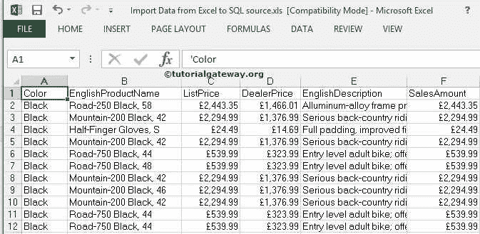

## 使用 SSIS 导入和导出数据向导将数据从 Excel 导入到 SQL Server

要使用 [SSIS](https://www.tutorialgateway.org/ssis/) 导入和导出数据向导将数据从 Excel 导入到 SQL Server，您必须打开该向导。为此，如果您在 Windows 7 上运行，那么您可以在 start - >所有程序- >微软[SQL server](https://www.tutorialgateway.org/sql/)r 2014->导入和导出数据向导中找到。

双击 SQL Server 导入和导出数据工具。它将打开 SQL Server 导入和导出向导。第一页是欢迎页面。

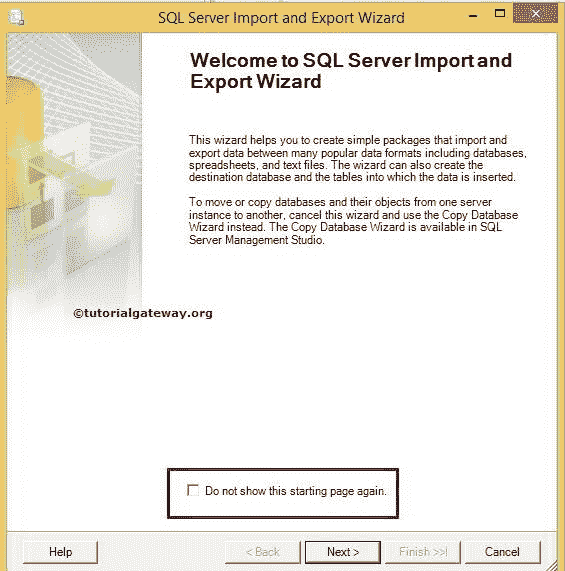

如果您不想再次看到此页面，请勾选“不再显示此起始页”复选框。现在，单击下一步

选择数据源页:此页用于配置源信息。我们的来源是一个 Excel 文件，所以我们选择微软 Excel 作为我们的数据源

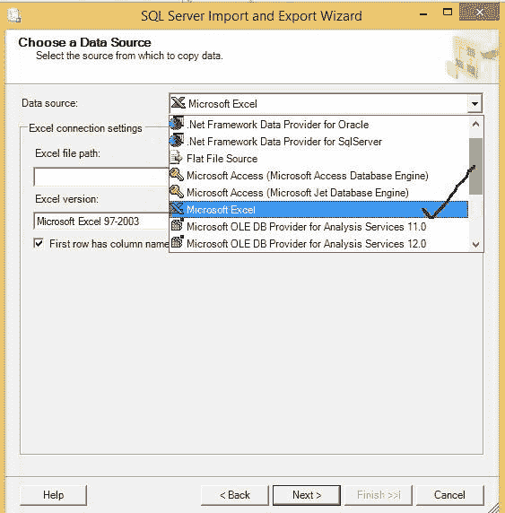

然后我们要从我们的本地驱动器

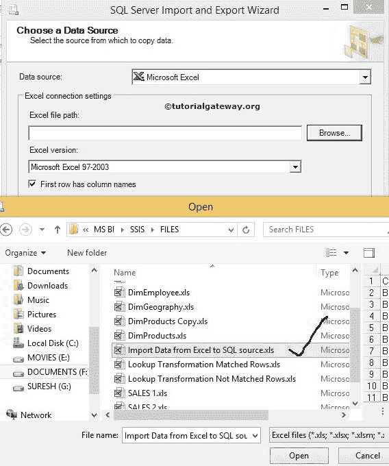

中选择文本文件

从上面可以观察到，我们选取了 Excel 文件。

如果您的 Excel 文件在第一行中包含列名，则勾选“第一个数据行中的列名”复选框。如果没有，取消选中它。

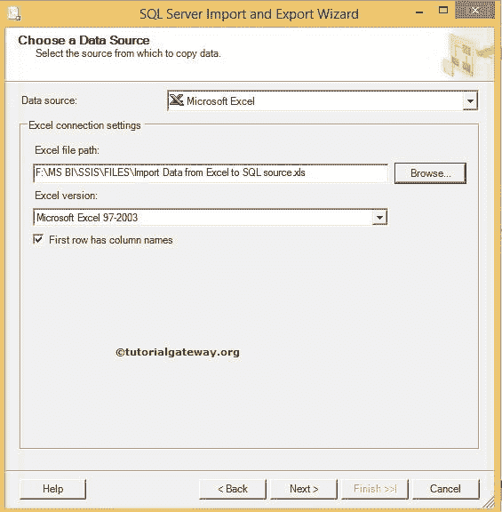

点击下一步按钮。

选择目标页:此页用于配置目标信息。我们的目标是 SQL 数据库，所以我们选择 SQL Server 本机客户端作为我们的目标，并且我们使用我们的实例作为服务器名称。

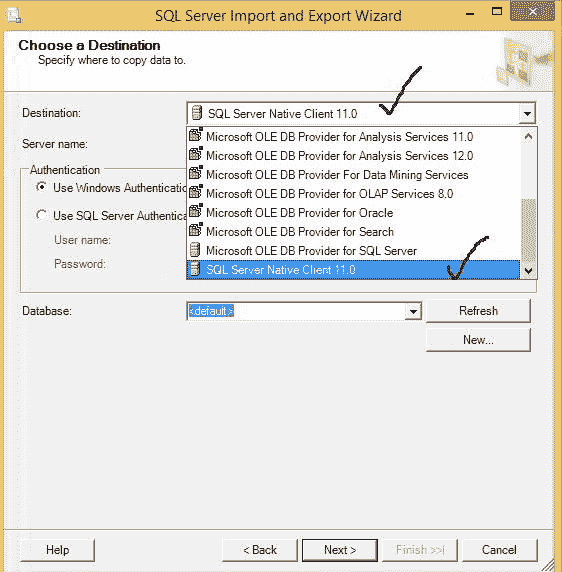

请从列表中选择目标数据库。让我们在这里选择 SSIS 教程。

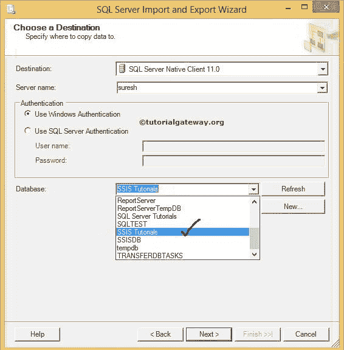

身份验证:这里，我们使用的是 windows 身份验证。但是在实时情况下，您的组织或公司提供了访问数据库的身份验证凭据。在这种情况下，您必须将单选按钮更改为 SQL 身份验证，并提供用户名和密码。

单击下一步按钮

指定表复制或查询:这里有两个选项

*   从一个或多个表或视图复制数据:使用此选项从现有表或视图(所有列数据)中进行选择
*   编写一个查询来指定要传输的文件数据选项:这是我们通常使用的选项，因为每个表中都会有不必要的列。所以最好避开它们或者选择有条件的数据。

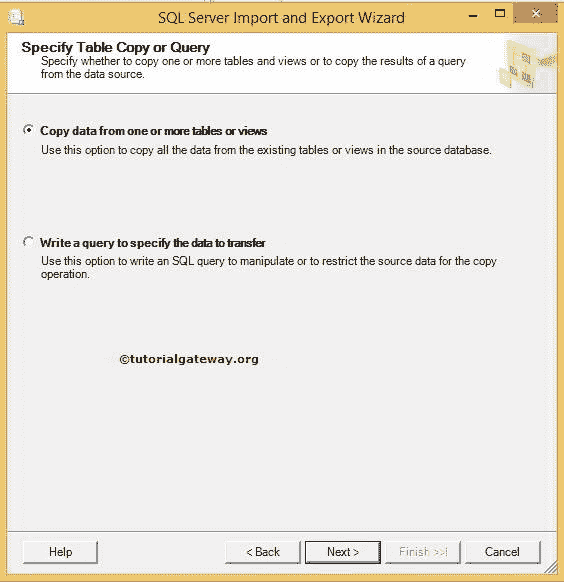

选择源表和视图:如果您已经创建了目标表，则此页用于从 SQL 数据库中选择目标表。如果没有，单击“编辑映射”按钮将打开如下所示的窗口，创建一个表，还可以单击“编辑 SQL”按钮进行自定义

点击【编辑映射】按钮

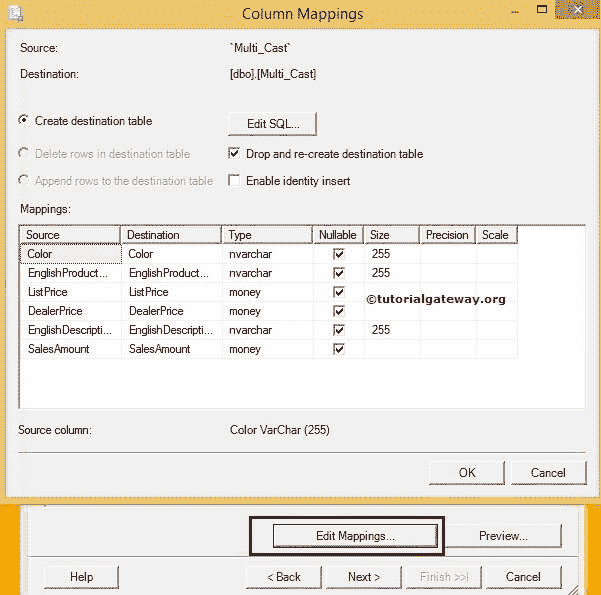

单击确定

从上面的截图可以观察到，

*   在这里，我们可以创建一个新表，或者我们可以通过单击“编辑 SQL”按钮来自定义已经存在的表。
*   我们可以删除现有的表，并通过选择删除并重新创建目标表来重新创建它
*   启用标识插入选项将帮助您将值插入标识列

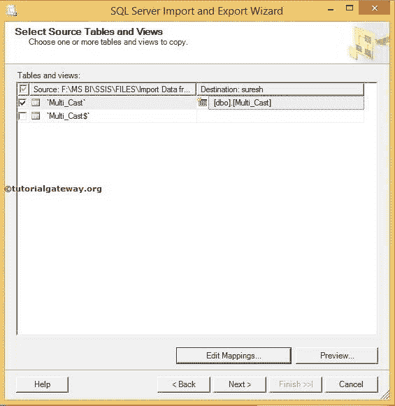

预览按钮用于查看列数据。

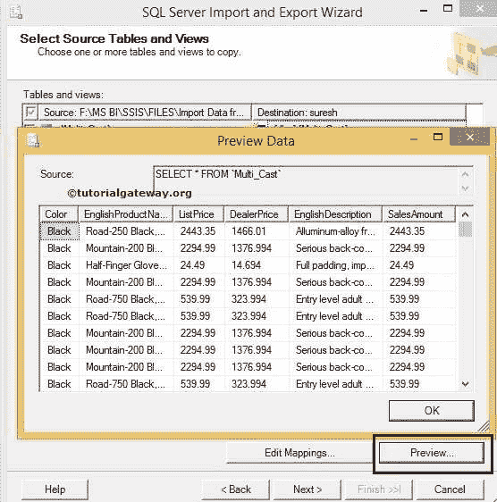

保存并运行包:此页面为我们提供了在 SQL 服务器或文件系统中保存包的选项。目前，我们正在选择文件系统

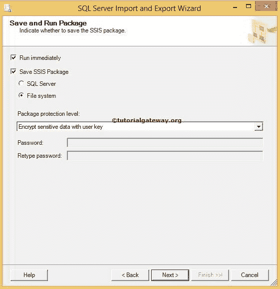

点击【下一步】按钮

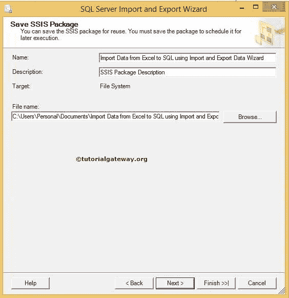

名称:根据需要更改软件包名称

描述:写下你的描述

文件名:通过单击“浏览”按钮选择文件名和文件位置，并导航到适当的位置。(这是包要保存的地方)。

点击下一步

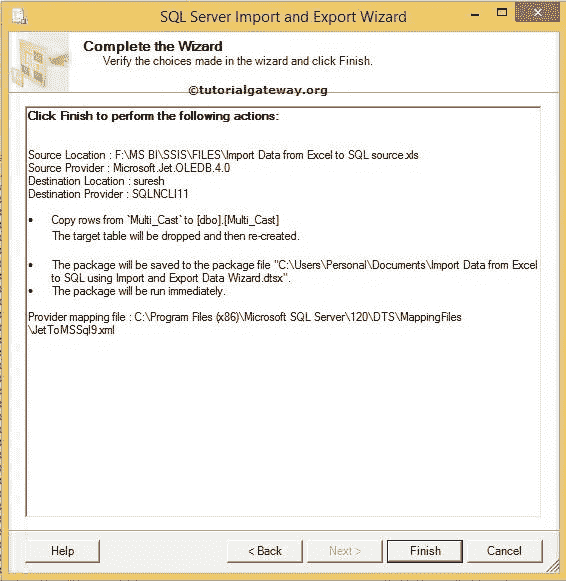

单击“完成”按钮完成向导。让我们打开 SSMS，检查输出数据

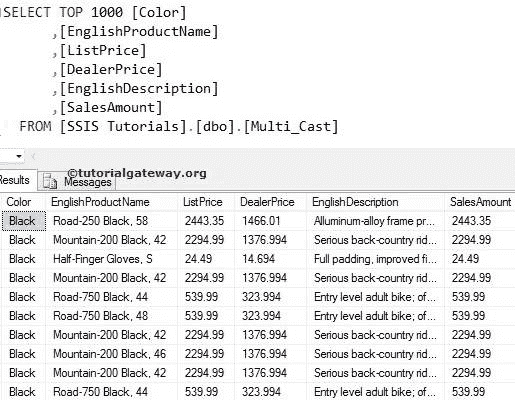