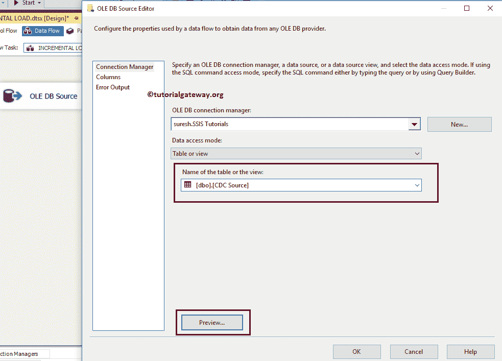
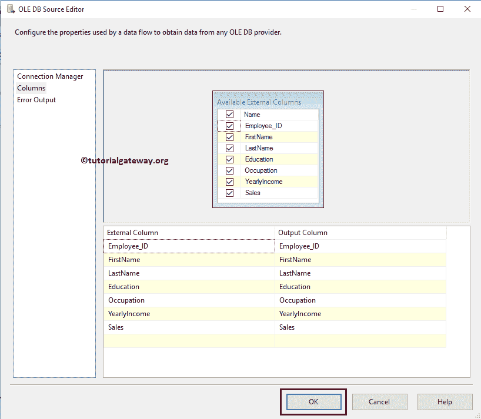
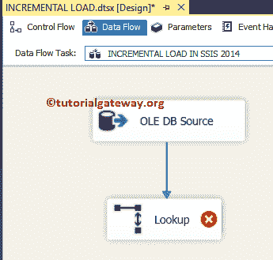
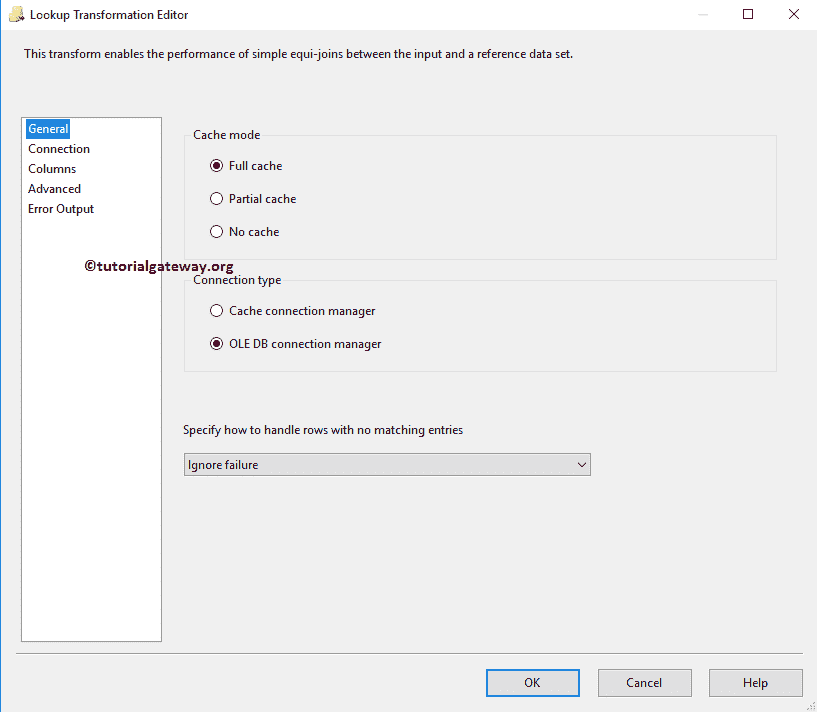
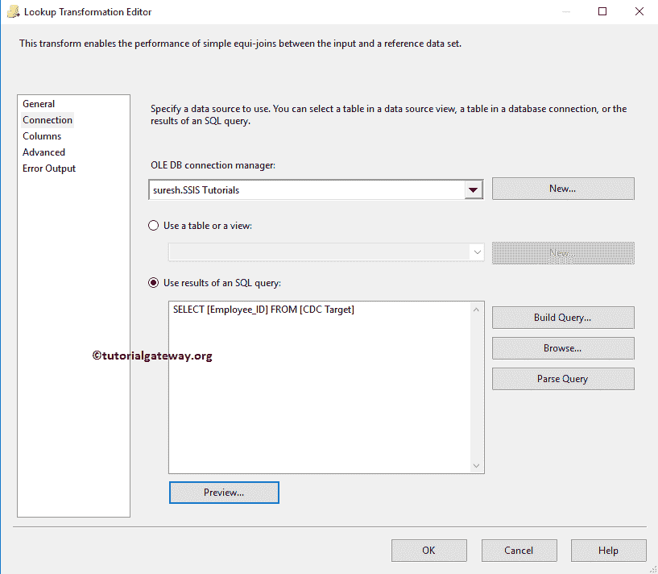
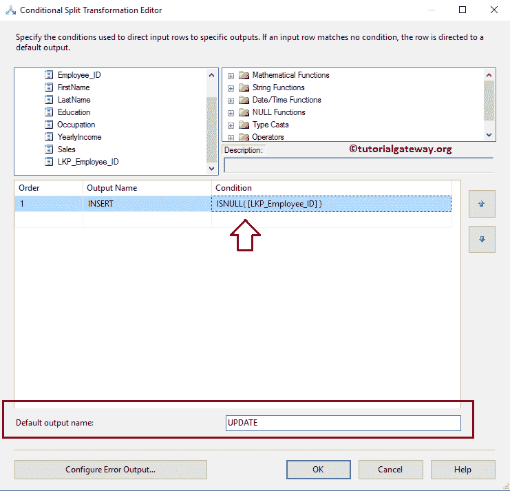
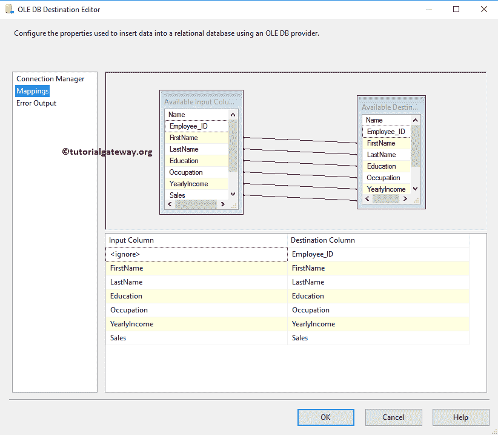
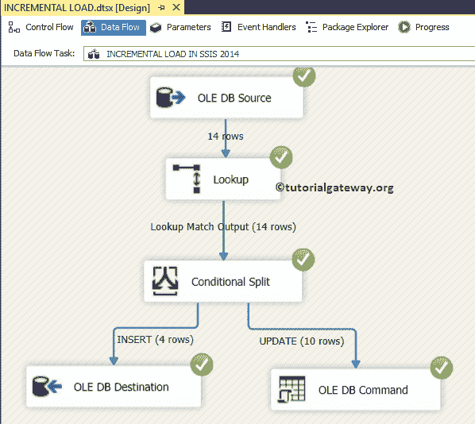
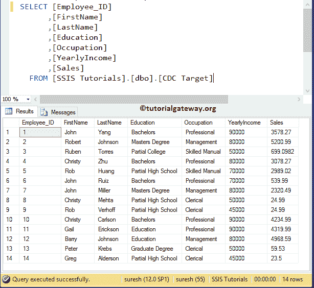

# SSIS 的增量负荷

> 原文：<https://www.tutorialgateway.org/incremental-load-in-ssis/>

在本文中，我们将通过示例向您展示如何在 SSIS 执行增量加载。SSIS 增量加载是指根据标识、日期戳或时间戳将目标表与源数据进行比较。

*   如果源数据中有任何新记录，那么我们必须在目标表中插入这些记录。例如，我们每天都要插入销售分支机构。
*   如果源数据中有任何更新的值，那么我们必须更新目标表中的那些记录。例如，更新客户地址。

在本例中，我们展示了在 SSIS 配置增量负载所涉及的步骤。在我们开始创建 SSIS 包之前，让我们看看源数据


现在让我们也看看目标表中的数据。


这里，我们的任务是将额外的 4 条记录加载到目标表中，并使用 SSIS 增量加载更新 2、5、10 行中的数据。

## 在 SSIS 配置增量负载

步骤 1:将数据流任务从工具箱拖放到控制流区域，并将其重命名为 SSIS 增量加载。


双击它将打开 [SSIS](https://www.tutorialgateway.org/ssis/) 数据流选项卡。

第二步:将 [OLE DB 源](https://www.tutorialgateway.org/ole-db-source-in-ssis/)拖放到数据流区域。双击它将打开 [OLE 数据库连接管理器](https://www.tutorialgateway.org/ole-db-connection-manager-in-ssis/)设置。

从下面的截图可以观察到，我们选择了【SSIS 教程】数据库作为源数据库，选择【疾控中心源】作为源表



第 3 步:单击列选项卡验证列。在此选项卡中，我们可以取消选中不需要的列。



单击确定关闭 OLE 数据库源，并将[查找转换](https://www.tutorialgateway.org/lookup-transformation-in-ssis/)从工具箱拖动到数据流选项卡。



第四步:双击[查找转换](https://www.tutorialgateway.org/lookup-transformation-in-ssis/)将打开查找转换编辑器，配置查找表(参考表)。在常规选项卡中的“指定如何处理没有匹配条目的行”下，将默认的失败组件更改为忽略失败选项。

提示:请参考 SSIS 的[查找](https://www.tutorialgateway.org/lookup-in-ssis/)文章了解查找中存在的属性，以及 SSIS 的[查找转换](https://www.tutorialgateway.org/lookup-transformation-in-ssis/)文章了解配置设置



步骤 5:单击连接选项卡来配置查找连接设置。如果您已经创建了 [OLE 数据库连接管理器](https://www.tutorialgateway.org/ole-db-connection-manager-in-ssis/)，请从列表中选择。否则，单击“新建”按钮并进行配置。这里我们选择了 SSIS 教程数据库。

接下来，我们使用 SQL Query 作为查找表，因为我们只需要一列进行查找(即 Employee_ID)，所以我们使用 SQL 查询。

注:一般来说，要求可能包括身份证或日期和时间



步骤 6:单击可用的输入列，并拖动到可用的查找列，在两个数据集之间创建连接。源数据中的员工标识列将与查找表(只有目标表)中的[员工标识]列进行核对。


第七步:拖动[条件分割变换](https://www.tutorialgateway.org/conditional-split-transformation-in-ssis/)，将查找匹配输出作为源连接到条件分割


第八步:双击它提供条件。我们在这个转换中使用的条件是 ISNULL(LKP _ 员工 _ 标识)。这意味着条件拆分将检查查找员工标识是否为空

*   如果 LKP 员工标识为空，则表示目标表中不存在记录。所以我们想插入新记录。
*   如果 LKP 员工标识不为空，则表示目标表中已经存在记录。所以我们想用新数据更新现有数据。

从上面可以看出，我们在[条件分割变换](https://www.tutorialgateway.org/conditional-split-transformation-in-ssis/)中使用了 1 个条件和 1 个默认输出。所以，我们总共得到两个输出。



步骤 9:将一个 [OLE DB 目标](https://www.tutorialgateway.org/ssis-ole-db-destination/)和 [OLE DB 命令转换](https://www.tutorialgateway.org/update-data-using-oledb-command-transformation-in-ssis/)拖放到数据流区域，然后将输出箭头拖动到这个新的 OLE DB 目标。将出现一个名为输入输出选择的弹出窗口，提示您选择输入输出类型:插入或更新。

注意:要更新表数据，我们需要 [SQL](https://www.tutorialgateway.org/sql/) 查询来执行 update 语句。这就是为什么我们在 SSIS 使用 [OLE DB 命令转换](https://www.tutorialgateway.org/ole-db-command-transformation-in-ssis/)


第十步:双击 [OLE DB 目标](https://www.tutorialgateway.org/ssis-ole-db-destination/)选择 [OLE DB 连接管理器](https://www.tutorialgateway.org/ole-db-connection-manager-in-ssis/)，选择【SSIS 教程】数据库中的【CDC 目标】表插入新记录。


步骤 11:单击映射选项卡，检查源列是否完全映射到目标列。如果您观察下面的截图，我们没有映射 Employee_ID 列，因为它是自动递增标识列。



第十二步:双击 [OLE DB 命令转换](https://www.tutorialgateway.org/update-data-using-oledb-command-transformation-in-ssis/)将打开 OLE-DB 命令高级编辑器进行配置。在连接管理器选项卡中，我们从列表中选择已经创建的 OLE DB 连接。


在组件属性中，我们必须编写 [SQL](https://www.tutorialgateway.org/sql/) 语句来执行更新。请选择 SqlCommand 属性，然后单击浏览按钮(…按钮)。单击浏览按钮后，将打开一个字符串值编辑器窗口来编写 SQL 语句。在本例中，我们正在更新产品表中的值。


[我们在上面截图中使用的 SQL](https://www.tutorialgateway.org/sql/) 语句是

```
UPDATE [CDC Target]
   SET [FirstName] = ?
      ,[LastName] = ?
      ,[Education] = ?
      ,[Occupation] = ?
      ,[YearlyIncome] = ?
      ,[Sales] = ?
 WHERE Employee_ID = ?
```

在列映射中，我们必须为参数分配适当的列名。

提示:第一个问号是参数 0，第二个问号是参数 1，依此类推。


单击“确定”完成 SSIS 包中增量负载的配置。让我们运行包



让我们打开 [SQL Server](https://www.tutorialgateway.org/sql/) 管理工作室，检查是否在 ssis 中使用增量加载插入了新记录和更新了旧记录。



我建议您参考[更好的方法–增量负载](https://www.tutorialgateway.org/ssis-incremental-load-better-approach/)文章，进一步参考增量负载。