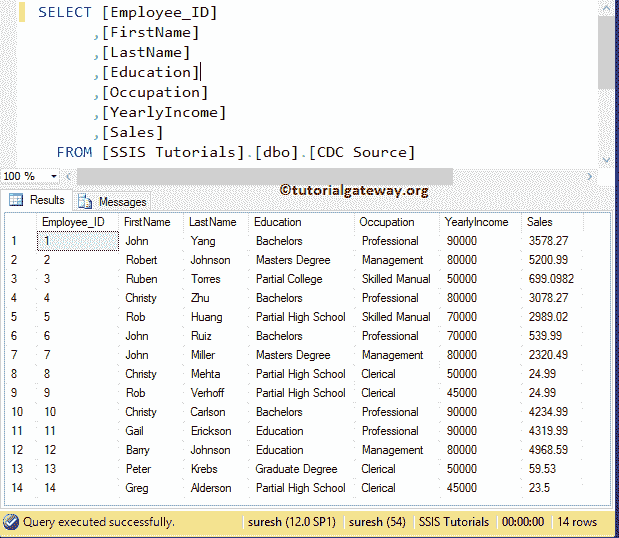

# SSIS 增量负载–更好的方法

> 原文：<https://www.tutorialgateway.org/ssis-incremental-load-better-approach/>

在本文中，我们将通过示例向您展示配置 SSIS 增量负载的更好方法。我们已经在前面的案例中解释了[增量加载](https://www.tutorialgateway.org/incremental-load-in-ssis/)，但是我们使用了 [OLE Db 命令转换](https://www.tutorialgateway.org/ole-db-command-transformation-in-ssis/)来更新目标表中的记录。尽管这种方法适用于少量数据，但对于大型数据集，将会出现性能问题。

在本例中，我们将向您展示配置 SSIS 增量负载所涉及的步骤。在我们开始创建 [SSIS](https://www.tutorialgateway.org/ssis/) 包之前，让我们看看源数据



现在让我们也看看目标表中的数据。


这里我们的任务是将额外的 4 条记录加载到目标表中，并更新 2、5、10 行中的数据。

## 配置 SSIS 增量负载

[OLE Db 命令转换](https://www.tutorialgateway.org/ole-db-command-transformation-in-ssis/)逐行执行更新，非常耗时。在本例中，我们将创建一个临时表或临时表来存储更新的信息，然后使用执行 SQL 任务将这些记录传递给目标表。

第一步:将数据流任务和两个[执行 SQL 任务](https://www.tutorialgateway.org/execute-sql-task-in-ssis/)从工具箱拖放到控制流区域，并将第一个执行任务重命名为创建状态表，数据流任务重命名为 [SSIS](https://www.tutorialgateway.org/ssis/) 增量加载，最后一个任务重命名为更新目标表。

*   创建临时表:这可以是一个全局临时表，也可以是存储更新信息的任何永久表。对于每个包运行，现有的表将被删除并重新创建。请记住，您也可以使用 Truncate 语句来截断表，而不是删除和重新创建。
*   数据流任务:将数据从源加载到目标
*   更新目标表:使用临时表中的数据更新目标表数据


第二步:双击执行 SQL 任务将打开任务编辑器。这里，我们正在目标数据库上创建一个临时表，因此，我们选择了已经创建的指向 SSIS 教程数据库的 [OLE DB 连接管理器](https://www.tutorialgateway.org/ole-db-connection-manager-in-ssis/)。请点击 SQL 语句属性旁的浏览按钮，编写自定义 SQL 语句


[SQL](https://www.tutorialgateway.org/sql/) 我们在上面截图中使用的命令是:

```
-- DROPPING EXISTING TABLE
IF OBJECT_ID('CDC_Staging', 'U') IS NOT NULL
   DROP TABLE  CDC_Staging;

-- CREATING NEW TABLE
CREATE TABLE CDC_Staging
(
 [Employee_ID] [int] PRIMARY KEY NOT NULL,
 [FirstName] [nvarchar](255) NULL,
 [LastName] [nvarchar](255) NULL,
 [Education] [nvarchar](255) NULL,
 [Occupation] [nvarchar](255) NULL,
 [YearlyIncome] [float] NULL,
 [Sales] [float] NULL
);
```

点击【确定】完成创建


临时表

接下来，双击数据流任务打开数据流选项卡。

第三步:将 [OLE DB 源](https://www.tutorialgateway.org/ole-db-source-in-ssis/)从工具箱拖放到数据流区域。双击数据流区域中的 OLE DB 源将打开 [OLE DB 连接管理器](https://www.tutorialgateway.org/ole-db-connection-manager-in-ssis/)设置。从下面可以观察到，我们选择了【SSIS 教程】数据库作为源数据库，选择【疾控中心源】作为源表


第 4 步:单击列选项卡验证列。您可以取消选中此处不需要的列(如果有)。


单击确定关闭 OLE 数据库源并拖动[查找转换](https://www.tutorialgateway.org/lookup-transformation-in-ssis/)。


第五步:双击[查找转换](https://www.tutorialgateway.org/lookup-transformation-in-ssis/)将打开查找转换编辑器，配置查找表(参考表)。在常规选项卡中的“指定如何处理没有匹配条目的行”下，将默认的失败组件更改为忽略失败选项。

提示:请参考 SSIS 的[查找](https://www.tutorialgateway.org/lookup-in-ssis/)文章了解查找中存在的属性，以及 SSIS 的[查找转换](https://www.tutorialgateway.org/lookup-transformation-in-ssis/)文章了解配置设置


步骤 6:单击连接选项卡来配置查找连接设置。如果您已经创建了 [OLE DB 连接管理器](https://www.tutorialgateway.org/ole-db-connection-manager-in-ssis/)，则从列表中选择，否则，单击新建按钮并进行设置。在这里，我们选择了现有的一个，这是指向 SSIS 教程数据库。

接下来，我们使用 SQL Query 作为查找表，因为我们只需要一列进行查找(即 Employee_ID)，所以我们使用如下所示的 SQL 查询。


步骤 7:单击可用的输入列，并将所需的列拖到可用的查找列上，以在两个数据集之间创建连接。源数据中的员工标识列将与查找表(只有目标表)中的[员工标识]列进行核对。


第八步:拖放[条件分割变换](https://www.tutorialgateway.org/conditional-split-transformation-in-ssis/)，将查找匹配输出作为源连接到条件分割


第九步:双击它提供条件。我们在这个 SSIS 增量负载示例中使用的条件是 ISNULL (LKP 员工标识)。这意味着条件分割验证查找员工标识是否为空

*   如果 LKP 员工标识为空，则意味着目标表中不存在记录，因此我们希望插入新记录。
*   如果 LKP 员工标识不为空，这意味着目标表中已经存在一条记录，因此我们希望用新数据更新现有数据。

从下图可以看出，我们在[条件分割变换](https://www.tutorialgateway.org/conditional-split-transformation-in-ssis/)中使用了 1 个条件和 1 个默认输出。所以，我们总共得到两个输出。


步骤 10:将两个 [OLE DB 目标](https://www.tutorialgateway.org/ssis-ole-db-destination/)拖放到数据流区域，然后将输出箭头拖动到这个新的 OLE DB 目标。将出现一个名为“输入输出选择”的弹出窗口，帮助您选择输入输出类型:插入或更新。


第十一步:双击第一个 [OLE DB 目标](https://www.tutorialgateway.org/ssis-ole-db-destination/)将打开 OLE DB 目标编辑器。选择 [OLE 数据库连接管理器](https://www.tutorialgateway.org/ole-db-connection-manager-in-ssis/)并选择【SSIS 教程】数据库中的【疾控中心目标】表以插入新记录。


步骤 12:单击映射选项卡，验证源列是否正确映射到目标列。如果您观察下图，我们没有映射员工标识列，因为它是自动递增标识列。


第十三步:双击第二个 [OLE DB 目标](https://www.tutorialgateway.org/ssis-ole-db-destination/)将打开 OLE DB 目标编辑器。选择 [OLE 数据库连接管理器](https://www.tutorialgateway.org/ole-db-connection-manager-in-ssis/)，并选择存在于【SSIS 教程】数据库中的【CDC_Staging】表。

提示:如果找不到表，请单独运行第一个执行 SQL 任务来创建。


第 14 步:重复第 12 步


在我们进入控制流选项卡之前，请将验证外部元数据从真更改为假，因为我们正在动态(运行时间)


创建一个临时表

步骤 15:在控制流中，双击第二个执行 SQL 任务打开任务编辑器。这里，我们正在用分段表数据更新[疾控中心目标]数据。因此，我们选择了已经创建的指向 SSIS 教程数据库的 [OLE DB 连接管理器](https://www.tutorialgateway.org/ole-db-connection-manager-in-ssis/)。请点击 [SQL](https://www.tutorialgateway.org/sql/) 语句属性旁的浏览按钮，编写自定义 SQL 语句


要更新记录，我们在上面的 SSIS 增量加载截图中使用的 SQL 命令是:

```
UPDATE [dbo].[CDC Target]
   SET [FirstName] = Staging.[FirstName]
      ,[LastName] = Staging.[LastName]
      ,[Education] = Staging.[Education]
      ,[Occupation] = Staging.[Occupation]
      ,[YearlyIncome] = Staging.[YearlyIncome]
      ,[Sales] = Staging.[Sales]
FROM [CDC Target]
   INNER JOIN
     [CDC_Staging] AS Staging 
	 ON [CDC Target].Employee_ID = Staging.Employee_ID

```

单击确定完成 SSIS 增量负载包的配置。让我们运行包


让我们打开 [SQL Server](https://www.tutorialgateway.org/sql/) 管理工作室，检查是否使用了 [SSIS](https://www.tutorialgateway.org/ssis/) 增量加载以及临时表插入了新记录和更新了旧记录。

