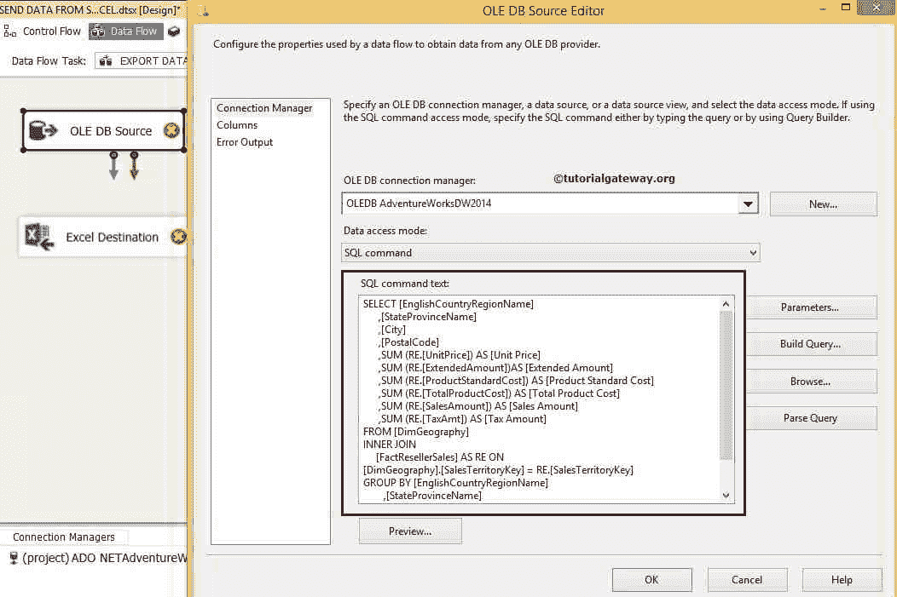
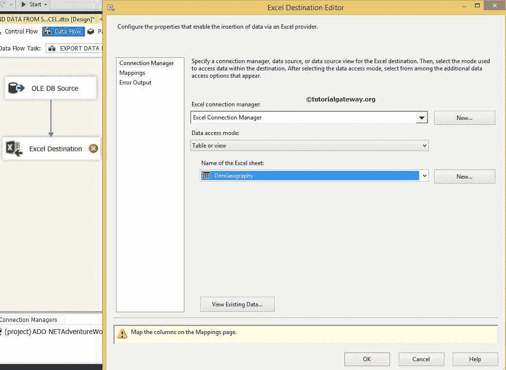

# 在 SSIS 将数据从 SQL Server 导出到 Excel

> 原文：<https://www.tutorialgateway.org/export-data-from-sql-server-to-excel-in-ssis/>

在本文中，我们将向您展示如何在 SSIS 将数据从 SQL Server 导出到 Excel。为此，我们将创建一个包来从 SQL server 数据库中选择数据，并将 SQL Server 表数据导出到本地硬盘中的 EXCEL 文件。

## 在 SSIS 示例中将数据从 SQL Server 导出到 Excel

步骤 1:将数据流任务从工具箱拖放到控制流区域。并将其重命名为从 [SQL Server](https://www.tutorialgateway.org/sql/) 导出数据到 Excel


第二步:双击 [SSIS](https://www.tutorialgateway.org/ssis/) 数据流任务将打开数据流区域。在数据流区域中，拖放 OLE DB 源和 Excel 文件目标。


步骤 3:双击 OLE 数据库源来配置 SQL Server 连接管理器，并从表中选择所需的数据。



[我们上面使用的 SQL](https://www.tutorialgateway.org/sql/) 语句是

```
USE [AdventureWorksDW2014] 
GO 

SELECT [EnglishCountryRegionName] 
      ,[StateProvinceName] 
      ,[City] 
      ,[PostalCode] 
      ,SUM (RE.[UnitPrice]) AS [Unit Price] 
      ,SUM (RE.[ExtendedAmount]) AS [Extended Amount] 
      ,SUM (RE.[ProductStandardCost]) AS [Product Standard Cost] 
      ,SUM (RE.[TotalProductCost]) AS [Total Product Cost] 
      ,SUM (RE.[SalesAmount]) AS [Sales Amount] 
      ,SUM (RE.[TaxAmt]) AS [Tax Amount]
FROM [DimGeography] 
INNER JOIN 
     [FactResellerSales] AS RE ON 
[DimGeography].[SalesTerritoryKey] = RE.[SalesTerritoryKey] 

GROUP BY [EnglishCountryRegionName] 
        ,[StateProvinceName] 
        ,[City] 
        ,[PostalCode]

ORDER BY [EnglishCountryRegionName] 
```

对于本例，我们选择了[冒险作品 DW 2014]数据库中的[暗淡地理]和[事实互联网销售]表。

步骤 4:现在，单击列选项卡验证输入列，然后单击确定。在此选项卡中，我们还可以取消选中不需要的列。


通过点击 ok，我们已经完成了我们的源部分。

第五步:让我们通过双击 Excel 文件目的地


来配置目的地

这里我们选择了 DimGeography.xls 作为我们的 excel 目标表

提示:在 Excel 连接管理器中使用之前，您必须先创建 Excel 工作表，并且运行包时不应打开 Excel 文件。



提示:如果选中“第一行有列名”选项，则列名将保存在所选 Excel 工作表的第一行。

在这里，我们选择了 DimGeography 表，因此，要检查结果，您必须打开 DimGeography.xls 中的 DimGeography 表

步骤 6:检查映射选项卡是否所有的行都精确地映射到目标列。


注意:如果您的输入列名和目标列名相同，智能将自动映射。如果列名有任何变化，我们必须手动映射它们。

完成映射后，单击“确定”按钮完成项目开发。让我们运行 SSIS 将数据从 SQL Server 导出到 Excel 包并查看


让我们打开 excel 文件，检查结果

