# 在 SSIS 将数据从 SQL Server 导出到平面文件

> 原文：<https://www.tutorialgateway.org/export-data-from-sql-server-to-flat-file-in-ssis/>

在本文中，我们向您展示了在 SSIS 将数据从 SQL Server 导出到平面文件的分步方法。为此，我们将创建一个包来从 SQL server 数据库中选择数据，并将该数据发送到本地硬盘中的文本文件。

## 在 SSIS 示例中将数据从 SQL Server 导出到平面文件

步骤 1:将数据流任务从工具箱拖放到控制流区域。并将其重命名为“将数据从 SQL Server 导出到平面文件”

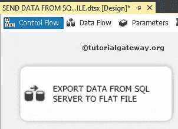

第二步:双击 [SSIS](https://www.tutorialgateway.org/ssis/) 数据流任务将打开数据流区域或选项卡，然后将 OLE DB 源和平面文件目标拖放到数据流区域。

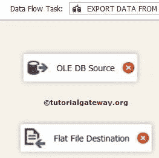

第三步:双击 OLE DB Source，配置 [SQL Server](https://www.tutorialgateway.org/sql/) 连接字符串，也可以从表中选择需要的数据。

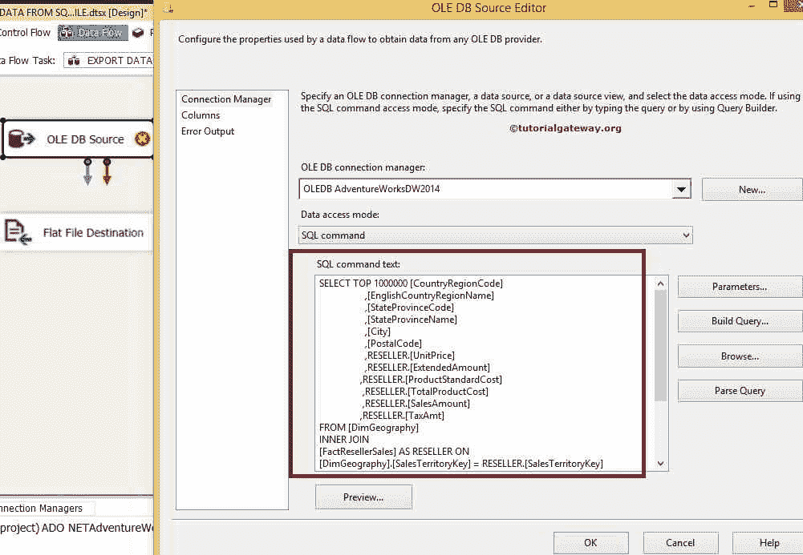

[我们这里使用的 SQL](https://www.tutorialgateway.org/sql/) 语句是

```
USE [AdventureWorksDW2014] 
GO 
SELECT TOP 1000000 [CountryRegionCode] 
                   ,[EnglishCountryRegionName] 
                   ,[StateProvinceCode] 
                   ,[StateProvinceName] 
                   ,[City] 
                   ,[PostalCode] 
                   ,RESELLER.[UnitPrice] 
                   ,RESELLER.[ExtendedAmount] 
                   ,RESELLER.[ProductStandardCost] 
                   ,RESELLER.[TotalProductCost] 
                   ,RESELLER.[SalesAmount] 
                  ,RESELLER.[TaxAmt] 
FROM [DimGeography] 
INNER JOIN 
     [FactResellerSales] AS RESELLER ON 
[DimGeography].[SalesTerritoryKey] = RESELLER.[SalesTerritoryKey] 

ORDER BY [CountryRegionCode] 
        ,[EnglishCountryRegionName] 
        ,[StateProvinceCode] 
        ,[StateProvinceName] 
        ,[City] 
        ,[PostalCode] 
        ,RESELLER.[SalesAmount] 

```

第四步:点击列选项卡，验证输入的列，然后点击【确定】

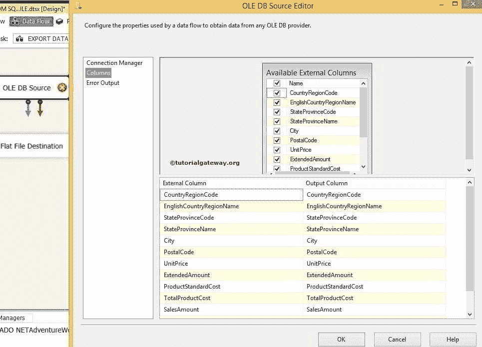

点击 ok，我们就完成了源部分。

步骤 5:让我们通过双击平面文件目标来配置目标。

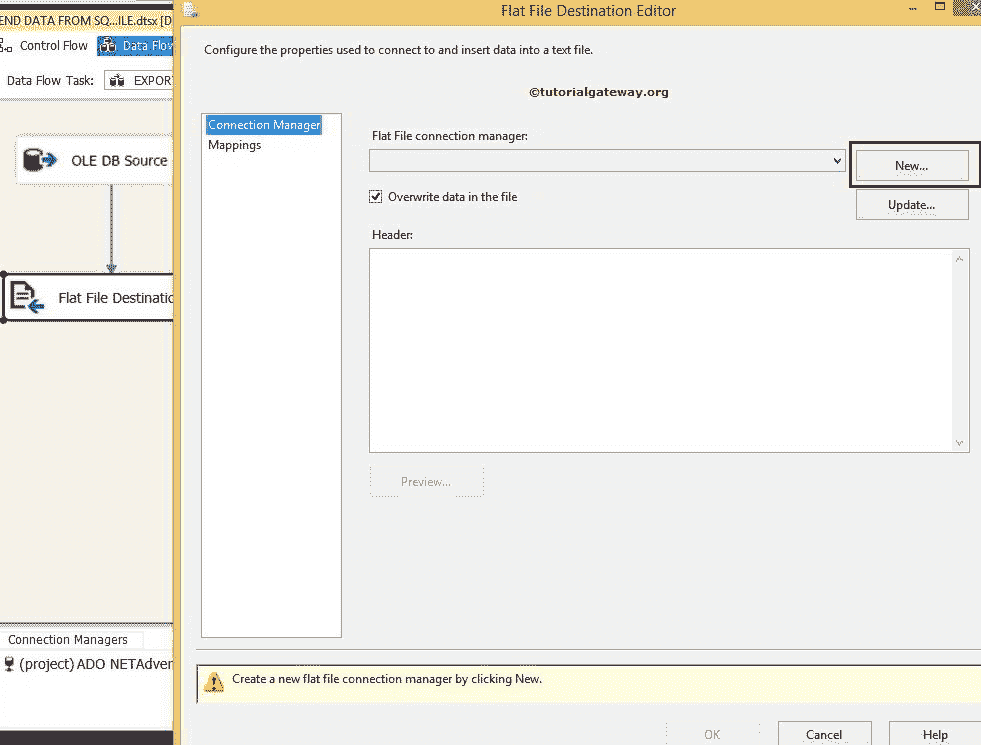

我们之前没有创建任何平面文件连接管理器所以，点击新建按钮会打开一个窗口表单选择平面文件格式如下图所示

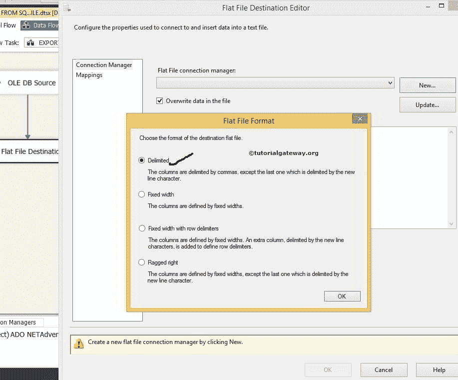

从上面的截图中，我们选择了分隔选项。单击确定按钮将打开平面文件连接管理器编辑器，以选择和配置文本文件。

通过点击浏览按钮，我们可以选择目标文本文件

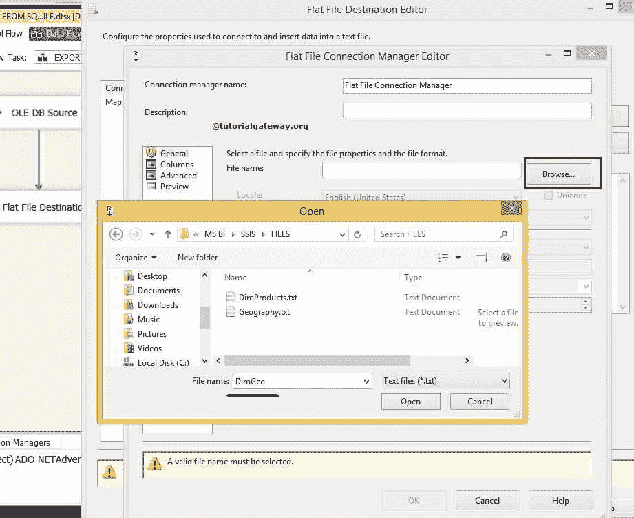

从下面，您可以看到我们决定将 DimGeo 文本文件放在我的本地硬盘上。

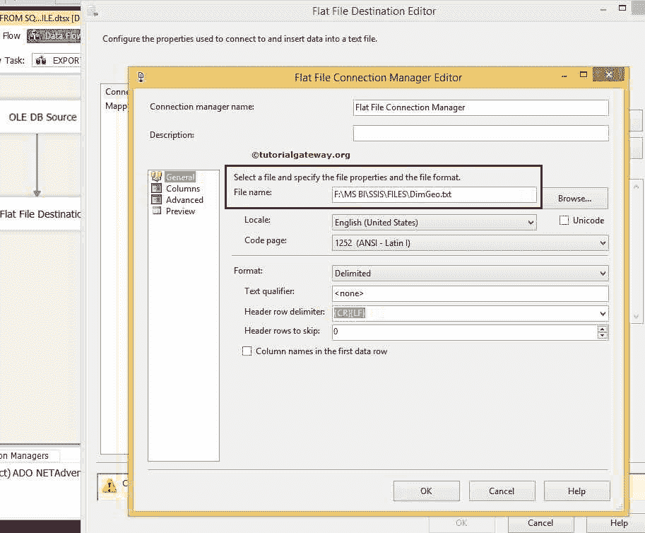

点击列标签验证列名

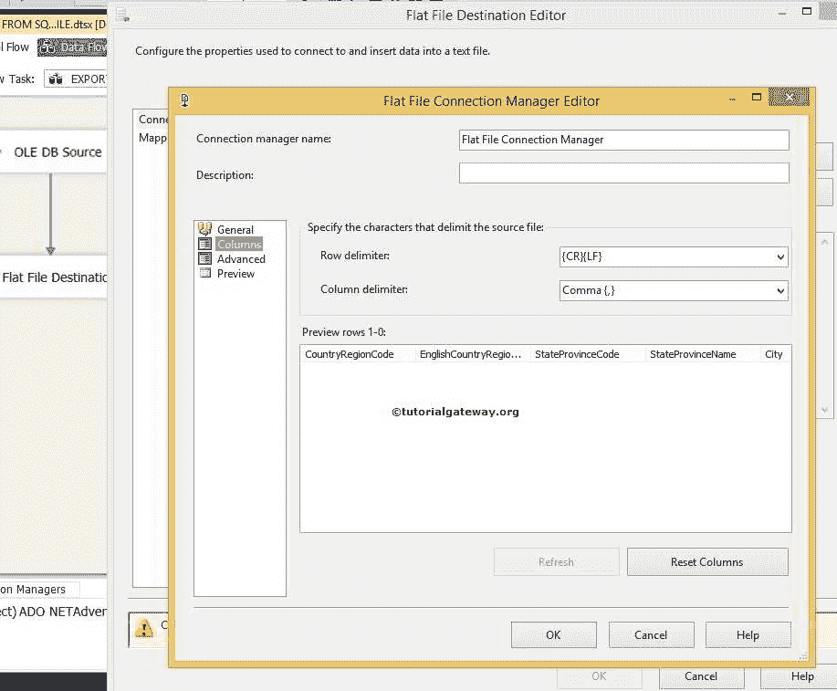

单击“确定”创建一个新的平面文件连接，连接到我们要用作目标的文件。

步骤 6:检查 SSIS 从 SQL Server 导出数据到平面文件映射选项卡，是否所有行都精确映射到目标列。

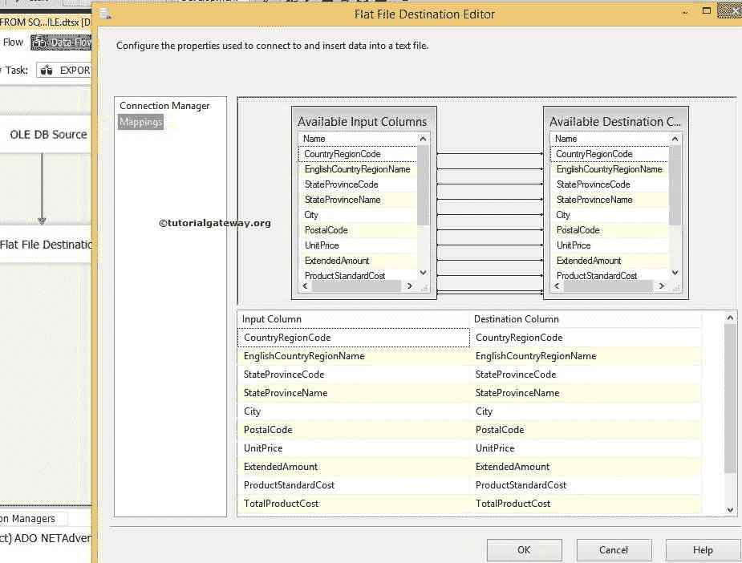

完成映射后，单击“确定”按钮完成项目开发。

让我们在 SSIS 包中运行将数据从 SQL Server 发送到平面文件，并查看

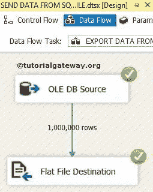

让我们通过打开 DimGeo 文本文件

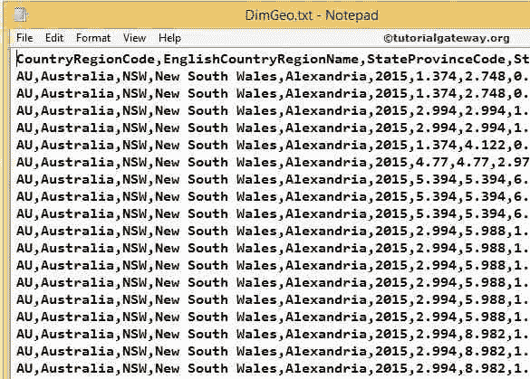

来检查结果