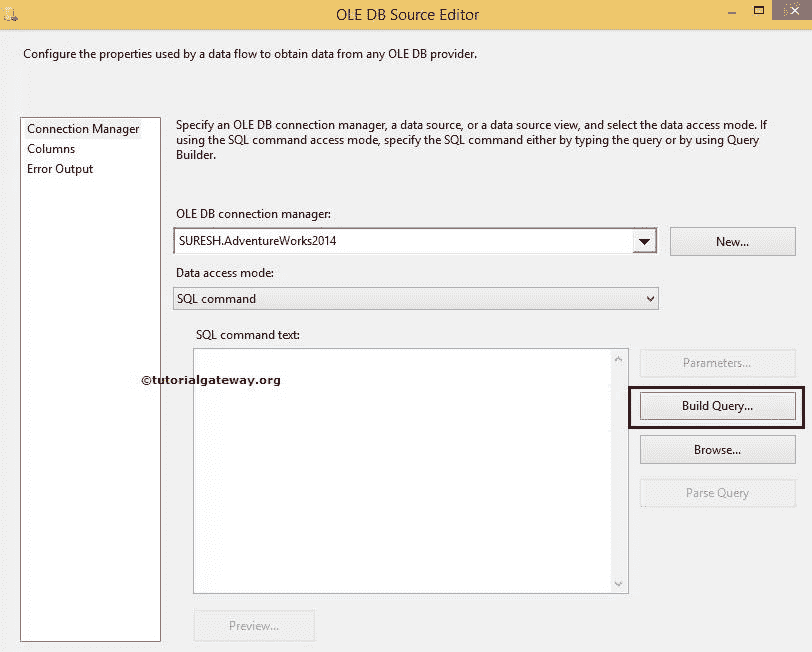
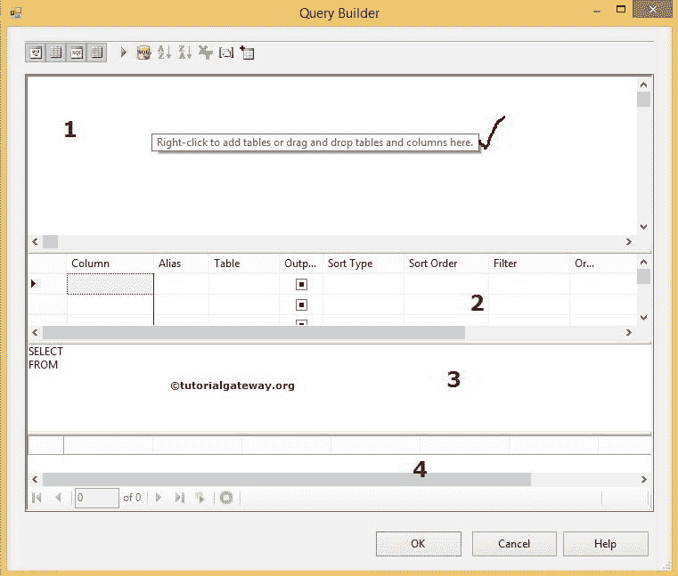
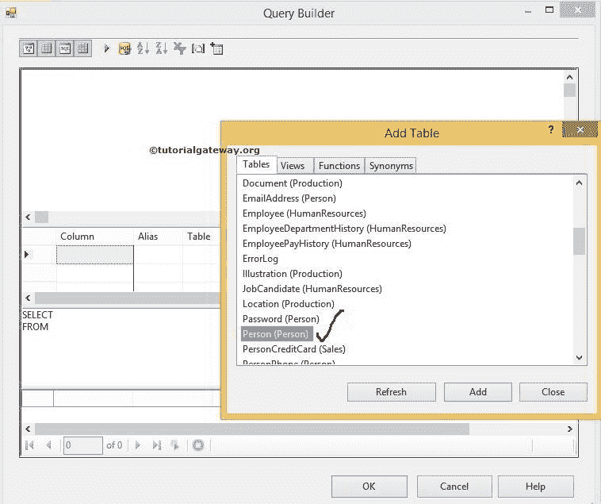
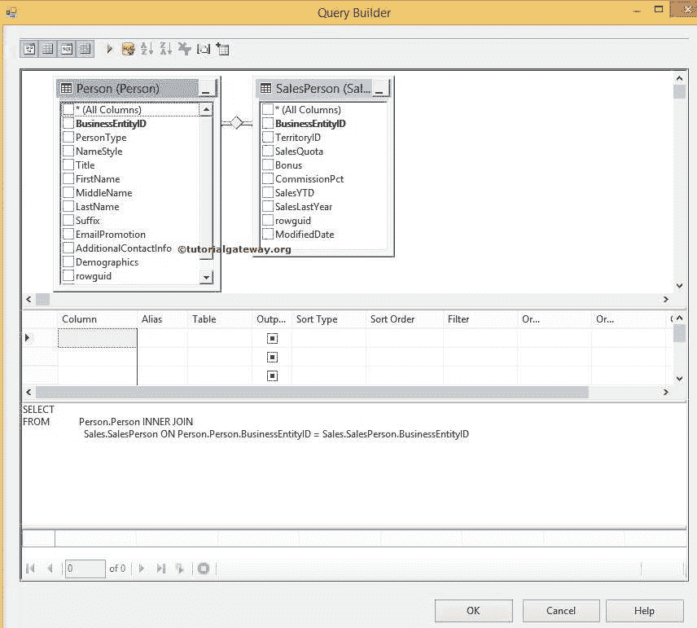
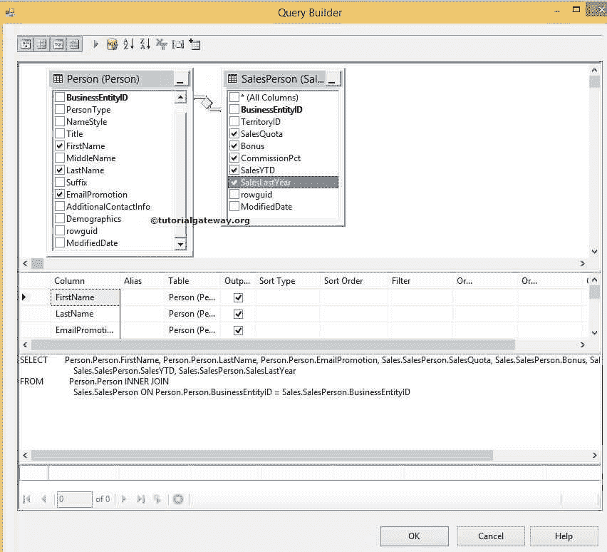
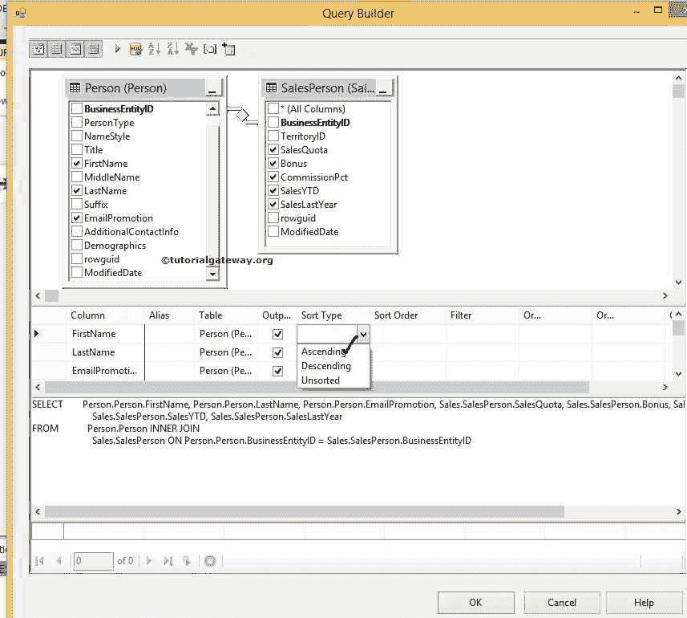
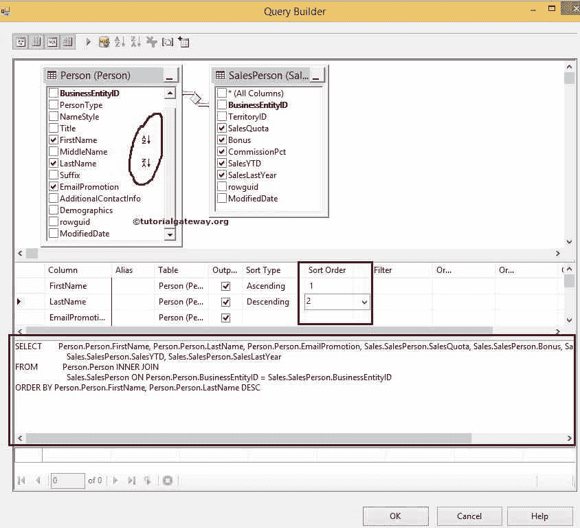
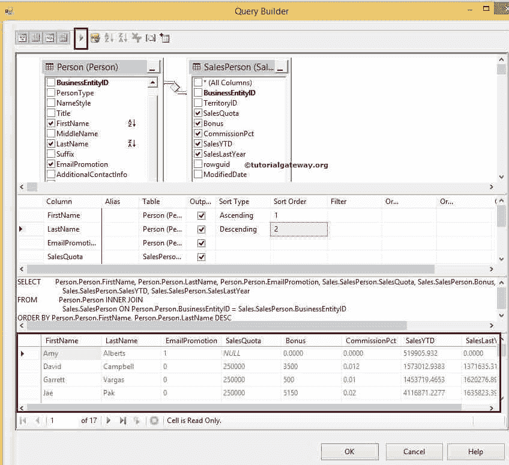
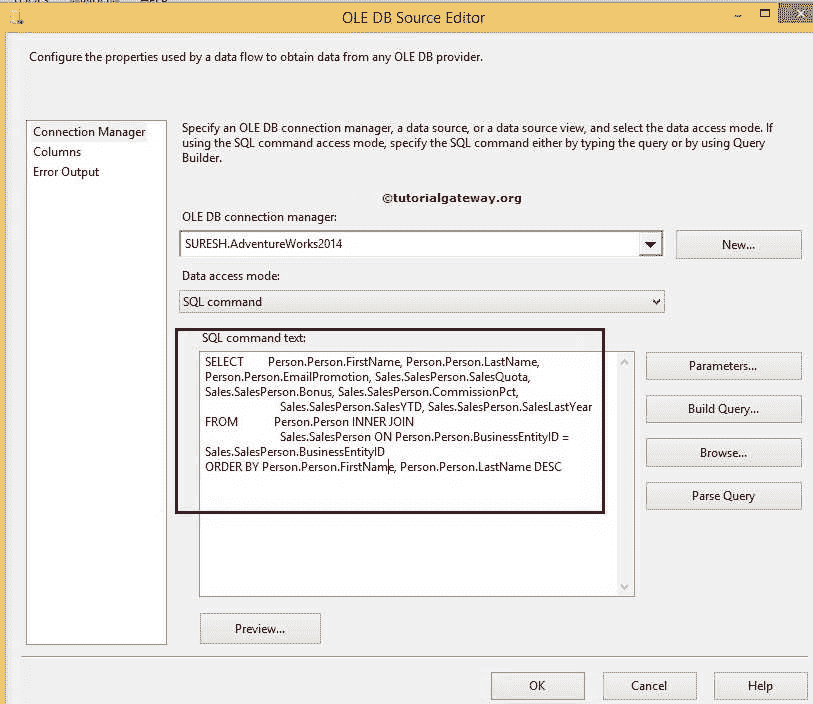

# SSIS 的查询生成器

> 原文：<https://www.tutorialgateway.org/query-builder-in-ssis/>

SSIS 的查询生成器使开发人员能够轻松设计 SQL 查询。如果您不知道如何编写 SQL 查询，或者执行分组、排序和连接操作很困难。或者，如果您发现很难设计复杂的 SQL 查询，那么您可以使用 SSIS 查询生成器使用图形用户界面来设计您想要的查询。

## SSIS 查询生成器示例

在本例中，我们向您展示了如何使用 SSIS 的查询生成器设计一个 SQL 查询。在本例中，我们将为 OLE 数据库源创建查询。因此，在 [OLE DB 源](https://www.tutorialgateway.org/ole-db-source-in-ssis/)编辑器中，点击构建查询按钮。

单击构建查询按钮后，它将在单独的窗口中打开查询构建器。在设计 [SQL](https://www.tutorialgateway.org/sql/) 查询之前，您应该了解 [SSIS](https://www.tutorialgateway.org/ssis/) 查询生成器中存在的不同窗格。

*   图表窗格:该窗格用于选择表、[视图](https://www.tutorialgateway.org/views-in-sql-server/)或[功能](https://www.tutorialgateway.org/user-defined-functions-in-sql/)。SSIS 的查询生成器会根据数据库关系自动[连接](https://www.tutorialgateway.org/sql-joins/)表。选择所需的表后，我们可以通过选中标记列来选择所需的列。
*   网格窗格:所有选定的列都将显示在该窗格中。该窗格便于应用排序(按排序和按 DESC 排序)以及对列名进行分组(按[分组](https://www.tutorialgateway.org/sql-group-by-clause/)语句)
*   SQL 窗格:SSIS 查询生成器将在此窗格中自动为我们构建 SQL 查询。
*   结果窗格:一旦您完成设计您的 SQL 查询，然后点击执行按钮(播放按钮)将在此窗格中显示 SQL 查询结果。

右键单击图表窗格以添加所需的表。

从上面的截图中，可以观察到我们选择了 Person 表。让我再添加一个表(销售人员)来显示连接。

从上面的截图中，您可以看到 SSIS 查询生成器使用 BusinessEntityID 列自动连接了两个表，Person 和 tables。

请通过在图表窗格中选中标记列名来选择所需的列。

排序:在网格窗格中，请根据您的要求将排序类型更改为升序或降序。在这个例子中，我们对名字升序和姓氏降序

进行排序

请根据您的要求更改排序选项。对于本例，它将首先按照升序按名字对数据进行排序。然后，它按照姓氏降序对数据进行排序。

从上面的截图中，您可以看到由 SSIS 查询生成器生成的最终的 SQL 查询。通过单击顶部的执行按钮，让我们看看构建的查询是否正在完美地执行。

你可以看到结果。点击【确定】按钮，使用查询生成器工具

完成 [SQL](https://www.tutorialgateway.org/sql/) 查询的设计