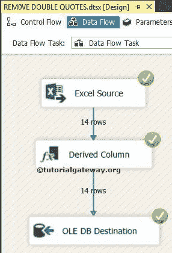

# 使用 SSIS 删除 Excel 工作表中的双引号

> 原文：<https://www.tutorialgateway.org/remove-double-quotes-in-excel-sheet-using-ssis/>

使用 [SSIS 转换](https://www.tutorialgateway.org/ssis-transformations/)删除 Excel 工作表中的双引号是我们的许多朋友和 SSIS 博客关注者最常问的问题。在本文中，我们将通过一个实例向您展示如何使用 SSIS 在 Excel 工作表中删除双引号。

下面的截图将向您展示 Customers.xls Excel 文件中的数据。如果仔细观察，“教育”列下的每一行都用双引号("")括起来。让我们看看用 SSIS 步骤解决的 Excel 表格中的删除双引号


## 使用 SSIS 示例删除 Excel 工作表中的双引号

第一步:将数据流任务从工具箱拖放到控制流区域


双击它将打开数据流选项卡。

第二步:将 [SSIS](https://www.tutorialgateway.org/ssis/) 工具箱中的 [EXCEL 源](https://www.tutorialgateway.org/excel-source-in-ssis/)、 [OLE DB 目的地](https://www.tutorialgateway.org/ssis-ole-db-destination/)拖放到数据流区域。


步骤 3:双击数据流区域中的 Excel 源将打开连接管理器设置，并提供一个选项来选择保存源数据的表。从下面的截图中，您可以看到我们正在选择本地硬盘


中的 Customers.xls 文件

因为我们的 excel 表在第一行包含列名，所以我们选中了“第一行有列名”选项。如果您的 excel 文件不同，不要选择它。


从下面的截图中，我们从 Customers.xls excel 文件中选择了客户选项卡表。


第 5 步:单击列选项卡验证列。在此选项卡中，我们可以取消选中不需要的列。


单击“确定”，将“派生列转换”从工具箱拖放到数据流区域。接下来，将 excel 源输出连接到此。

第五步:双击或右键点击[导出列转换](https://www.tutorialgateway.org/derived-column-transformation-in-ssis/)编辑并转换我们的源列数据。


在派生列转换编辑器中，我们将新列添加为新教育，并向其中添加了表达式。

```
LTRIM(RTRIM(REPLACE(Education,"\"","")))
```


如果观察表达式代码，我们使用 [LTRIM](https://www.tutorialgateway.org/sql-ltrim-function/) 和 [RTRIM](https://www.tutorialgateway.org/sql-rtrim-function/) 删除多余的空格，使用 [REPLACE](https://www.tutorialgateway.org/sql-replace-function/) 函数替换双引号。

步骤 7:接下来，提供目标的服务器、数据库和表的详细信息。因此，双击 OLE 数据库目标并提供所需的信息。

这里，我们正在创建一个新表


注意:从 Excel 到 [SSIS](https://www.tutorialgateway.org/ssis/) 的 [SQL server](https://www.tutorialgateway.org/sql/) 数据库的转换过程中，总是需要转换数据类型。在这里，我们用 NVARCHAR 数据类型创建了一个表，但是在实时情况下，情况会有所不同。


步骤 8:单击“映射”选项卡，检查源列是否完全映射到目标列。


单击“确定”完成我们的包设计。让我们运行这个包，看看我们是否使用 SSIS



成功删除了 Excel 工作表中的双引号

让我们打开 [SQL Server](https://www.tutorialgateway.org/sql/) 管理工作室，查看结果

