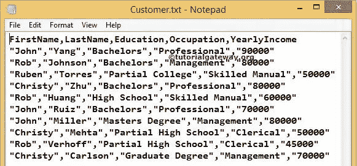
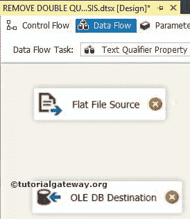

# SSIS 的文本限定词

> 原文：<https://www.tutorialgateway.org/text-qualifier-in-ssis/>

SSIS 的文本限定词或如何删除 CSV 文件中的双引号或如何删除平面文件中的双引号是任何 SSIS 采访中最常见的问题。在本文中，我们通过一个实例向您展示了如何在 SSIS 使用文本限定符消除 CSV 文件中的双引号。

下面的截图显示了 Customers.txt 平面文件中的数据。如果观察，标题部分后的每一行都用双引号(" ")括起来。让我们看看 SSIS 文本限定词解决它的步骤

## SSIS 示例中的文本限定词

第一步:将数据流任务从工具箱中拖放到控制流区域，并将其重命名为 [SSIS](https://www.tutorialgateway.org/ssis/) 中的文本限定符。

双击它，它将打开数据流选项卡。

步骤 2:将平面文件源和 OLE DB 目标从工具箱拖放到数据流区域。

双击数据流区域中的平面文件源将打开平面文件源编辑器来配置连接管理器设置。如果您之前没有创建平面文件连接管理器，请单击新建按钮。

单击“新建”按钮后，平面文件连接管理器编辑器打开。请单击“浏览”按钮，从我们的文件系统中选择所需的文件。这里，我们选择的是

的 Customers.txt 平面文件

选择文件后，我们必须通过选中第一个数据行选项中的列名来指定文本文件是否在第一行保存列名。由于我们的平面文件包含第一行中的列名，因此我们选中了该选项。如果您的文本文件不同，则不要选择它。

让我们通过访问平面文件连接管理器

中的列选项卡来检查数据

### SSIS 文本限定词

现在，回到常规选项卡，并在 SSIS 文本限定符属性中放置双引号，如下所示

提示:您可以用任何特殊字符替换此双引号，以从平面文件

中删除那些特殊字符

单击确定将关闭平面文件连接管理器编辑器。如果要将空值保留为空值，请在数据流选项中选中将源中的空值保留为空值。

单击列选项卡验证列。在此选项卡中，我们还可以取消选中不需要的列。

单击确定并将平面文件源输出拖放到 OLE 数据库目标。

现在，我们必须提供目标的服务器、数据库和表的详细信息。因此，双击 OLE 数据库目标并提供所需的信息。从下面的截图中，您可以看到我们正在 SSIS 教程数据库

中选择 SSIS 表中的文本限定符

单击“映射”选项卡，检查源列是否完全映射到目标列。

单击“确定”完成我们的 SSIS 文本限定符包设计。让我们运行包并检查结果，看看我们是否在 SSIS 使用文本限定符成功删除了平面文件中的双引号

