# SSIS 脚本任务

> 原文：<https://www.tutorialgateway.org/script-task-in-ssis/>

SSIS 脚本任务提供了一个选项来实现在 SSIS 工具箱中不可用或不可能实现的功能(在内置任务和转换中)。SSIS 脚本任务利用微软 VSTA(Visual Studio Tools for Applications)作为代码环境，您可以在其中编写 C#或 VB 脚本。

提示:SSIS 脚本任务 VSTA 提供了在一般 Visual Studio 环境中可用的所有标准期货。

## SSIS 脚本任务发送电子邮件

将脚本任务从 SSIS 工具箱拖放到控制流区域

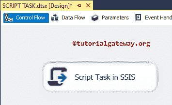

在开始配置 SSIS 脚本任务之前，让我们创建四个变量。要创建变量，右键单击控制流区域，它将打开上下文菜单来选择变量选项。一旦选择了变量选项，它将打开名为变量的新窗口来创建新变量。

这里你可以创建 n 个变量

*   电子邮件发件人:请指定您要发送电子邮件的电子邮件标识。
*   电子邮件收件人:请指定您要向其发送电子邮件的电子邮件标识。
*   电子邮件主题:请指定要包含的主题
*   邮件正文:请指定邮件。它可以是纯文本或超文本标记语言消息

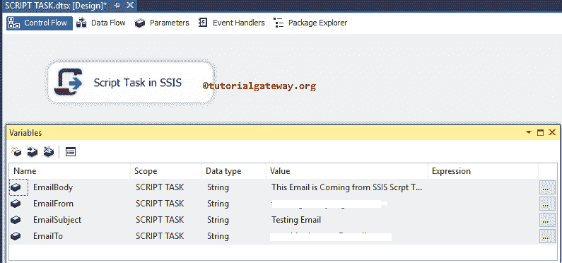

双击脚本任务将打开以下编辑器来配置 SSIS 脚本任务组件

*   入口点:请指定 [SSIS](https://www.tutorialgateway.org/ssis/) 运行时调用的方法名作为入口点。您在这里指定的方法名必须在 ScriptMain 类中。请记住，您可以根据自己的需要更改名称，当您更改名称时，必须在 ScriptMain 类中进行更改

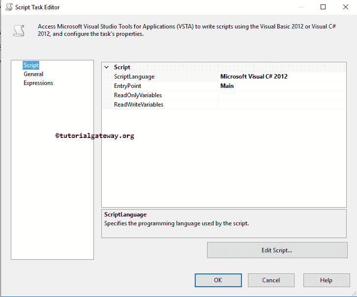

### SSIS 脚本任务常规选项卡

请单击常规选项卡更改默认名称和描述。

*   名称:请提供唯一的名称
*   描述:简要描述 SSIS 脚本任务功能。提供有效的描述始终是一种良好的做法。

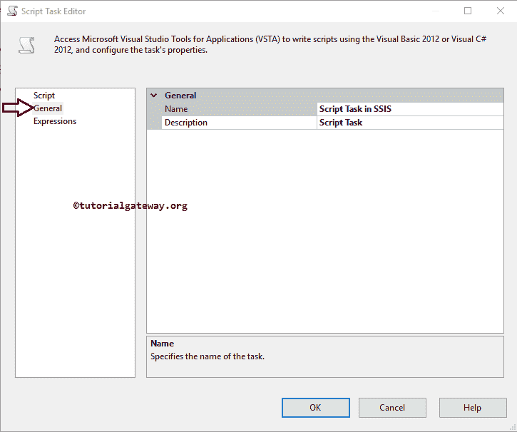

脚本语言:微软提供了两种流行的语言:作为脚本语言使用的 Visual Basic (VB)和 C#语言。我对 C#非常熟悉，所以我选择 C#作为我的脚本语言。

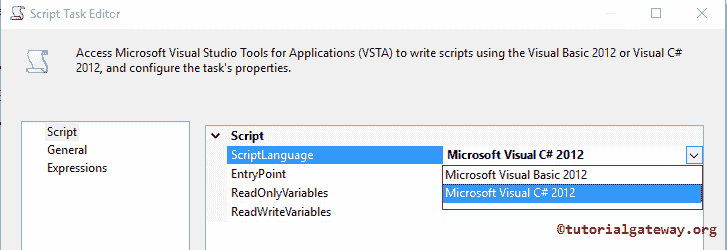

*   ReadOnlyVariables:请选择要在 SSIS 脚本任务中使用的变量，它们可以是用户定义的变量或系统默认变量。请记住，选择为只读的变量是用于只读目的的变量(我们不能更改它们)
*   读写变量:请选择要在脚本任务中使用的变量，它们可以是用户定义的变量或系统默认变量。请记住，作为读写变量选择的变量可以根据我们的要求进行更改

要选择变量，请点击 Eclipse (…)按钮 ReadOnlyVariables 选项

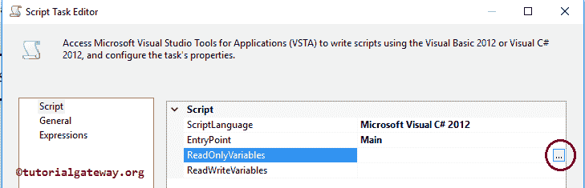

一旦你点击 Eclipse (…)按钮，选择变量窗口将会打开。请选择先前创建的变量

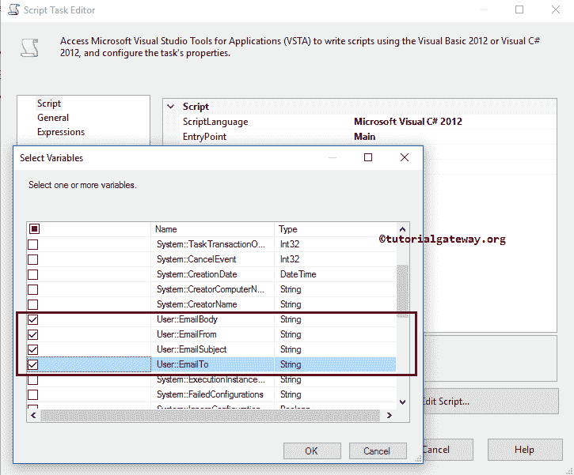

### 在 SSIS 脚本任务中添加 C#代码

选择所需变量后，请单击编辑脚本..按钮编写实际的 C#脚本

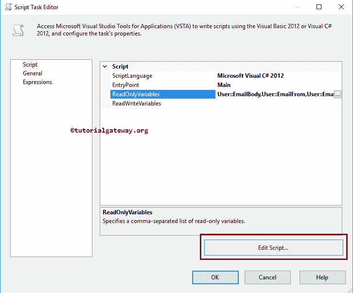

一旦你点击编辑脚本，它就会打开 ScriptMain.cs 类文件来编写 C#代码。

要从 C#发送电子邮件，我们需要添加两个引用或导入引用，称为:使用 System.Net；和使用系统。网络邮件；

提示:如果你是 VB 开发人员，那么它应该类似于脚本主. vb

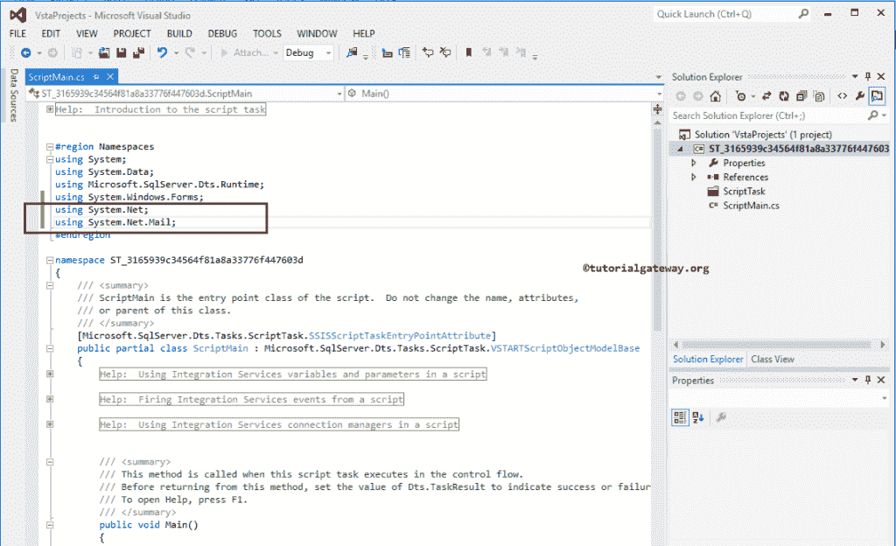

接下来，在 Main()函数中添加您的代码。请记住，如果您的代码很长或很健壮，请尝试通过创建方法来划分代码

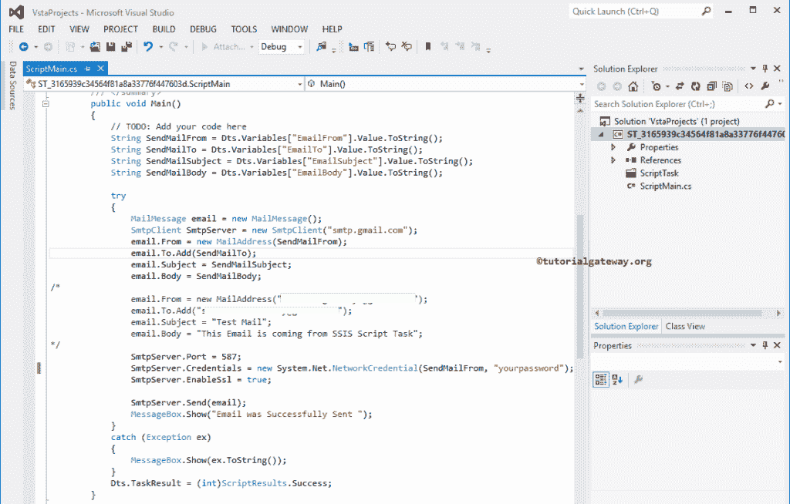

我们在上面截图中用于这个 SSIS 脚本任务的 C#代码是:

```
// C# Script for Script Task in SSIS
String SendMailFrom = Dts.Variables["EmailFrom"].Value.ToString();
String SendMailTo = Dts.Variables["EmailTo"].Value.ToString();
String SendMailSubject = Dts.Variables["EmailSubject"].Value.ToString();
String SendMailBody = Dts.Variables["EmailBody"].Value.ToString();

try
  {
     MailMessage email = new MailMessage();
     SmtpClient SmtpServer = new SmtpClient("smtp.gmail.com");
     // START
     email.From = new MailAddress(SendMailFrom);
     email.To.Add(SendMailTo);
     email.Subject = SendMailSubject;
     email.Body = SendMailBody;
     //END

     SmtpServer.Port = 587;
     SmtpServer.Credentials = new System.Net.NetworkCredential(SendMailFrom, "your password");
     SmtpServer.EnableSsl = true;

     SmtpServer.Send(email);
     MessageBox.Show("Email was Successfully Sent ");
  }
catch (Exception ex)
  {
      MessageBox.Show(ex.ToString());
  }
Dts.TaskResult = (int)ScriptResults.Success;
```

如果您忘记创建变量(或者您发现创建变量很困难)，那么您可以删除前四行代码，并用下面显示的代码替换//Start… END 之间的代码

```
// SSIS Script Task Example
email.From = new MailAddress("[email protected]");
email.To.Add("[email protected]");
email.Subject = "Test Mail";
email.Body = "This Email is coming from SSIS Script Task";
```

完成编辑后，请关闭脚本主文件和脚本任务编辑器。让我们运行 SSIS 脚本任务包

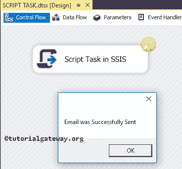

从上面的截图中，你可以观察到 SSIS 脚本任务成功，我们得到了一个消息框，说电子邮件发送成功。让我打开我的 Gmail

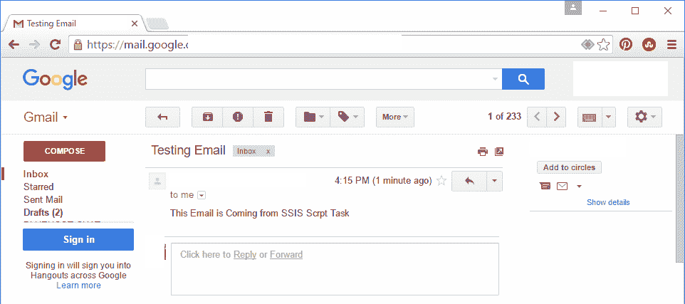

从上面的截图中，您可以看到我们收到了带有我们指定的消息的电子邮件。

### 此脚本任务需要记住的要点:

*   如果您想在每次数据加载后向您的经理(或您自己)发送电子邮件，您可以将此 SSIS 脚本任务与数据流任务一起使用。
*   始终使用变量来存储电子邮件、密码、主题或 SMTP 凭据。
*   如果出现说明安全连接的错误，请在您的 Gmail 帐户设置中转到不太安全的应用，并打开访问不太安全的应用选项。