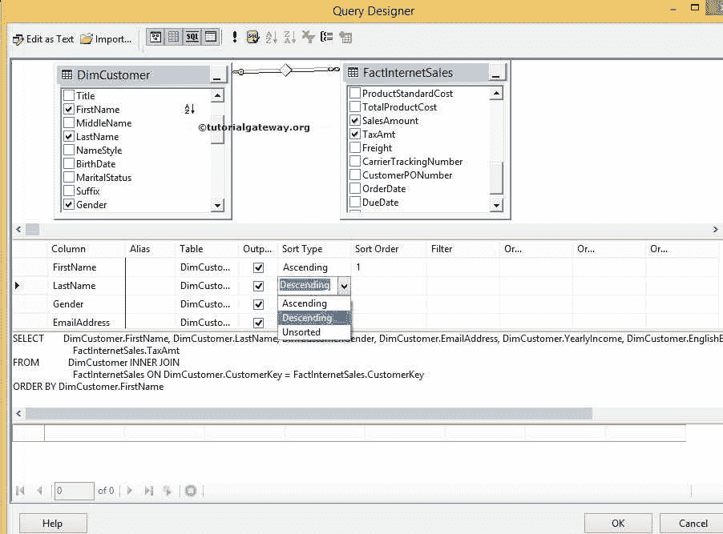
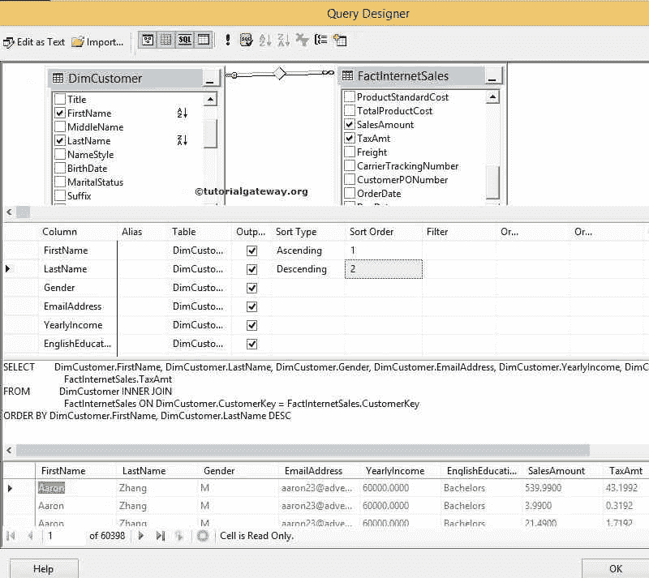

# SSRS 查询设计器

> 原文：<https://www.tutorialgateway.org/ssrs-query-designer/>

SSRS 查询设计器使开发人员能够轻松设计 SQL 查询。如果您不知道如何编写 SQL 查询，或者您发现执行分组、排序和连接操作很有挑战性。

或者，如果您发现设计复杂的 SQL 查询具有挑战性，请使用 SSRS 查询设计器使用图形用户界面创建您想要的查询。

## SSRS 查询设计器示例

在本例中，我们将向您展示如何使用 SSRS 查询设计器设计一个 [SQL](https://www.tutorialgateway.org/sql/) 查询。对于这个例子，我们将针对冒险工作数据仓库数据库设计查询。

首先，右键单击[共享数据集](https://www.tutorialgateway.org/shared-dataset-in-ssrs/)，然后单击添加新数据集选项。接下来，选择查询类型为文本，点击 [SSRS](https://www.tutorialgateway.org/ssrs/) 查询设计器按钮，如下图所示。

单击查询设计器按钮后，它将在单独的窗口中打开查询设计器。在设计 SQL 查询之前，您应该了解 SSRS 查询设计器中存在的不同窗格。

*   图表窗格:该窗格用于选择表、视图或函数。SSRS 查询设计器将根据数据库关系自动连接这些表。选择所需的表后，我们可以通过选中标记列来选择所需的列。
*   网格窗格:所有选定的列都将显示在该窗格中。该窗格便于应用排序(按 ASC 排序和按 DESC 排序)以及对列名分组(按[分组和按](https://www.tutorialgateway.org/sql-group-by-clause/)语句分组)
*   SQL 窗格:SSRS 查询设计器将在此窗格中自动为我们构建 SQL 查询。
*   结果窗格:一旦您完成了 SQL 查询的设计，那么单击执行按钮将在此窗格中显示 SQL 查询结果。

右键单击图表窗格将打开上下文菜单。单击添加表..选项并添加所需的表。

从下面的截图中，您可以看到我们选择了客户表和事实互联网销售表。请通过在图表窗格中选中标记列名来选择所需的列。

从上面的截图中，您可以观察到 SSRS 查询设计器使用 CustomerKey 列在两个表 Customers 和 Fact Internet Sales 之间自动应用了[内部连接](https://www.tutorialgateway.org/sql-inner-join/)。

排序:在网格窗格中，请根据您的要求将排序类型更改为升序或降序。在这个 SSRS 查询设计器示例中，我们正在对名字升序和姓氏降序

进行排序

请根据您的要求更改排序选项。对于本例，它将首先按升序按名对数据进行排序，然后按降序按姓对数据进行排序。

从上面的截图中，您可以看到由 SSRS 查询设计器生成的最终的 SQL 查询。通过单击顶部的执行按钮，让我们看看构建的查询是否正在完美地执行。

构建的查询正在完美地执行。如果您希望看到该查询后面生成的代码，请选择设计器顶部的“编辑为文本”选项。

现在，你可以看到结果了。点击【确定】按钮，在 SSRS

使用查询生成器工具完成 SQL 查询设计