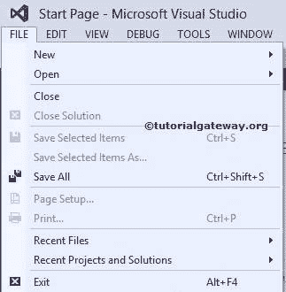
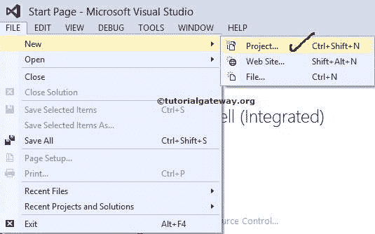
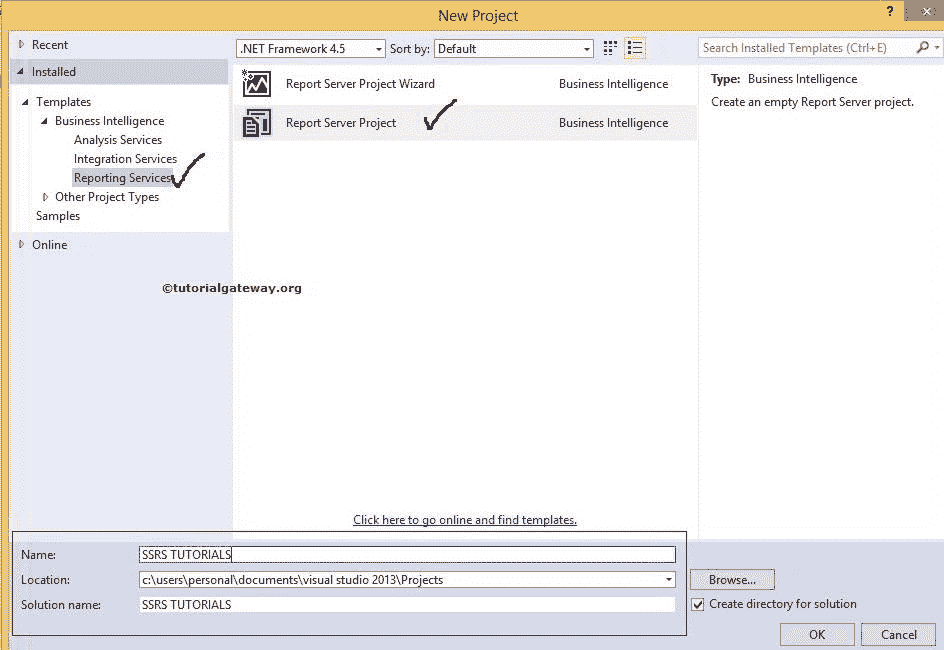

# 在 SSRS 创建新项目

> 原文：<https://www.tutorialgateway.org/create-new-project-in-ssrs/>

SQL Server Reporting Services(简称 SSRS)是一个基于服务器的报告平台，用于创建和管理表、矩阵、图形、图表和自由格式的报告。我们创建的报告可以通过全球连接进行访问和管理。

在本文中，我们将通过一个示例向您展示在 SSRS 创建新项目的分步方法。

提示:SSRS 可以从关系数据源和多维数据源中提取数据来生成报告。

## 如何在 SSRS 创建一个新项目

在本例中，我们将向您展示在 SSRS 创建新项目的步骤。为此，首先双击商业智能开发工作室(简称为 BIDS)，然后从菜单项

中选择文件选项

请选择新建，然后选择新建项目…选项创建新的 [SSRS](https://www.tutorialgateway.org/ssrs/) 项目

T4】

一旦点击新建项目…选项，将打开新建项目窗口，从可用项目模板

中选择所需项目

单击“确定”完成创建新的 SQL Server 报告服务项目。现在，如果您查看解决方案资源管理器，您可以理解解决方案名称和项目名称。

从上面的截图中，你可以看到我们在 SSRS 新项目下有三个文件夹

*   共享数据源:如果您想为多个报告、报告模型和订阅共享同一个数据源，那么我们必须创建一个共享数据源。请参考 [SSRS 共享数据源](https://www.tutorialgateway.org/ssrs-shared-data-source/)文章了解数据源配置
*   共享数据集:如果您想与多个报告共享同一个数据集，那么我们必须创建一个共享数据集。请参考 SSRS 文章中的[共享数据集了解数据集配置。](https://www.tutorialgateway.org/shared-dataset-in-ssrs/)
*   报告:此文件夹用于创建 SSRS 报告。如果您想使用向导创建报告，请参考 [SSRS 表格报告使用向导](https://www.tutorialgateway.org/creating-ssrs-report-using-report-wizard/)一文。否则，参见 [SSRS 表格报告](https://www.tutorialgateway.org/ssrs-table-report/)一文