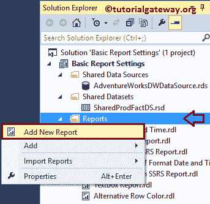
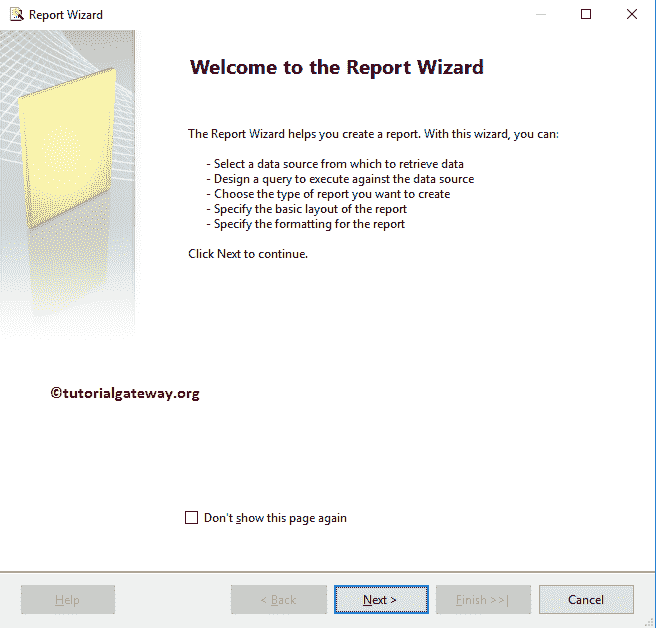
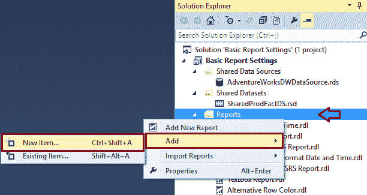
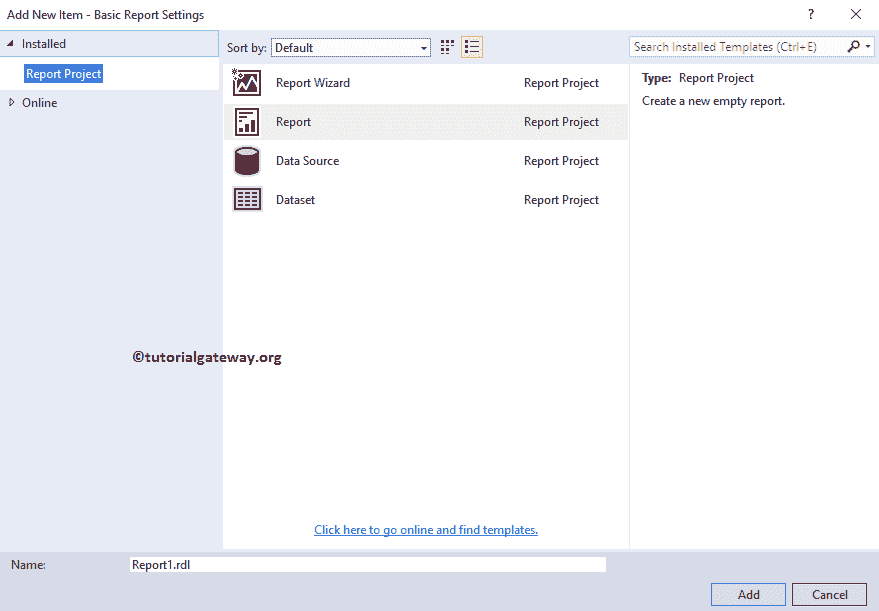
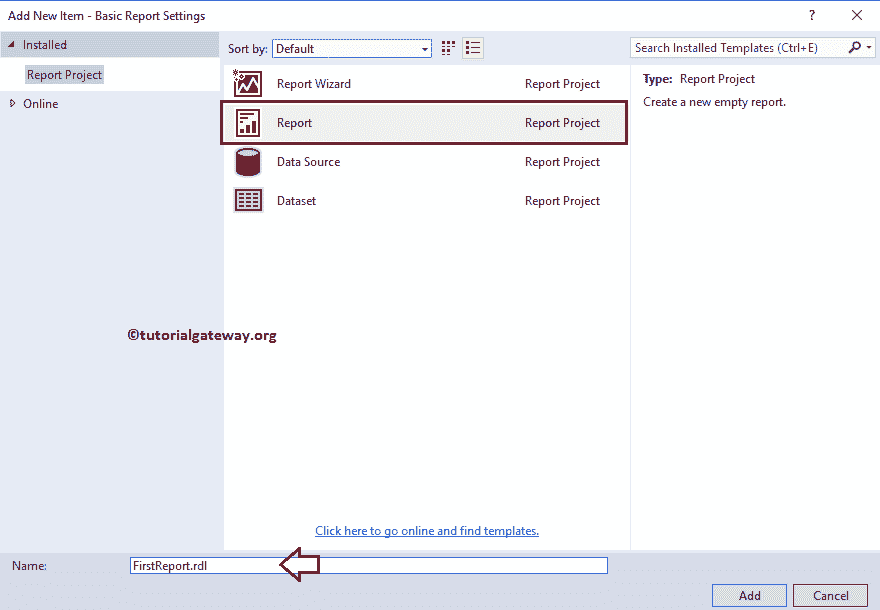
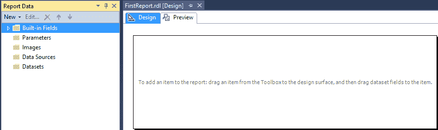
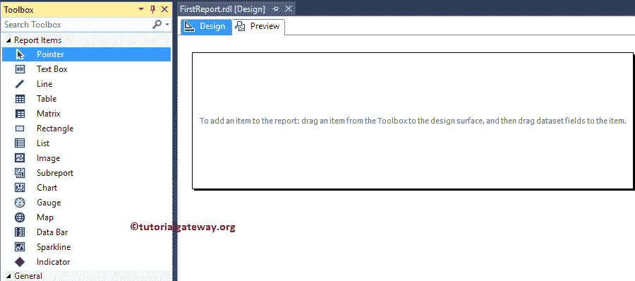

# 在 SSRS 创建新报告

> 原文：<https://www.tutorialgateway.org/create-a-new-report-in-ssrs/>

在本文中，我们将通过一个示例向您展示如何在 SSRS 创建新报告。对于这个 SQL 报告演示，我们将使用下面显示的数据源和数据集。

请参考[共享数据源](https://www.tutorialgateway.org/ssrs-shared-data-source/)和[数据集](https://www.tutorialgateway.org/shared-dataset-in-ssrs/)文章，了解我们在 [SSRS](https://www.tutorialgateway.org/ssrs/) 创建新报告时使用的创建共享数据源和数据集的步骤。

## 创建新的 SSRS 报告

创建新的[项目](https://www.tutorialgateway.org/create-new-project-in-ssrs/)后，我们在解决方案资源管理器中有三个文件夹，如[共享数据源](https://www.tutorialgateway.org/ssrs-shared-data-source/)、[共享数据集](https://www.tutorialgateway.org/shared-dataset-in-ssrs/)和报告。“报告”文件夹足以设计基本报告。

我们可以通过多种方式创建新的 SSRS 报告:使用报告向导和正常模式。

### 使用向导创建 SSRS 报告

首先，我们将向您展示第一个选项，然后我们将展示另一个选项。右键单击报告文件夹将打开上下文菜单，请从中选择第一个选项添加新报告。

单击该选项后，将打开 SSRS 报告向导。第一页是欢迎屏幕。由于我们已经解释了使用向导创建报告的步骤，请参考[使用向导创建](https://www.tutorialgateway.org/creating-ssrs-report-using-report-wizard/)一文。

### 不使用向导创建 SSRS 报告

一般来说，我们不使用向导生成任何报告。通常要创建报告，首先要转到解决方案资源管理器。接下来，在解决方案资源管理器中，右键单击报告文件夹->添加->新建项目

它将打开包含所有可用选项的“添加新项目”窗口。请选择该选项，并根据您的要求将其重命名。

让我将新创建的 SSRS 报告名称更改为更有意义的名称(FirstReport.rdl)

单击添加按钮后，将生成具有指定名称的新 SSRS 报告。如果您观察报告数据窗格，我们有五个不同的文件夹。

*   内置字段:这些是 SSRS 提供的[内置字段](https://www.tutorialgateway.org/global-references-in-ssrs/)。您可以使用这些项目来显示页码、标题。
*   参数:使用此文件夹创建参数。后来，这些参数在报告中使用。请参考[报告参数](https://www.tutorialgateway.org/ssrs-report-parameters/)一文，了解创建参数涉及的步骤。
*   图像:用于添加图像。请参考[显示图片](https://www.tutorialgateway.org/display-image-in-ssrs-report/)报道文章了解相同内容。
*   数据源:该文件夹用于创建嵌入式数据源。请参考[嵌入式数据源](https://www.tutorialgateway.org/embedded-data-source-in-ssrs/)一文。
*   数据集:该文件夹用于创建嵌入式数据集。请参考[嵌入式数据集](https://www.tutorialgateway.org/embedded-dataset-in-ssrs/)一文。

从下面的截图中，您可以看到报告项目列表。我们必须使用这些 [SSRS 项目](https://www.tutorialgateway.org/ssrs-report-items/)根据客户要求创建报告。

