# SSRS 共享数据源

> 原文：<https://www.tutorialgateway.org/ssrs-shared-data-source/>

在 SSRS，数据源是一种连接设置，用于连接底层数据库或数据仓库。SSRS 共享数据源是提供程序名称、服务器实例名称、数据库名称和数据库凭据的组合。

SQL Server Reporting Services 支持两种类型的数据源:共享数据源和[嵌入式数据源](https://www.tutorialgateway.org/embedded-data-source-in-ssrs/)。在本文中，我们将向您展示创建 SSRS 共享数据源的步骤。

SSRS 共享数据源:如果您想为多个报表、报表模型和订阅共享同一个数据源，那么我们必须创建一个共享数据源。以下是 SSRS 共享数据源的一些用途:

*   它可以创建一次并在多个报告中使用。
*   如果要更改数据源，可以一次到位，并且会反映在所有的支持报表中。

## 创建 SSRS 共享数据源

创建新的 SQL Reporting Services 项目(SSRS 项目)后，解决方案资源管理器如下所示

提示:请参考[创建 SSRS 项目](https://www.tutorialgateway.org/create-new-project-in-ssrs/)文章，了解创建新项目所涉及的步骤。

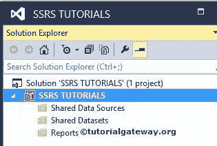

要创建 SSRS 共享数据源，右键单击解决方案资源管理器中的共享数据源文件夹，并从上下文菜单

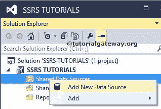

中选择添加新数据源选项

或者，您可以选择“添加”选项，并从上下文菜单中选择“新建项目”选项。它打开一个新窗口，选择新数据源选项

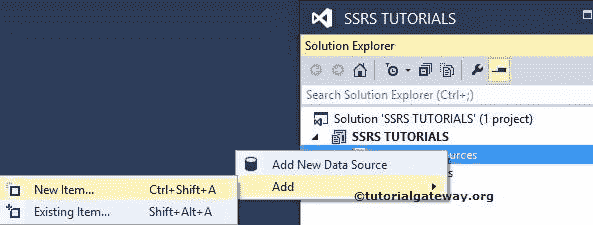

在本例中，我们从上下文菜单中选择了添加新数据源选项。单击该选项后，它将打开共享数据源属性窗口来配置 SSRS 共享数据源。以下是“共享数据源属性”窗口中的属性

*   名称:请为要创建的数据源指定一个有效的唯一名称。
*   类型:请从下拉列表中选择连接类型
*   连接字符串:如果你知道，如何写连接字符串，那就写在这里。如果没有，请单击“编辑”按钮指定数据源(提供程序)、服务器实例名称、登录凭据和数据库名称。

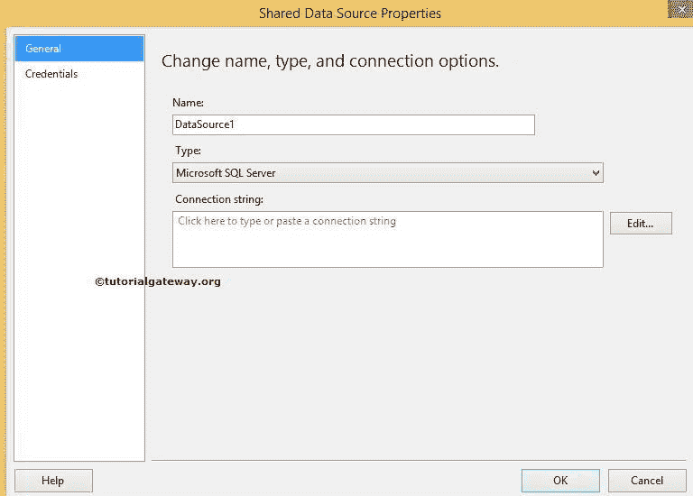

下面的截图将向您展示支持类型。例如，如果你的数据源是 [SQL Server](https://www.tutorialgateway.org/sql/) ，那么选择微软 SQL Server 或者 OLE DB。如果您的数据源是 SQL Server 分析服务，则选择 Microsoft SQL Server 分析服务。

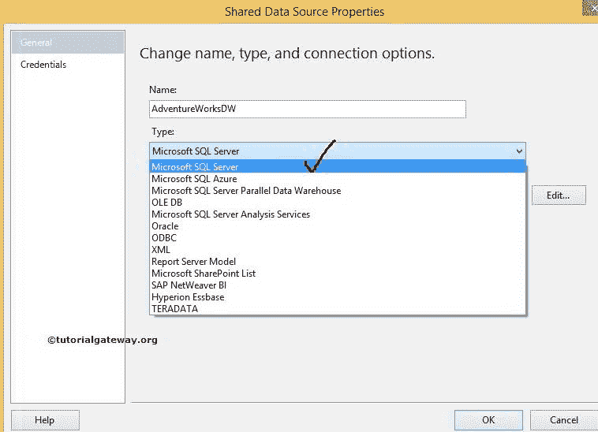

点击上面截图中的编辑按钮将打开另一个窗口来配置连接属性。在这里，我们必须指定数据源(提供程序)、服务器名称(或实例名称)、登录凭据和数据库名称。

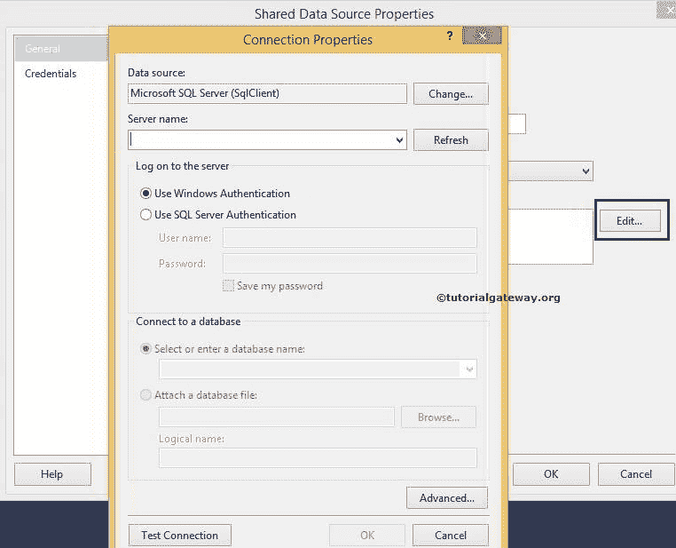

在这个 SSRS 共享数据源示例中，

*   数据源:我们正在从 SQL Server 检索数据，所以我们选择了微软 [SQL Server](https://www.tutorialgateway.org/sql/) (SqlClient)。您可以根据自己的需要更改此选项。
*   服务器名:请指定服务器名。目前，我们使用本地主机名。
*   登录到服务器:请指定您希望如何登录到 SQL Server。目前，我们正在使用 windows 身份验证。

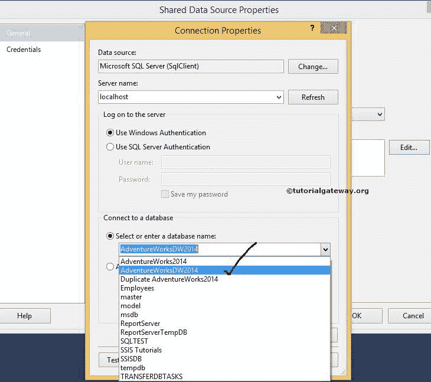

从上面的截图中，您可以看到我们正在使用从列表中选择[AdventureWorksDW2014]数据库。

注意:在这里，我们使用本地数据库，所以我们使用 windows 凭据。实时地，您必须选择 SQL Server 身份验证，并提供由数据库管理员或您的团队领导提供的凭据。

单击下面提供的“测试连接”按钮，检查连接是否成功。

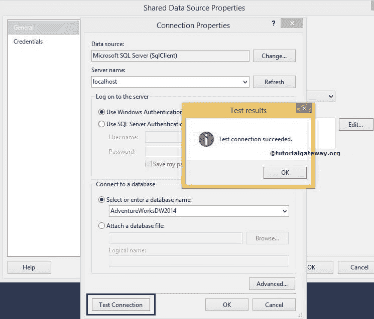

单击“确定”完成连接属性的配置。

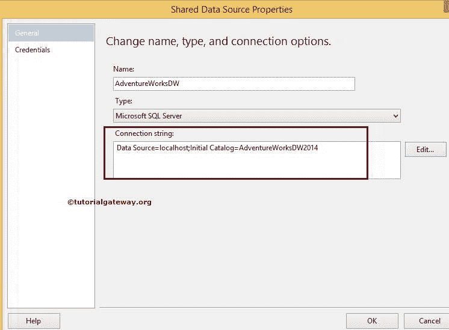

SSRS 共享数据源的凭据选项卡:

*   使用窗口身份验证:它将使用当前用户窗口凭据连接到数据源。目前，我们正在使用这个选项
*   使用此用户名和密码:请指定用户名和密码以登录数据源。报告将使用此用户名和密码连接到数据源
*   提示输入凭据:当报表连接到数据源时，它将提示给定的文本(要求输入凭据)。
*   不使用凭据:报表不会使用任何凭据来连接数据源。

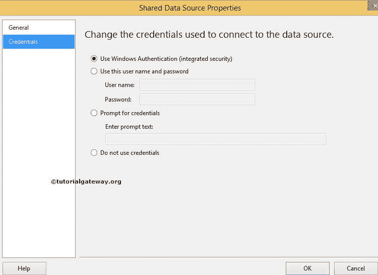

单击“确定”完成创建 SSRS 共享数据源。让我们在解决方案资源管理器中看到。

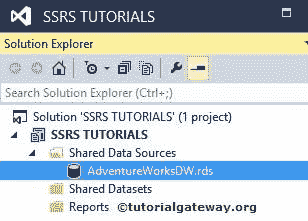