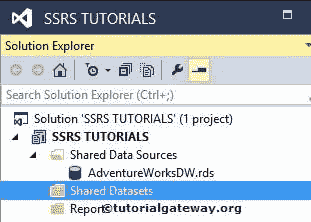
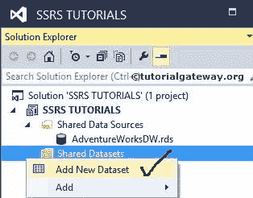
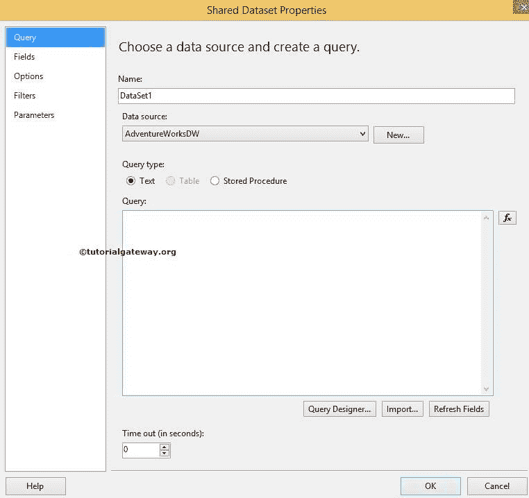
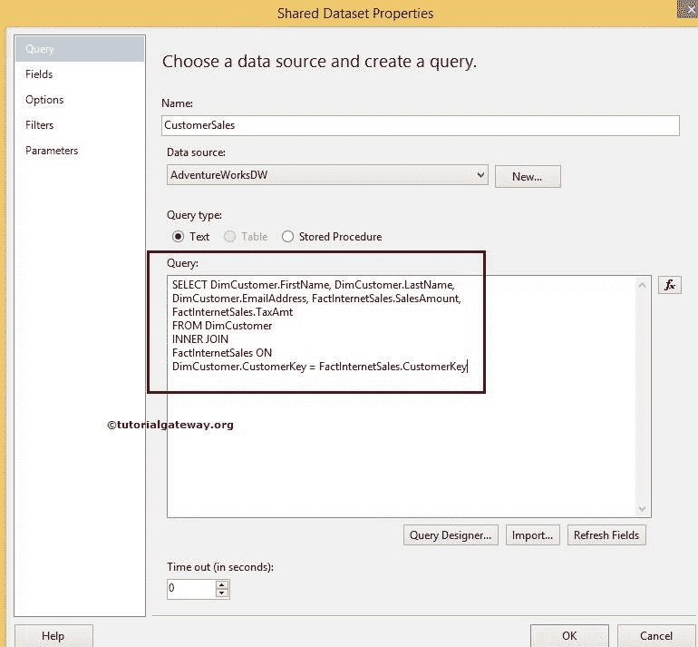
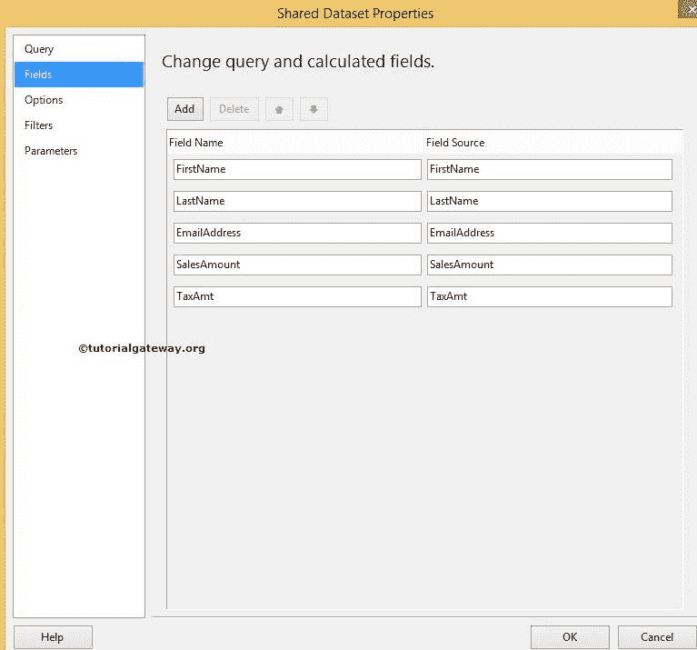
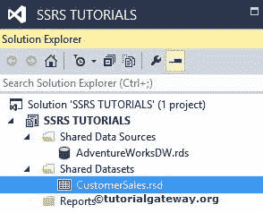

# SSRS 的共享数据集

> 原文：<https://www.tutorialgateway.org/shared-dataset-in-ssrs/>

在 SSRS，数据集是一个 SQL 命令，用于从数据源检索数据以创建报告。数据集由 SQL 命令、参数、过滤器等组成。SQL Server Reporting Services 支持两种类型的数据集:共享数据集和[嵌入式数据集](https://www.tutorialgateway.org/embedded-dataset-in-ssrs/)。在本文中，我们将向您展示在 SSRS 创建共享数据集所涉及的步骤

SSRS 共享数据集:如果您想与多个报告共享同一个数据集，那么我们必须创建一个共享数据集。以下是 SSRS 共享数据集的一些用途:

*   它可以创建一次并在多个报告中使用。
*   如果您想更改数据集，您可以一次完成，它将反映在所有支持报告中。

## 在 SSRS 创建共享数据集

创建新的 SQL Reporting Services 项目( [SSRS](https://www.tutorialgateway.org/ssrs/) 项目)后，解决方案资源管理器如下所示。我们在之前的文章



中已经创建了[共享数据源](https://www.tutorialgateway.org/ssrs-shared-data-source/)

要在 SSRS 创建共享数据集，请右键单击解决方案资源管理器中的共享数据集文件夹。接下来，从上下文菜单中选择添加新数据集选项。或者，您可以选择“添加”选项，然后从上下文菜单中选择“新建项目”选项。

它将打开一个新窗口，在该窗口中，您可以选择新数据集选项



在本例中，我们从上下文菜单中选择了添加新数据集选项。单击该选项后，它将打开共享数据集属性窗口来配置 SSRS 数据集。以下是“共享数据源属性”窗口中的属性

*   名称:请为要创建的数据集指定一个有效的唯一名称。
*   数据源:如果已经创建，请从下拉列表中选择数据源。如果没有，请点击新建按钮创建 [SSRS 共享数据源](https://www.tutorialgateway.org/ssrs-shared-data-source/)
*   查询类型:它允许我们从 3 个选项中进行选择。
    *   文本:您必须编写 SQL 查询或使用查询设计器
    *   表:选择要用于此 SSRS 共享数据集的表。
    *   存储过程:您必须选择要使用的存储过程。
*   查询设计器:如果不知道如何编写 [SQL](https://www.tutorialgateway.org/sql/) 查询，那么可以选择这个选项。它将允许您使用图形用户界面进行设计。请参考 [SSRS 查询设计器](https://www.tutorialgateway.org/ssrs-query-designer/)文章，了解其中涉及的步骤。
*   超时:它允许您指定查询执行时间。



注意:要在 SSRS 创建共享数据集，我们只需要一个共享数据源。

从下面的截图中你可以观察到我们正在选择文本类型



[SQL](https://www.tutorialgateway.org/sql/) 我们在上面截图中使用的查询是:

```
SELECT DimCustomer.FirstName, 
       DimCustomer.LastName, 
       DimCustomer.EmailAddress, 
       FactInternetSales.SalesAmount, 
       FactInternetSales.TaxAmt 
FROM DimCustomer 
   INNER JOIN 
     FactInternetSales ON 
DimCustomer.CustomerKey = FactInternetSales.CustomerKey
```

提示:请参考 [SQL 内部连接](https://www.tutorialgateway.org/sql-inner-join/)文章了解内部连接。

您可以通过选择字段选项来检查可用字段。它还允许您更改列名。



单击确定完成在 SSRS 创建共享数据集。让我们在解决方案资源管理器中看到。

