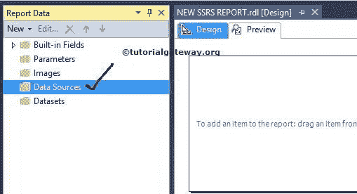
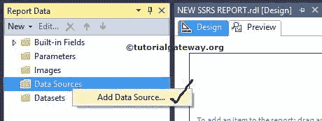
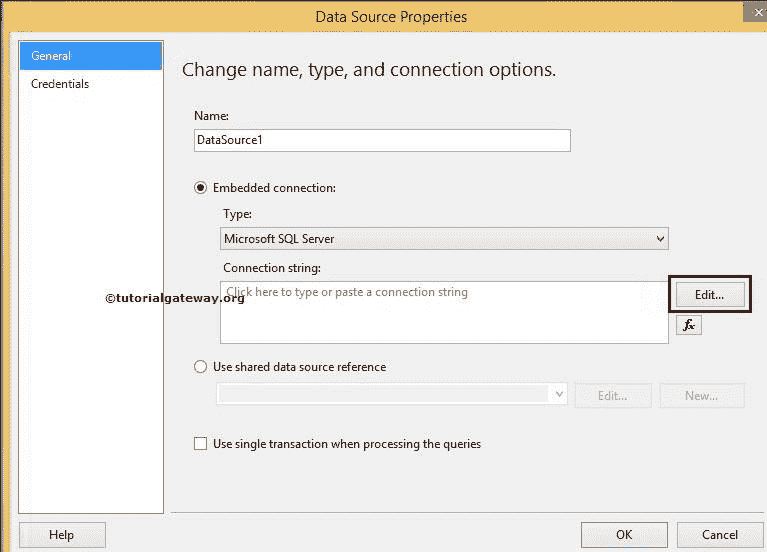
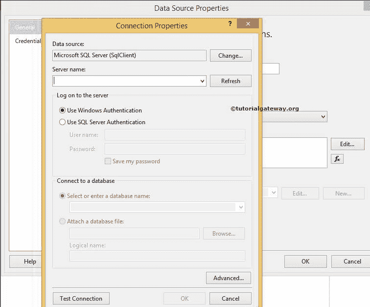
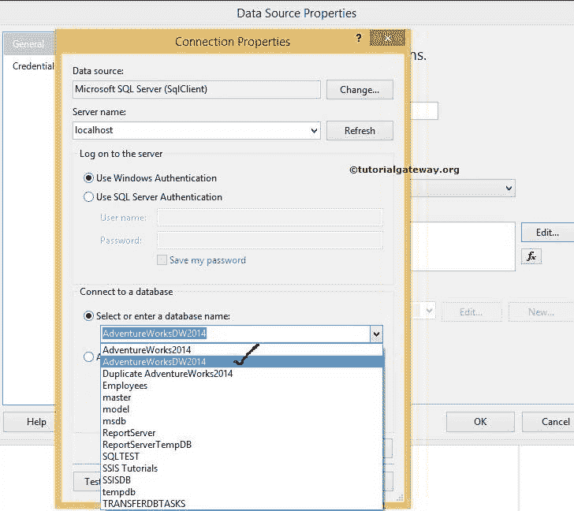
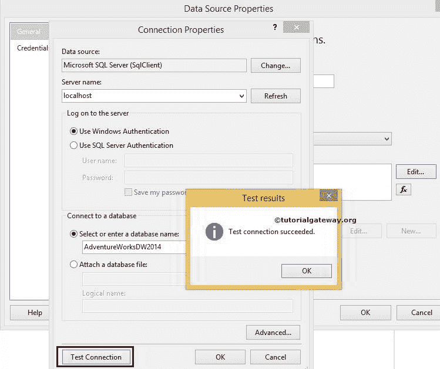
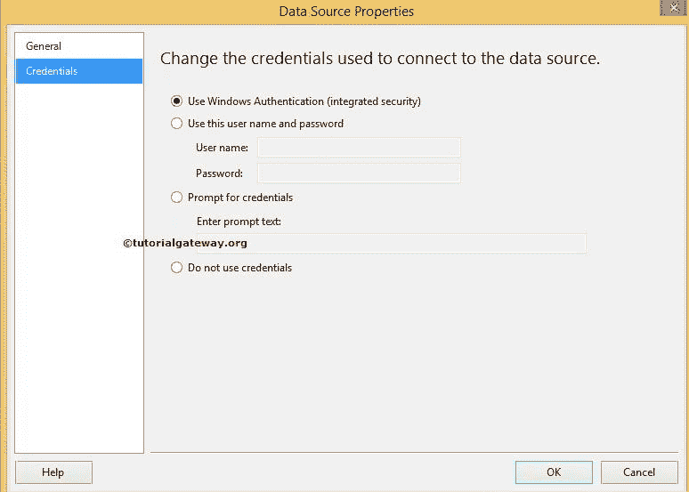
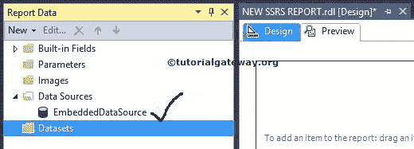

# SSRS 的嵌入式数据源

> 原文：<https://www.tutorialgateway.org/embedded-data-source-in-ssrs/>

在 SQL Server Reporting Services 中，数据源是一种连接设置，用于连接基础数据库或数据仓库。在本文中，我们将向您展示在 SSRS 创建嵌入式数据源所涉及的步骤，这是一个实际的例子。

SSRS 嵌入式数据源是提供程序名称、服务器实例名称、数据库名称和数据库凭据的组合。SQL Server Reporting Services 支持两种类型的数据源:[共享数据源](https://www.tutorialgateway.org/ssrs-shared-data-source/)和嵌入式数据源。

SSRS 嵌入式数据源:如果您想在单个报表中使用数据源，那么创建共享数据源是没有意义的。在这些情况下，我们创建 SSRS 嵌入式数据源

## 在 SSRS 创建嵌入式数据源

创建新的 SQL Reporting Services 项目( [SSRS](https://www.tutorialgateway.org/ssrs/) 项目)后，报表数据如下所示。

要在 SSRS 创建嵌入式数据源，右键单击报告数据中的数据源文件夹，并从上下文菜单

中选择添加数据源选项

单击该选项后，它将打开数据源属性窗口来配置 SSRS 数据源。以下是“SSRS 嵌入式数据源属性”窗口中的属性

*   名称:请为要创建的数据源指定一个有效的唯一名称。
*   类型:请从下拉列表中选择连接类型。SSRS 数据源支持多种连接类型。例如，如果你的数据源是 [SQL Server](https://www.tutorialgateway.org/sql/) ，那么选择微软 SQL Server 或者 OLE DB。如果您的数据源是 SQL Server 分析服务，则选择 Microsoft SQL Server 分析服务。
*   连接字符串:如果你知道，如何写连接字符串，那就写在这里。如果没有，请单击“编辑”按钮来指定数据源(提供程序)、服务器实例名称、登录凭据和数据库名称。

提示:如果要使用已创建的共享数据源，请选择“使用共享数据源引用”单选按钮，并从下拉列表中选择现有的共享数据源。

点击上面截图中的编辑按钮将打开另一个窗口来配置连接属性。在这里，我们必须指定数据源(提供程序)、服务器名称(或实例名称)、登录凭据和数据库名称。

在这个 SSRS 嵌入式数据源示例中，

*   数据来源:我们正在从 [SQL Server](https://www.tutorialgateway.org/sql/) 中检索数据，所以我们选择了微软 SQL Server (SqlClient)。您可以根据自己的需要更改此选项。
*   服务器名:请指定服务器名。目前，我们使用本地主机名。
*   登录到服务器:请指定您希望如何登录到 SQL Server。目前，我们正在使用 windows 身份验证。

从上面的截图中，您可以看到我们正在使用从列表中选择[AdventureWorksDW2014]数据库。

单击下面提供的“测试连接”按钮，检查连接是否成功。

单击“确定”完成 SSSR 嵌入式数据源连接属性的配置。

凭据选项卡:

*   使用窗口身份验证:它将使用当前用户窗口凭据连接到数据源。目前，我们正在使用这个选项
*   使用此用户名和密码:请指定用户名和密码以登录数据源。报告将使用此用户名和密码连接到数据源
*   提示输入凭据:当报表建立到数据源的连接时，它将提示给定的文本(要求输入凭据)。
*   不使用凭据:报表不会使用任何凭据来连接数据源。

单击“确定”完成在 SSRS 创建嵌入式数据源。让我们在报告数据选项卡

中看到