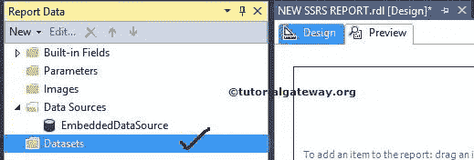
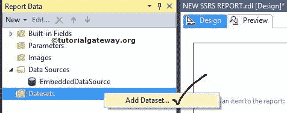
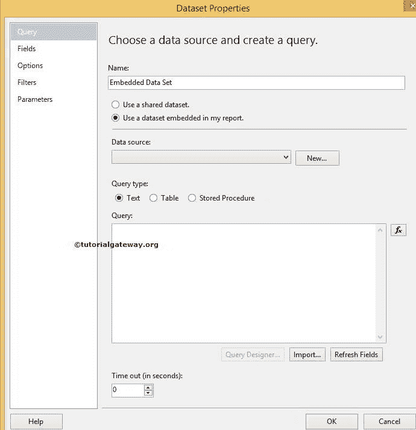
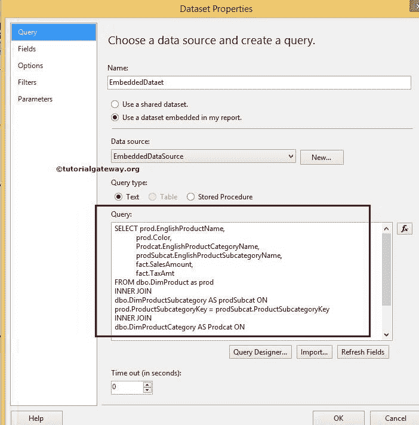
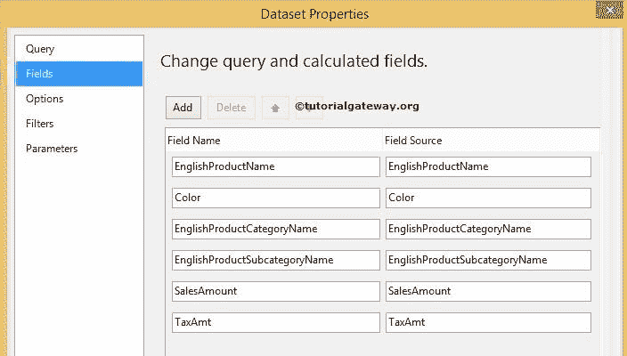
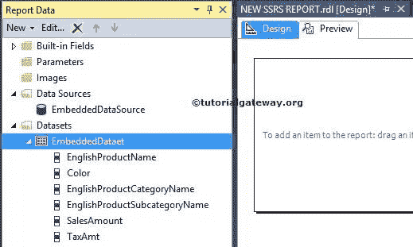

# SSRS 的嵌入式数据集

> 原文：<https://www.tutorialgateway.org/embedded-dataset-in-ssrs/>

在 SQL Server 报表服务中，数据集是一个 SQL 命令，用于从数据源检索数据以创建报表。SSRS 嵌入式数据集由 SQL 命令、参数、过滤器等组成。

SQL Server Reporting Services 支持两种类型的数据集:[共享数据集](https://www.tutorialgateway.org/shared-dataset-in-ssrs/)和嵌入式数据集。在本文中，我们将通过一个示例向您展示在 SSRS 创建嵌入式数据集所涉及的步骤。

SSRS 嵌入式数据集:如果您想在单个报表中使用数据集，那么创建共享数据集是没有意义的。在这些情况下，我们在 SSRS 创建嵌入式数据集

## 在 SSRS 创建嵌入式数据集

创建新的 SQL Reporting Services 项目(SSRS 项目)后，“报告数据”选项卡如下所示。我们在之前的文章



中已经创建了[嵌入式数据源](https://www.tutorialgateway.org/embedded-data-source-in-ssrs/)

要在 SSRS 创建嵌入式数据集，请右键单击报告数据选项卡中的数据集文件夹，并从上下文菜单中选择添加数据集选项。



单击该选项后，它将打开数据集属性窗口来配置 [SSRS](https://www.tutorialgateway.org/ssrs/) 数据集。以下是 SSRS 嵌入式数据集属性窗口中的属性

*   名称:请为要创建的数据集指定一个有效的唯一名称。
*   数据源:如果已经创建，请从下拉列表中选择数据源。如果没有，请点击新建按钮在 SSRS 创建[嵌入式数据源](https://www.tutorialgateway.org/embedded-data-source-in-ssrs/)
*   查询类型:它允许我们从 3 个选项中进行选择。
    *   正文:你必须写 [SQL](https://www.tutorialgateway.org/sql/) 查询或者使用查询设计器
    *   表:你要选择你要使用的[表](https://www.tutorialgateway.org/sql-create-table/)。
    *   存储过程:你必须选择你想要使用的[存储过程](https://www.tutorialgateway.org/stored-procedures-in-sql/)。
*   查询设计器:如果你不知道如何编写 SQL 查询，那么你可以选择这个选项。它将允许您使用图形用户界面进行设计。请参考 [SSRS 查询设计器](https://www.tutorialgateway.org/ssrs-query-designer/)文章，了解其中涉及的步骤。
*   超时:指定查询执行时间。



提示:如果要使用已创建的共享数据集，请选择使用共享数据集选项，并从下拉列表中选择所需的数据集。

从下面的截图中，我们选择了嵌入式数据源作为数据源，这是我们在之前的文章中创建的。接下来，我们选择文本类型作为查询类型。



[SQL](https://www.tutorialgateway.org/sql/) 我们在上面截图中使用的查询是:

```
SELECT prod.EnglishProductName, 
       prod.Color, 
       Prodcat.EnglishProductCategoryName, 
       prodSubcat.EnglishProductSubcategoryName, 
       fact.SalesAmount, 
       fact.TaxAmt 
FROM dbo.DimProduct as prod 
  INNER JOIN 
dbo.DimProductSubcategory AS prodSubcat ON 
prod.ProductSubcategoryKey = prodSubcat.ProductSubcategoryKey 
  INNER JOIN  
dbo.DimProductCategory AS Prodcat ON 
prodSubcat.ProductCategoryKey = Prodcat.ProductCategoryKey 
  INNER JOIN  
dbo.FactInternetSales AS fact ON 
fact.ProductKey = prod.ProductKey
```

提示:请参考 [SQL 内部连接](https://www.tutorialgateway.org/sql-inner-join/)文章了解内部连接。

您可以通过选择字段选项来检查可用字段。它还允许您更改列名。



单击确定完成在 SSRS 创建嵌入式数据集。让我们在“报告数据”选项卡的“数据集”文件夹中查看。



提示:现在您可以在报表设计中使用上面显示的列