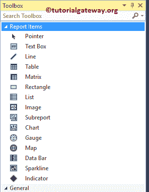

# SSRS 报告项目

> 原文：<https://www.tutorialgateway.org/ssrs-report-items/>

SSRS 报告项目，也称为项目，是放置在报告中的可视项目。为了向最终用户显示任何可视信息，我们必须使用这些报表项来设计报表。在本文中，我们将显示可用的 SSRS 报告项目列表。

## SSRS 报告项目

在我们进入描述之前，让我向您展示 BIDS

中的 SSRS 报告项目列表

以下是可用的 [SSRS](https://www.tutorialgateway.org/ssrs/) 报告项目列表，以及一个小描述:

1.  图表:SSRS 有各种内置图表来可视化数据，如[柱形图](https://www.tutorialgateway.org/column-chart-in-ssrs/)、[堆叠条形图](https://www.tutorialgateway.org/stacked-bar-chart-in-ssrs/)、[折线图](https://www.tutorialgateway.org/line-chart-in-ssrs/)、[饼图](https://www.tutorialgateway.org/pie-chart-in-ssrs/)、[漏斗图](https://www.tutorialgateway.org/funnel-chart-in-ssrs/)、[金字塔图](https://www.tutorialgateway.org/pyramid-chart-in-ssrs/)、[区域图](https://www.tutorialgateway.org/area-chart-in-ssrs/)、[距离图](https://www.tutorialgateway.org/range-chart-in-ssrs/)、[散点图](https://www.tutorialgateway.org/scatter-plot-in-ssrs/)、[气泡图](https://www.tutorialgateway.org/bubble-chart-in-ssrs/)、[雷达图](https://www.tutorialgateway.org/radar-chart-in-ssrs/)[我们在之前的文章中已经解释过了，所以请参考 SSRS](https://www.tutorialgateway.org/radar-chart-in-ssrs/) 文章中的[图表来了解不同的图表。否则，点击每个超链接将向您展示实际示例。](https://www.tutorialgateway.org/charts-in-ssrs/)
2.  数据栏:通常在矩阵或表中使用的 SSRS 报告项目。您可以使用此报告项目来使用条形图可视化高级数据。请参考 SSRS 中的[数据栏，了解配置表内指示器的步骤。](https://www.tutorialgateway.org/data-bars-in-ssrs/)
3.  度量:我们使用这个报告项目主要是为了可视化关键绩效指标。请参考 SSRS 中的[量规，了解配置径向量规和](https://www.tutorialgateway.org/gauges-in-ssrs/)[线性量规](https://www.tutorialgateway.org/linear-gauges-in-ssrs/)中线性量规的步骤。
4.  图像:图像报表项便于在报表设计器中显示产品图片、公司徽标或任何自定义图像。请参考[如何在 SSRS 报告中显示图像](https://www.tutorialgateway.org/display-image-in-ssrs-report/)一文，了解在报告中插入图像的步骤。
5.  指示器:矩阵或表中使用的 SSRS 报告项目。使用表达式，我们可以根据需要更改指示器的颜色。请参考 SSRS 文章中的[指标，了解在表中配置指标的步骤。](https://www.tutorialgateway.org/indicators-in-ssrs/)
6.  地图:此报告项目有助于在地理环境中可视化数据。
7.  矩阵:使用此报表项显示行组和列组的数据。请参考 [SSRS 矩阵报告](https://www.tutorialgateway.org/ssrs-matrix-report/)一文了解矩阵报告的配置。
8.  行:顾名思义，这只是划分报表字段的一行。
9.  列表:该报表项类似于表和矩阵，但是列表项的自由流动特性允许您在列表中添加新的报表项。请参考[在 SSRS 创建列表报告](https://www.tutorialgateway.org/create-a-list-report-in-ssrs/)一文，了解配置列表所涉及的步骤。
10.  矩形:这个 SSRS 报告项目组合了一个或多个项目。请参考[如何向 SSRS 报告添加矩形](https://www.tutorialgateway.org/add-rectangle-to-ssrs-report/)了解向报告添加矩形的步骤。
11.  火花线:类似于数据条，这个报告项目在矩阵或表中很方便。可视化 Tablix 内部的趋势是有益的。详见 SSRS[火花线](https://www.tutorialgateway.org/sparkline-in-ssrs/)。
12.  子报告:此 SSRS 报告项目对于向现有报告添加相关报告非常有用。在我们之前的文章中，我们已经详细解释了这个概念，所以请参考 [SSRS 子报告](https://www.tutorialgateway.org/ssrs-subreports/)文章来理解。
13.  表:这是以二维表式显示数据的基本报表项目。请参考 [SSRS 表格报告](https://www.tutorialgateway.org/ssrs-table-report/)一文，了解创建和配置表格报告所涉及的步骤。
14.  文本框:使用文本框报表项将文本放入报表中。您可以将这些文本框放在报表、页眉或页脚中。在我们的上一篇文章中，我们已经解释了如何将文本框添加到报表设计器中。因此，请参考[将文本框添加到 SSR 报告](https://www.tutorialgateway.org/add-textbox-to-ssrs-report/)。