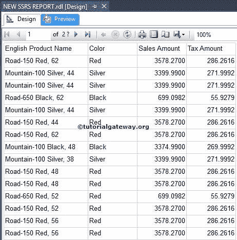

# SSRS 表报告

> 原文：<https://www.tutorialgateway.org/ssrs-table-report/>

在本文中，我们将通过一个实际的例子向您展示如何创建 SSRS 表报告(不使用 SQL Server Reporting Services 中的[报告向导](https://www.tutorialgateway.org/creating-ssrs-report-using-report-wizard/))。

## 创建 SSRS 表报告

创建新 SSRS 项目后，我们在解决方案资源管理器中有三个文件夹，如[共享数据源](https://www.tutorialgateway.org/ssrs-shared-data-source/)、[共享数据集](https://www.tutorialgateway.org/shared-dataset-in-ssrs/)和报表。报表文件夹足以设计一个基本的 [SSRS](https://www.tutorialgateway.org/ssrs/) 报表。

在解决方案资源管理器中，右键单击报告文件夹->添加->新建项目

它将打开包含所有可用选项的“添加新项目”窗口。请选择报告选项，并根据您的要求对其进行重命名。在这个 SSRS 表报告的例子中，我们将其重命名为新 SSRS 报告

点击添加按钮，创建一个空白报告，如下图所示。

如果没有找到 SSRS 工具箱，则按 Ctrl+Alt+X 或转到查看选项卡，选择工具箱

将表从 SSRS 工具箱拖放到数据区域。

在本例中，我们使用已经创建的数据源和数据集。请参考[嵌入式数据源](https://www.tutorialgateway.org/embedded-data-source-in-ssrs/)和[嵌入式数据集](https://www.tutorialgateway.org/embedded-dataset-in-ssrs/)文章查看数据。

我们可以通过两种方式将列名添加到 SSRS 表报告中:

*   我们可以将列名从报表数据拖到表列中。
*   当我们单击特定单元格时，它将打开上下文菜单，显示该数据集中可用的列名。我们可以从列表中选择所需的列，如下图所示

我们成功创建了第一个表报告。我们为第一份报告选择的栏目有:英文产品名称、颜色、销售额和税额(已更名为税目)。

点击预览按钮查看

SSRS 表报表预览