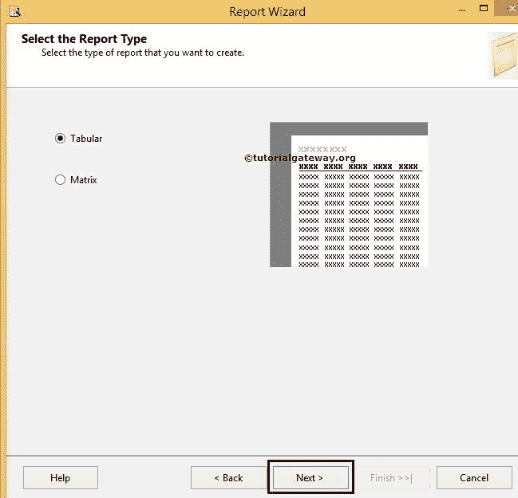

# 使用报表向导创建 SSRS 表报表

> 原文：<https://www.tutorialgateway.org/creating-ssrs-report-using-report-wizard/>

在本文中，我们将向您展示使用报表向导创建 SSRS 表报表所涉及的步骤。建议大家参考[创建表报告](https://www.tutorialgateway.org/ssrs-table-report/)一文，大致了解一下创建表报告的步骤。

## 使用报表向导创建 SSRS 表报表

创建新的 [SSRS](https://www.tutorialgateway.org/ssrs/) 项目后，我们在解决方案资源管理器中有三个文件夹，如[共享数据源](https://www.tutorialgateway.org/ssrs-shared-data-source/)、[共享数据集](https://www.tutorialgateway.org/shared-dataset-in-ssrs/)和报表。Reports 文件夹足以设计一个基本报告。


当我们右键单击“报告”文件夹时，它提供了各种设计报告的选项。

*   添加新报表:打开报表向导设计报表。
*   添加:让我们可以选择是使用报表向导还是空报表来设计报表。
*   导入报告:我们可以从文件系统导入报告。

这里我们选择第一个选项，添加新报告。单击此选项后，它将打开报告向导，如下图所示。

第一页是欢迎屏幕，如果您不想再次看到此页，请勾选“不再显示此页”选项。


选择数据源

此页面用于配置数据源。这里我们有两个选择:

*   共享数据源:如果已经创建了[共享数据源](https://www.tutorialgateway.org/ssrs-shared-data-source/)，请从下拉列表中选择数据源名称。
*   新数据源:如果您尚未创建数据源，请选择此选项并创建新数据源。


如果选择“新数据源”，将会使用以下属性。请参考 SSRS 文章中的[共享数据源，详细了解属性。](https://www.tutorialgateway.org/ssrs-shared-data-source/)

点击编辑按钮配置连接字符串


设计查询

该页面用于编写 [SQL](https://www.tutorialgateway.org/sql/) 查询，从数据源中提取数据。如果您不熟悉 SQL 查询，请单击查询生成器按钮。请参考 [SSRS 查询设计器](https://www.tutorialgateway.org/ssrs-query-designer/)文章，了解设计 SQL 查询


所涉及的步骤

在这个例子中，我们从 [SQL Server](https://www.tutorialgateway.org/sql/) 管理工作室复制到


查询字符串空白空间

我们在上面截图中使用的 [SQL](https://www.tutorialgateway.org/sql/) 命令是:

```
SELECT FirstName, 
       LastName, 
       Gender, 
       EmailAddress, 
       YearlyIncome, 
       EnglishEducation, 
       EnglishOccupation, 
       Phone
FROM DimCustomer
ORDER BY FirstName DESC, 
         LastName DESC
```

选择报告类型:请选择要设计的报告类型。

*   如果您正在设计表格报告，请选择表格选项。
*   如果您正在设计矩阵报告，请选择矩阵选项。



设计表:此页面涉及的属性有:

*   可用字段:我们从之前设计的 SQL 查询中获得的列列表
*   页面:如果您放置任何东西，它将为每个新值开始一个新页面
*   分组:如果要执行任何分组操作，请将这些列放在这个位置。
*   详细信息:添加到此选项卡的列将在表报告中显示为输出列。
*   删除:此按钮将从页面、分组和详细信息中删除列名


因为是第一份报告，请不要费心分组。理解概念就行了。你可以访问其他文章来了解这些事情。


选择表格样式:您可以根据自己的要求选择自己的样式。


完成向导:请为报告提供有效的名称，然后单击“完成”按钮。

这里，我们使用报告向导名称将 SSRS 报告指定为报告名称


如果您观察上面的截图，您可以看到 SQL 查询、报表类型、数据源和布局类型的详细信息。

单击“完成”按钮，使用报告向导完成 SSRS 报告的创建。


点击预览按钮查看


报告预览