# SSRS 矩阵报告

> 原文：<https://www.tutorialgateway.org/ssrs-matrix-report/>

在本文中，我们将通过一个实例向您展示如何在 SSRS 创建矩阵报告。

下面的截图将展示我们用来创建这个 [SSRS](https://www.tutorialgateway.org/ssrs/) 矩阵报告的[数据源](https://www.tutorialgateway.org/ssrs-shared-data-source/)和[数据集](https://www.tutorialgateway.org/shared-dataset-in-ssrs/)。

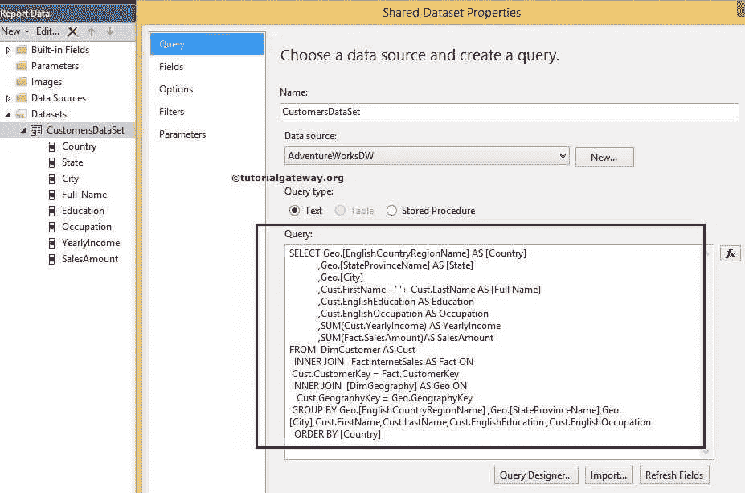

[SQL](https://www.tutorialgateway.org/sql/) 在上面的截图中，我们用于这个 SSRS 矩阵报告的命令是:

```
SELECT Geo.[EnglishCountryRegionName] AS [Country]
      ,Geo.[StateProvinceName] AS [State]
      ,Geo.[City]
      ,Cust.FirstName +' '+ Cust.LastName AS [Full Name]  
      ,Cust.EnglishEducation AS Education 
      ,Cust.EnglishOccupation AS Occupation
      ,Cust.Gender
      ,SUM(Cust.YearlyIncome) AS YearlyIncome
      ,SUM(Fact.SalesAmount)AS SalesAmount 
FROM  DimCustomer AS Cust
  INNER JOIN
      FactInternetSales AS Fact ON 
 Cust.CustomerKey = Fact.CustomerKey
 INNER JOIN
     [DimGeography] AS Geo ON
   Cust.GeographyKey = Geo.GeographyKey
 GROUP BY Geo.[EnglishCountryRegionName]
         ,Geo.[StateProvinceName] 
	 ,Geo.[City]
	 ,Cust.FirstName
         ,Cust.LastName  
         ,Cust.EnglishEducation 
         ,Cust.EnglishOccupation 
         ,Cust.Gender
  ORDER BY [Country]
```

## 在 SSRS 不使用报告向导创建矩阵报告

请参考 [SSRS 表格报告](https://www.tutorialgateway.org/ssrs-table-report/)了解基本报告的创建。将矩阵从 SSRS 工具箱拖放到数据区域。

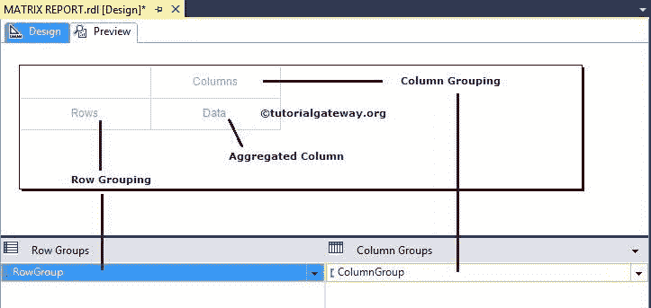

我们可以通过三种方式将列名添加到 SSRS 矩阵分组中:

*   我们可以将列名从报告数据拖到行分组或列分组列中。
*   将列名从报告数据拖放到行分组窗格或列分组窗格。
*   当我们单击特定单元格时，它将打开上下文菜单，显示该数据集中可用的列名。我们可以从列表中选择所需的列。这里我们选择状态列作为行分组项

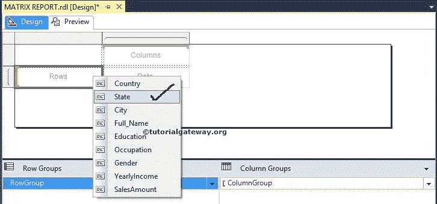

现在，我们选择职业列作为列分组项目

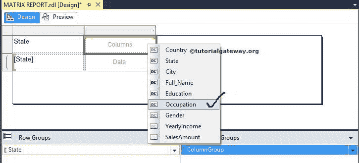

我们选择“销售额”列作为数据项。

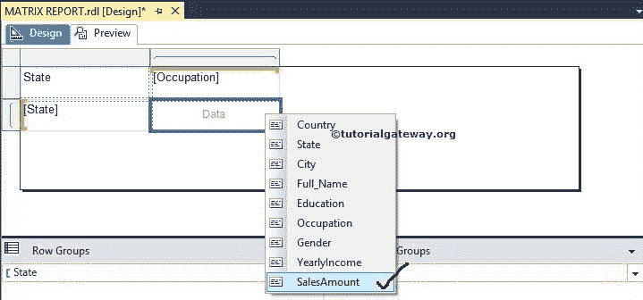

注意:将列添加到数据列时，报告服务器将自动聚合数据。如果要更改聚合函数，请转到 fx 表达式并相应地更改它们。

我们成功创建了第一份 SSRS 矩阵报告。如果你观察下面的截图，我们也做了格式化。请参考[文本框的格式字体和背景色](https://www.tutorialgateway.org/format-fonts-and-background-of-a-textbox-in-ssrs/)一文了解。

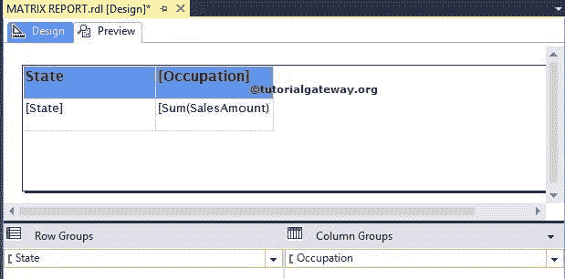

点击预览按钮查看

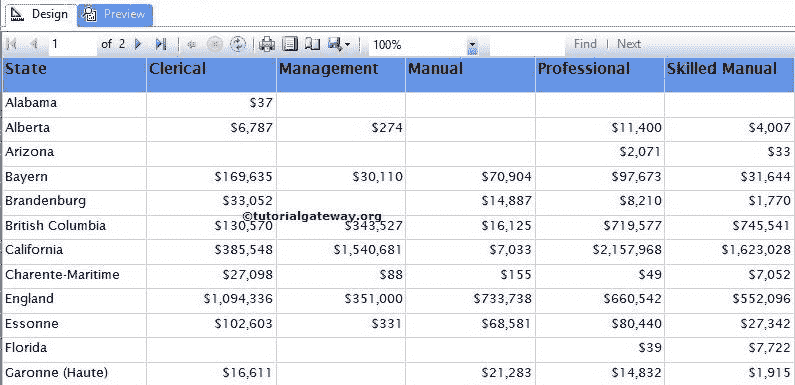

报告预览

### 为 SSRS 矩阵报告中的列分组添加标题列

如果你观察上面的截图，我们都知道文书、管理、手册等。，是客户职业。如果我们不知道，或者我们想向用户提供关于每个专栏的额外信息，该怎么办？在这些情况下，我们必须添加行(包含列的标题详细信息)。

要向 SSRS 矩阵报告添加新行，请选择报告的标题列，然后右键单击它以打开上下文菜单。从菜单中，请选择插入行选项。这里我们有多个选项，它们的功能是:

*   组内–上方:此选项在“标题”列顶部和组内插入一个新行。在组内意味着标题文本将在每一行重复
*   组内–下方:该选项将在标题列下方和组内插入一个新行。
*   组外–上方:它在“标题”列顶部和组外插入一个新行。组外意味着标题文本将是静态的，不会在每一行重复

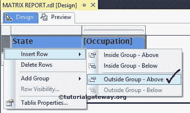

我们将标题文本命名为职业，如下图所示

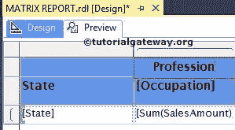

如果你观察下面的截图，我们已经做了后台[格式化](https://www.tutorialgateway.org/format-fonts-and-background-of-a-textbox-in-ssrs/)。

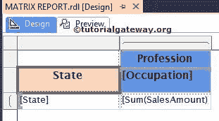

点击预览按钮，查看 SSRS 矩阵报告预览

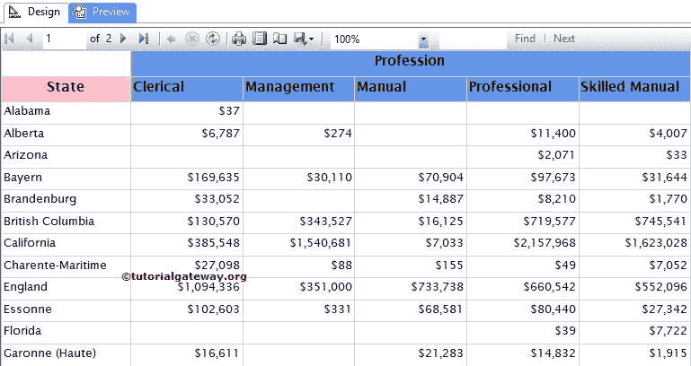