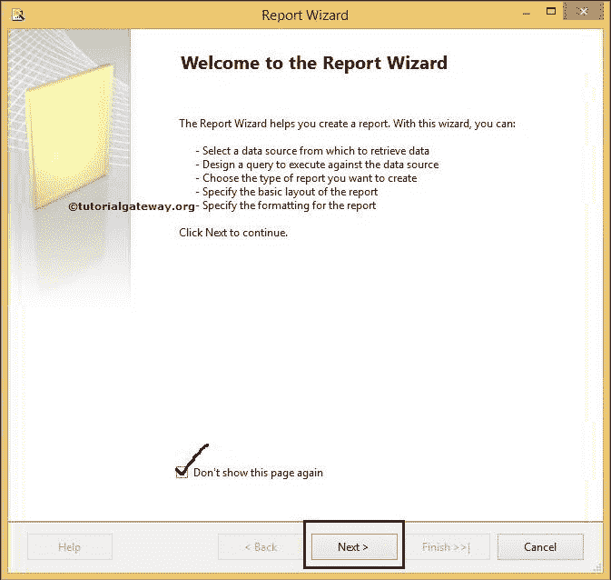
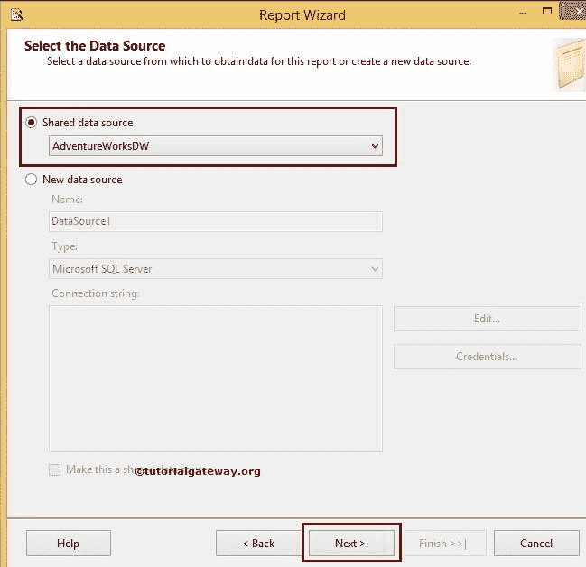
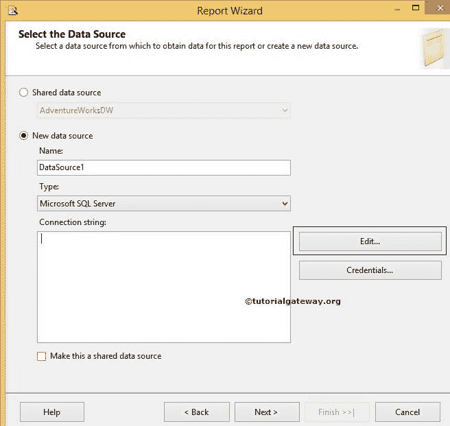
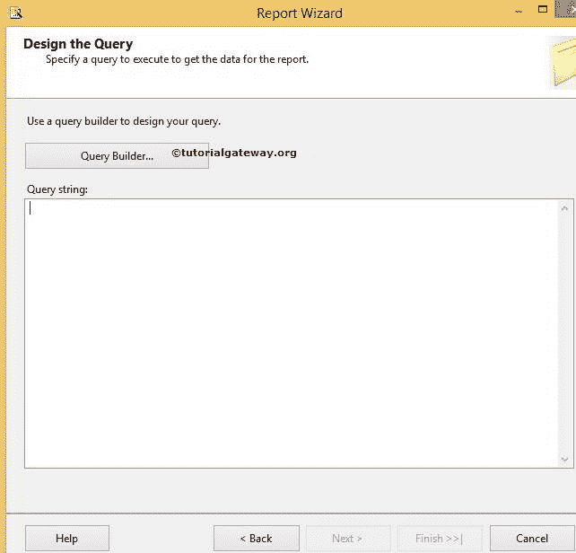
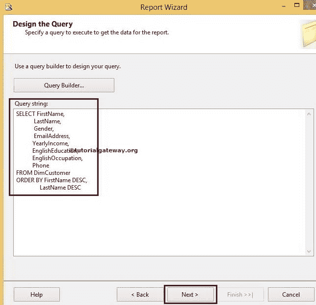

# 使用报表向导创建 SSRS 矩阵报表

> 原文：<https://www.tutorialgateway.org/creating-ssrs-matrix-report-using-report-wizard/>

在本文中，我们将向您展示使用 SQL Server Reporting Services 中的报表向导创建 SSRS 矩阵报表的分步方法。

## 使用报表向导创建 SSRS 矩阵报表

创建新的 [SSRS 项目](https://www.tutorialgateway.org/create-new-project-in-ssrs/)后，我们在解决方案资源管理器中有三个文件夹，如[共享数据源](https://www.tutorialgateway.org/ssrs-shared-data-source/)、[共享数据集](https://www.tutorialgateway.org/shared-dataset-in-ssrs/)和报表。报告文件夹足以设计一个基本的 [SSRS](https://www.tutorialgateway.org/ssrs/) 报告。


当我们右键单击“报告”文件夹时，它提供了各种设计报告的选项。

*   添加新报表:打开报表向导设计报表。
*   添加:让我们可以选择是使用报表向导还是空报表来设计报表。
*   导入报告:我们可以从文件系统导入报告。

这里，我们选择第一个选项，添加新报告。单击此选项后，它将打开报告向导。第一页是欢迎屏幕，如果您不想再次看到此页，请标记“不再显示此页”选项。



选择数据源:此页面用于配置数据源。这里我们有两个选择:

*   共享数据源:如果已经创建了[共享数据源](https://www.tutorialgateway.org/ssrs-shared-data-source/)，请从下拉列表中选择数据源名称。
*   新数据源:如果您尚未创建[数据源](https://www.tutorialgateway.org/embedded-data-source-in-ssrs/)，请选择该选项并创建一个新数据源。



如果选择“新数据源”，将会使用以下属性。具体属性详见 [SSRS 共享数据源](https://www.tutorialgateway.org/ssrs-shared-data-source/)文章。



设计查询

该页面用于编写 [SQL](https://www.tutorialgateway.org/sql/) 查询，从数据源中提取数据。如果您不熟悉 SQL 查询，请单击查询生成器按钮。请参考 [SSRS 查询设计器](https://www.tutorialgateway.org/ssrs-query-designer/)文章，了解设计 SQL 查询



所涉及的步骤

在这个例子中，我们正在处理从 [SQL Server](https://www.tutorialgateway.org/sql/) 管理工作室到



查询字符串空白空间的 SQL 查询

我们在上面截图中使用的 SQL 命令是:

```
SELECT FirstName, 
       LastName, 
       Gender, 
       EmailAddress, 
       YearlyIncome, 
       EnglishEducation, 
       EnglishOccupation, 
       Phone
FROM DimCustomer
ORDER BY FirstName DESC, 
         LastName DESC
```

选择报告类型:请选择要设计的报告类型。

*   如果您正在设计表格报告，请选择表格选项。
*   如果您正在设计矩阵报告，请选择矩阵选项。


设计矩阵:本页涉及的属性有:

*   可用字段:我们从之前设计的 SQL 查询中获得的列列表
*   页面:如果你放置任何东西，它将为每个唯一的值开始一个新的页面
*   列:如果要执行任何列分组操作，请将这些列放在此处。这里，我们将性别放在列分组中
*   行:如果要执行任何行分组操作，请将这些列放在这个位置。这里，我们将英语职业和英语教育放在行分组中
*   详细信息:添加到此选项卡的列将在表报告中显示为输出列。我们正在此详细选项卡中添加销售金额
*   删除:此按钮将从页面、分组和详细信息中删除列名


注:如果要启用追溯操作，请选中启用追溯选项，否则请取消选中

选择表格样式:您可以根据自己的要求选择自己的样式。现在，我们正在选择企业风格


完成向导:请为报告提供有效的名称，然后单击“完成”按钮。这里，我们使用报告向导名称将 SSRS 矩阵报告指定为报告名称


如果观察上面的截图，可以看到 SQL 查询、报表类型、数据源、布局类型的详细信息。

单击“完成”按钮，使用报告向导完成 SSRS 矩阵报告的创建。


从上面的截图中，您可以观察到带有行组和列组的最终报告。

提示:如果您想再添加几个行或列组，可以在底部的行组窗格或列组窗格中添加它们

单击预览按钮查看报告预览。


如果观察上面的截图，看起来还不错。但是，英语职业和英语教育栏目没有标题文本。它可能会使最终用户感到困惑，所以，让我们添加标题文本。

选择两个分组单元格，右键单击它将打开上下文菜单。请选择“拆分单元格”选项，并将标题名称写在空文本框中。


单击预览按钮查看报告预览。现在，我们可以理解标题数据


提示:如果您取消选中矩阵向导中的启用向下钻取选项，则我们必须手动应用。