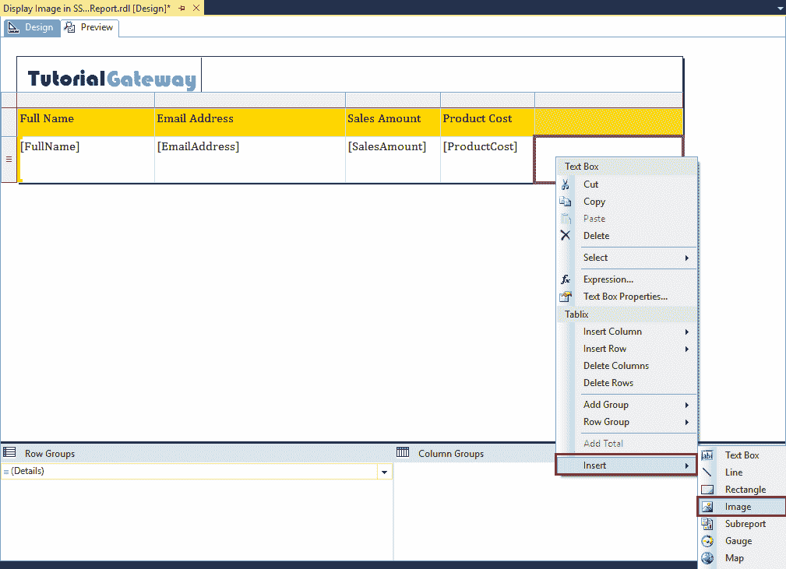

# 在 SSRS 报告中显示图像

> 原文：<https://www.tutorialgateway.org/display-image-in-ssrs-report/>

在本文中，我们将向您展示如何在 SSRS 报告中显示图像。这是设计报告时的标准要求之一，因为每个客户都需要在呈现的报告中显示他们的徽标。因此，这里我们将通过一个例子向您展示在《SSRS 报告》中查看图像的分步方法。

为了解释 SSRS 报告中的图像，我们使用下面显示的数据集。请参考 [SSRS](https://www.tutorialgateway.org/ssrs/) 的[嵌入式数据源](https://www.tutorialgateway.org/embedded-data-source-in-ssrs/)和[数据集](https://www.tutorialgateway.org/embedded-dataset-in-ssrs/)文章。


我们在上面的数据集中使用的自定义 [SQL](https://www.tutorialgateway.org/sql/) 查询是:

```
-- Displaying Image on SSRS Report
USE [AdventureWorksDW2014]
GO
SELECT [FirstName] + ' ' + [LastName] AS [FullName]
      ,[EmailAddress]
      ,[Gender]
      ,[Title]
      ,SUM(FACT.SalesAmount) AS SalesAmount
      ,SUM(FACT.TotalProductCost) AS ProductCost
      ,[EmployeePhoto]
  FROM [DimEmployee] AS EMP
  INNER JOIN [FactResellerSales] AS FACT ON
  EMP.EmployeeKey = FACT.EmployeeKey
  GROUP BY [FirstName]
      ,[LastName]
      ,[EmailAddress]
      ,[Gender]
      ,[Title]
      ,[EmployeePhoto]
```

以上查询所写的数据是:


## SSRS 报告中的显示图像

为了演示在 SSRS 报告中显示图像所涉及的步骤，我们将使用之前生成的报告，如下所示。请参考 [SSRS 表格报告](https://www.tutorialgateway.org/ssrs-table-report/)一文了解创建表格报告的步骤，并参考 SSRS 一文中的[表格报告格式了解格式。](https://www.tutorialgateway.org/format-table-report-in-ssrs/)

[](https://www.tutorialgateway.org/format-table-report-in-ssrs/)

让我给你看看报告预览。


为了演示 SSRS 报告中的图像，我们将在页眉中添加一个图像(我们的徽标)。为此，右键单击页眉并从上下文菜单中选择图像选项。

添加页眉页脚请参考[SSRS 报告](https://www.tutorialgateway.org/add-headers-and-footers-to-ssrs-report/)文章添加页眉页脚。


选择图像选项后，将显示一个名为图像属性的新窗口，如下所示。

在常规选项卡下，我们有三个选项来选择图像源:

*   外部:如果您想要显示来自编码的动态图像，此选项非常有用。比方说，你可以展示来自 C#、VB.NET 等的动态图像。
*   嵌入:如果您想存储图像，并且它是报告定义中的 MIME 类型，那么您可以使用此选项。使用此选项可以避免任何错误，因为图像存储在报告定义中，所以不会错过。
*   数据库:使用此选项显示数据库表中的图像。


首先，我们将解释嵌入式选项，稍后我们将向您展示数据库选项。为此，请选择“嵌入”选项作为“选择图像源”选项，然后单击“导入”按钮将图像从本地文件系统导入到报告定义中。


单击导入按钮后，将打开一个打开的对话窗口，从文件系统中选择图像。让我随机选择一张图片。


点击确定关闭属性窗口


从下面的截图中，您可以看到徽标图像显示在我们的报告中。


使用鼠标根据您的要求调整图像的宽度和高度。


完成图像缩放后，单击预览选项卡查看报告预览。


图像属性:右击图像将打开上下文菜单。请选择图像属性..选项来改变现有图像的属性。


在“大小”选项卡下，我们有四个选项来调整图像显示

*   原始大小:此选项调整图像项目(报告项目)的大小，以原始大小显示图像。例如，如果您选择 720p 图像，那么它将容纳 720p 的空间并显示图像。
*   适合大小:此选项将调整图像大小，以适合图像项目(报告项目)的内部。例如，如果您选择一个 720p 图像，并且报告项大小为 100 * 100，则 720p 图像将被压缩以适合该 100 * 100 项。
*   适合比例:这是图像项目的默认选项。此选项将调整图像的大小，使其适合图像项目(报告项目)的内部，同时保持纵横比。
*   剪辑:它剪辑图像以适合图像项目(报告项目)的内部。


填充意味着图像周围有额外的空间。让我在图像的左侧添加 10pt


现在你可以看到在图像的左侧有一个空间。


在“可见性”选项卡下，您可以决定是否要显示图像。

*   显示:这是默认选项。它将显示图像项目
*   隐藏:它将隐藏图像项目。
*   基于表达式显示或隐藏:报告项将基于我们在此编写的表达式显示。
*   显示可以通过该报告项进行切换:该报告项将基于另一个报告项显示。


在“操作”选项卡下，您可以对图像启用操作功能。我们已经在[转到 URL](https://www.tutorialgateway.org/go-to-url-action-in-ssrs/) 的文章中解释了这些选项，所以请参考相同的内容。


您可以使用“边框”选项卡来更改边框样式、颜色、类型、宽度和图案。默认情况下，图像项目不显示任何边框。出于演示目的，我们将礼物从无更改为轮廓，宽度更改为 4pt，颜色更改为午夜蓝


从下面的截图中可以看到，我们的图像项目被我们指定颜色的边框所包围。


### 在 SSRS 报告中显示数据库图像

为了演示相同的内容，我们在现有报告中添加了一个空列。请选择文本框，右键单击它将打开上下文菜单。请选择插入，然后选择图像选项。



选择图像选项后，将显示一个名为图像属性的新窗口。

在这里，请选择数据库选项作为选择图像源选项，并选择保存图像的数据库字段。如您所见，我们正在选择员工照片


接下来，选择 MIME 类型


让我向您展示 SSRS 报告预览中的显示图像。

