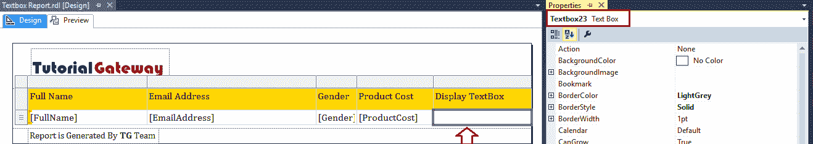

# 向 SSRS 报告添加文本框

> 原文：<https://www.tutorialgateway.org/add-textbox-to-ssrs-report/>

在本文中，我们将向您展示如何向 SSRS 报告添加文本框。这是标准要求之一，因为每个报告都需要标题，或标题上的地址，或页脚，或报告区域上的任何自定义文本。因此，这里我们将通过一个示例向您展示向 SSRS 报告添加文本框的分步方法。

为了解释 SSRS 报告中的文本框，我们将使用下面显示的数据集。请参考[嵌入式数据源](https://www.tutorialgateway.org/embedded-data-source-in-ssrs/)和[数据集](https://www.tutorialgateway.org/embedded-dataset-in-ssrs/)文章，了解我们在本 [SSRS](https://www.tutorialgateway.org/ssrs/) 报告中使用的创建嵌入式数据源和数据集的步骤。


以及自定义 [SQL](https://www.tutorialgateway.org/sql/) 查询:

```
-- Displaying TextBox on SSRS Report
USE [AdventureWorksDW2014]
GO
SELECT [FirstName] + ' ' + [LastName] AS [FullName]
      ,[EmailAddress]
      ,[Gender]
      ,[Title]
      ,SUM(FACT.SalesAmount) AS SalesAmount
      ,SUM(FACT.TotalProductCost) AS ProductCost
      ,[EmployeePhoto]
  FROM [DimEmployee] AS EMP
  INNER JOIN [FactResellerSales] AS FACT ON
  EMP.EmployeeKey = FACT.EmployeeKey
  GROUP BY [FirstName]
      ,[LastName]
      ,[EmailAddress]
      ,[Gender]
      ,[Title]
      ,[EmployeePhoto]
```

以上查询所写的数据是:


## 向 SSRS 报告添加文本框

为了演示将 TextBox 添加到 SSRS 报告所涉及的步骤，我们将使用之前生成的报告，如下所示。添加页眉页脚请参考[SSRS 报告](https://www.tutorialgateway.org/add-headers-and-footers-to-ssrs-report/)文章添加页眉页脚。


出于向 SSRS 报告添加文本框的演示目的，我们将在报告区域内添加一个文本框。为此，右键单击报告区域，选择插入，然后选择文本框选项。


一旦您从上下文菜单中选择了文本框选项，一个新的文本框将添加到报告区域。


您可以使用鼠标增加或减少文本框的宽度和高度。


出于演示目的，让我在文本框


中添加一些相同的文本

在 SSRS 报告预览中，您可以看到我们在文本框


中输入的文本

### 将文本框添加到 SSRS 表格报告

在本演示中，我们将使用之前设计的报告。请参考 SSRS 文章中的 [SSRS 表格报告](https://www.tutorialgateway.org/ssrs-table-report/)、[格式-表格报告，了解创建表格报告&格式。](https://www.tutorialgateway.org/format-table-report-in-ssrs/)

[](https://www.tutorialgateway.org/format-table-report-in-ssrs/)

让我给你看看报告预览。如您所见，该报告有一个空列，显示文本框作为标题文本。这里我们的任务是将文本框添加到这个字段


[表格报告](https://www.tutorialgateway.org/ssrs-table-report/)中的每个字段(或列)本身就是一个文本框。如果选择表中的列并转到属性，则它将被视为文本框。



让我在该特定字段中添加文本框。为此，请选择文本框，右键单击它将打开上下文菜单。请选择插入，然后选择文本框选项。


在文本框中，您可以根据自己的需求编写任何自定义文本。但是您必须使用占位符来放置列名。

例如，如果您想将销售额放在此文本框中，则必须在文本框内创建一个占位符。要添加相同的内容，右键单击文本框并选择创建占位符..选项。


选择“创建占位符”后..选项，将会打开一个名为“占位符属性”的新窗口。

*   标签:要在报告设计器中显示的文本。
*   值:要使用的列名
*   工具提示:使用它来提供关于标签的信息。


在这个例子中，我们将从我们的数据集


中添加标题列

现在您可以看到标题标签(代表数据集的[标题]列)


让我添加一些自定义文本，以及销售金额列。


让我给你看看报告预览。从下面的截图中，您可以看到文本框显示了列值和自定义文本。


文本框属性:右击文本框将打开上下文菜单。请选择文本框属性..选项来更改现有文本框的属性。


选择文本框属性后..选项，将打开一个名为“文本框属性”的新窗口。

在常规选项卡下，您可以将名称分配给我们在报告中添加的 SSRS 文本框。

*   对齐选项卡对于对齐文本框很有用。
*   “数字”选项卡:要将文本框值格式化为“货币，日期”。我们已经在[文本框中格式化数字](https://www.tutorialgateway.org/format-numbers-in-ssrs/)一文中解释了这个属性。
*   可见性:使用此选项卡决定是否向用户显示文本框。
*   交互排序:这个概念我们已经在[交互排序](https://www.tutorialgateway.org/ssrs-interactive-sort/)一文中解释过了，所以请参考。
*   操作:使用此操作选项卡启用图像的操作功能。我们已经在[转到 URL](https://www.tutorialgateway.org/go-to-url-action-in-ssrs/) 的文章中解释了这个选项，所以请参考同样的内容。


字体选项卡用于更改文本框字体。首先，我们将字体系列属性更改为 Cambria，大小更改为 12pt，字体样式属性更改为粗体。


您可以使用“边框”选项卡来更改边框样式、颜色、类型、宽度和图案。出于演示目的，我们将礼物从无更改为轮廓，宽度更改为 2pt，颜色更改为午夜蓝


在“填充”选项卡下，我们可以更改文本框的背景颜色。让我将背景颜色更改为浅钢蓝色


我们可以选择使用外部图像作为文本框的背景。我们已经解释了在 SSRS 报告文章中添加图像或[显示图像文本框的步骤，请参考。](https://www.tutorialgateway.org/display-image-in-ssrs-report/)

[](https://www.tutorialgateway.org/display-image-in-ssrs-report/)

单击确定按钮关闭属性窗口。请调整报告中的列，以便在一行中显示


从下面的截图中可以看到，我们的文本框是一个带有淡钢蓝色的字段，并被我们指定的颜色的边框包围。

