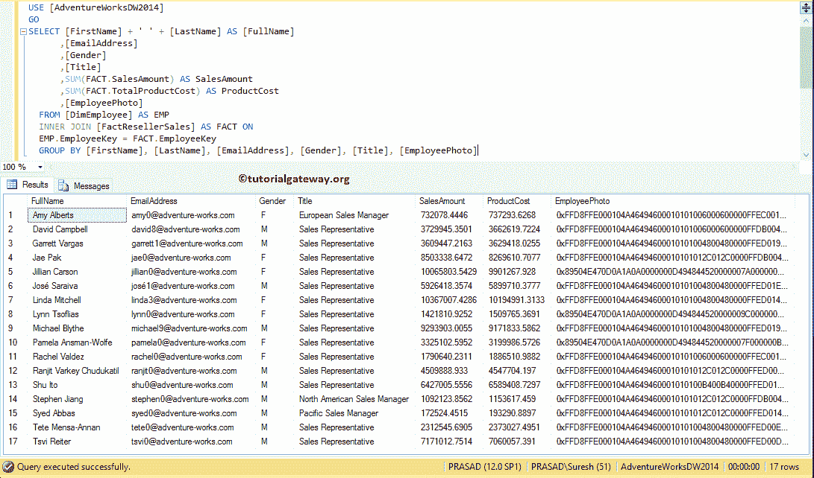
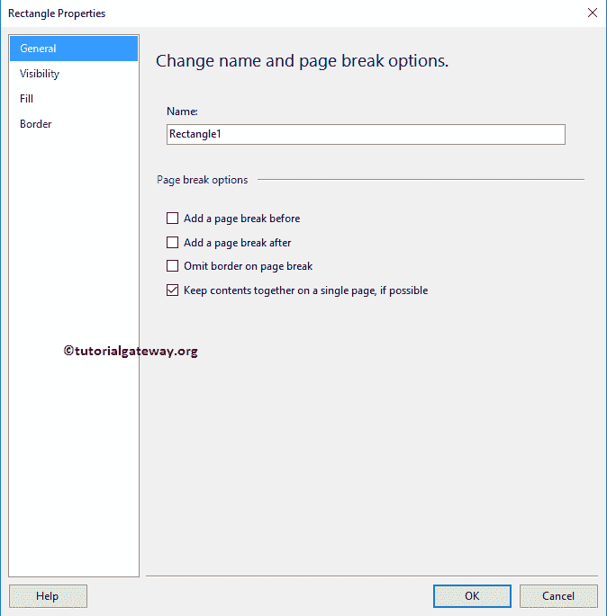
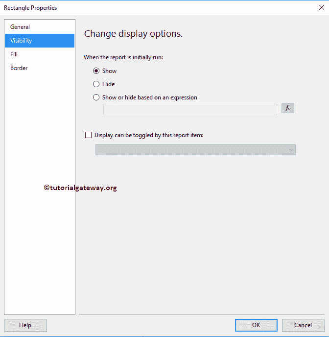

# 向 SSRS 报告添加矩形

> 原文：<https://www.tutorialgateway.org/add-rectangle-to-ssrs-report/>

在本文中，我们将向您展示如何向 SSRS 报告添加矩形。它是设计报告时最有用的报告项之一，因为您可以使用此矩形将图像、文本框和图表组合在一个位置。

因此，这里我们将通过一个示例向您展示将矩形添加到 SSRS 报告的分步方法。

为了解释这一点，我们将使用下面显示的数据集。请参考[嵌入式数据源](https://www.tutorialgateway.org/embedded-data-source-in-ssrs/)和[数据集](https://www.tutorialgateway.org/embedded-dataset-in-ssrs/)文章，了解我们在本 [SSRS](https://www.tutorialgateway.org/ssrs/) 报告中使用的创建嵌入式数据源和数据集的步骤。


我们在上面的数据集中使用的自定义 [SQL](https://www.tutorialgateway.org/sql/) 查询是:

```
-- Displaying Rectangle on SSRS Report
USE [AdventureWorksDW2014]
GO
SELECT [FirstName] + ' ' + [LastName] AS [FullName]
      ,[EmailAddress]
      ,[Gender]
      ,[Title]
      ,SUM(FACT.SalesAmount) AS SalesAmount
      ,SUM(FACT.TotalProductCost) AS ProductCost
      ,[EmployeePhoto]
  FROM [DimEmployee] AS EMP
  INNER JOIN [FactResellerSales] AS FACT ON
  EMP.EmployeeKey = FACT.EmployeeKey
  GROUP BY [FirstName]
      ,[LastName]
      ,[EmailAddress]
      ,[Gender]
      ,[Title]
      ,[EmployeePhoto]
```

以上查询所写的数据是:



## 向 SSRS 报告添加矩形

为了演示将矩形添加到 SSRS 报告中所涉及的步骤，我们将使用之前生成的报告，如下所示。添加页眉页脚请参考[新建报告](https://www.tutorialgateway.org/create-a-new-report-in-ssrs/)、[为 SSRS 表格报告](https://www.tutorialgateway.org/add-headers-and-footers-to-ssrs-report/)添加页眉页脚一文。


出于演示目的，我们将在 SSRS 报告区域内添加一个矩形。为此，右键单击报告区域，选择插入，然后选择矩形选项。


从上下文菜单中选择矩形选项后，新的矩形将添加到报告区域。


您可以使用鼠标增加或减少矩形的宽度和高度。


出于演示的目的，我们将在矩形区域内添加一个文本框。为此，右键单击矩形，选择插入，然后选择文本框选项。


让我在文本框中添加一些文本，然后我们在矩形中添加图像。建议大家参考[SSRS 表格报告中显示图片](https://www.tutorialgateway.org/display-image-in-ssrs-report/)一文，了解添加图片到报告中涉及的步骤。


在 SSRS 报告预览中，您可以看到我们在文本框中输入的文本和图像


矩形属性:右击矩形将打开上下文菜单。请选择矩形属性..选项来改变矩形的现有属性。


选择矩形属性后..选项，将打开一个名为矩形属性的新窗口。在常规选项卡下，您可以更改矩形的名称，也可以添加分页符。



可见性:使用此选项卡决定是否要向用户显示矩形。



在“填充”选项卡下，我们可以更改矩形的背景颜色。让我把背景颜色改为绿松石


我们可以选择使用外部图像作为矩形的背景。

我们已经解释了在 SSRS 报告文章中的[显示图像中添加图像或矩形所涉及的步骤，请参考。](https://www.tutorialgateway.org/display-image-in-ssrs-report/)

[](https://www.tutorialgateway.org/display-image-in-ssrs-report/)

您可以使用“边框”选项卡来更改边框样式、颜色、类型、宽度和图案。出于演示目的，我们将礼物从无更改为轮廓，样式更改为实心，宽度更改为 2pt，颜色更改为棕色


单击确定按钮关闭属性窗口。请调整报告项目(对齐)，以便在一行中显示


如您所见，我们的矩形是用绿松石色归档的，周围是我们指定的边框颜色。

