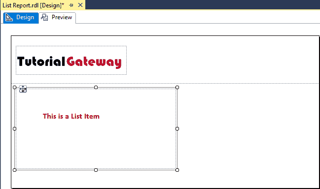
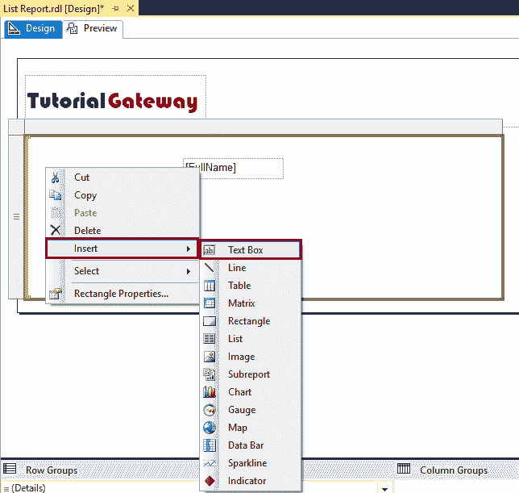

# 在 SSRS 中创建列表报告

> 原文：<https://www.tutorialgateway.org/create-a-list-report-in-ssrs/>

在本文中，我们将向您展示如何在 SSRS 创建列表报告。SSRS 列表报告有助于放置列值以及图表或相应的图像。因此，这里我们将通过一个示例向您展示在 SSRS 创建列表报告的分步方法。

为了演示 SSRS 列表报告，我们将使用下面显示的数据集。请参考[嵌入式数据源](https://www.tutorialgateway.org/embedded-data-source-in-ssrs/)和[数据集](https://www.tutorialgateway.org/embedded-dataset-in-ssrs/)文章，了解如何创建我们用于本 [SSRS](https://www.tutorialgateway.org/ssrs/) 报告的嵌入式数据源和数据集。


我们在上面的数据集中使用的自定义 [SQL](https://www.tutorialgateway.org/sql/) 查询是:

```
-- Create List Report in SSRS
USE [AdventureWorksDW2014]
GO
SELECT [FirstName] + ' ' + [LastName] AS [FullName]
      ,[EmailAddress]
      ,[Gender]
      ,[Title]
      ,SUM(FACT.SalesAmount) AS SalesAmount
      ,SUM(FACT.TotalProductCost) AS ProductCost
      ,[EmployeePhoto]
  FROM [DimEmployee] AS EMP
  INNER JOIN [FactResellerSales] AS FACT ON
  EMP.EmployeeKey = FACT.EmployeeKey
  GROUP BY [FirstName]
      ,[LastName]
      ,[EmailAddress]
      ,[Gender]
      ,[Title]
      ,[EmployeePhoto]
```

以上查询所写的数据是:


## 在 SSRS 创建列表报告

为了演示在 SSRS 创建列表报告所涉及的步骤，我们将使用之前生成的报告，如下所示。

添加页眉请参考[新建报表](https://www.tutorialgateway.org/create-a-new-report-in-ssrs/)、[为 SSRS 表格报告](https://www.tutorialgateway.org/add-headers-and-footers-to-ssrs-report/)添加页眉页脚一文。


要将列表项添加到报表设计器中，请右键单击报表区域，并从上下文菜单中选择插入，然后选择列表选项。


从上下文菜单中选择列表选项后，新的列表项将添加到 SSRS 报告区域。



出于演示目的，让我将[全名]列从列表拖放到列表区域。


接下来，我们将在 SSRS 列表区域内再添加一个文本框。为此，右键单击列表区域，并从上下文菜单中选择插入，然后选择文本框选项。



如您所见，我们在新添加的文本框中添加了名为(员工姓名)的自定义文本。


使用上面指定的方法为电子邮件标识和名称添加自定义文本。接下来，将电子邮件地址和标题列从列表拖放到列表区域。


在 SSRS 列表报告预览中，您可以看到自定义文本和相应的列值。


SSRS 列表区只是一个长方形。如果右键单击列表区域将打开上下文菜单。请选择矩形属性..选项来更改列表区域的现有属性。请参考[为 SSRS 报告](https://www.tutorialgateway.org/add-rectangle-to-ssrs-report/)添加矩形一文，了解矩形格式选项。


让我给你看看 SSRS 名单报告预览。列表用漂亮的字体显示项目，因为我们格式化了列表区域内的所有文本框。

建议大家参考[格式化文本框](https://www.tutorialgateway.org/add-textbox-to-ssrs-report/)一文，了解格式化文本框涉及的步骤。


让我将图像添加到列表区域。看，我们将员工照片列指定为图像源。建议大家参考[SSRS 表格报告中显示图片](https://www.tutorialgateway.org/display-image-in-ssrs-report/)一文，了解添加图片到报表中涉及的步骤。


点击【确定】关闭属性窗口，调整文本框长度、宽度


单击预览选项卡查看 SSRS 列表报告预览。

