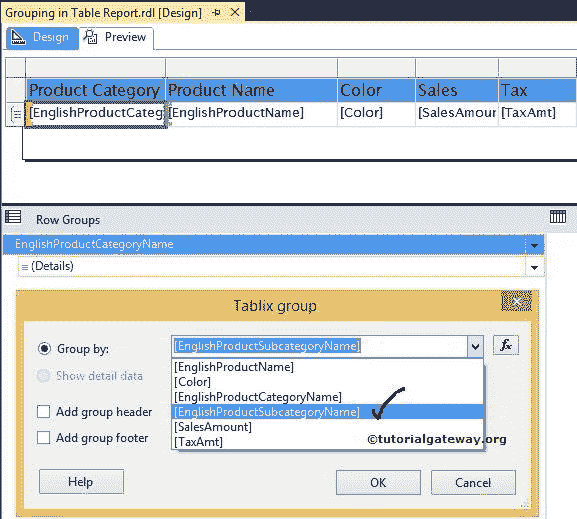

# SSRS 表报告中的分组

> 原文：<https://www.tutorialgateway.org/ssrs-grouping-in-table-reports/>

在本文中，我们将通过一个示例向您展示如何在 SSRS 或 SQL Server Reporting Services 中将父组和子组添加到表报告中。在这里，我们将使用下图所示的报告来解释“SSRS 表报告中的分组”。

请参考[表报告](https://www.tutorialgateway.org/ssrs-table-report/)、[数据源](https://www.tutorialgateway.org/ssrs-shared-data-source/)、[数据集](https://www.tutorialgateway.org/shared-dataset-in-ssrs/)文章，了解数据源、数据集、 [SSRS](https://www.tutorialgateway.org/ssrs/) 表报告的创建。

如果您观察下面的截图，它是一个包含产品名称、颜色、销售额和税额列的普通表格报告。

## SSRS 表报告中的分组

要在 SSRS 添加或启用分组，首先，转到行组窗格，右键单击详细信息将打开上下文菜单。从上下文中，请选择添加组，然后选择父组选项，如下图截图

选择“父组”选项后，将打开一个新的 Tablix 组窗口来配置 SSRS 表报告中的分组。

*   分组依据:在这里，您必须指定分组列名。您可以从下拉列表中选择列名，或者单击 fx 按钮创建表达式。
*   添加组标题:如果要向该组添加标题，请选中此选项
*   添加组页脚:如果要将页脚添加到该组，请选中此选项

在 SSRS 表报告的这个分组示例中，我们选择英语产品类别名称作为该详细行的父组。

单击“确定”完成创建父组(英文产品类别名称)。点击预览按钮查看

报告预览

现在，我们将向您展示如何将子组添加到 SSRS 表报告。

首先，在“行组”窗格中选择产品类别名称，右键单击它将打开上下文菜单。请选择添加组，然后选择子组选项

众所周知，英文产品子类别名称是英文产品类别名称的一个子类别。因此，我们选择英语产品子类别名称作为该行的子组。

单击“确定”完成在 SSRS 创建子组(产品子类别名称)

从下面的截图中，您可以在

行组窗格下看到创建的行组

点击预览按钮查看

SSRS 分组报告预览