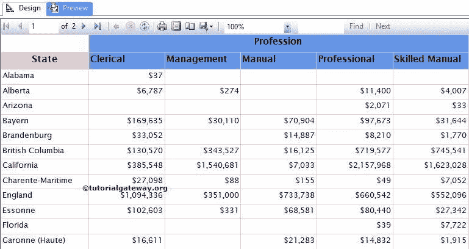
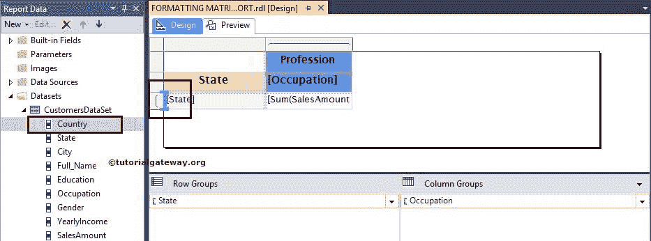
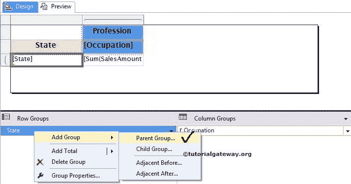
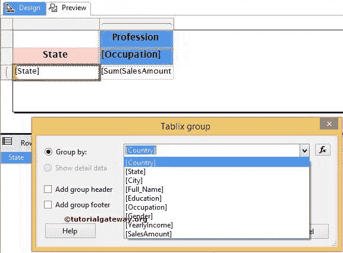
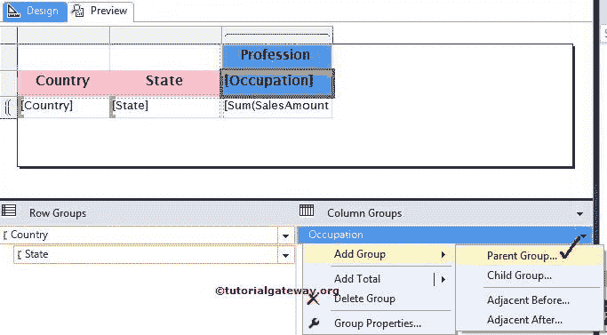
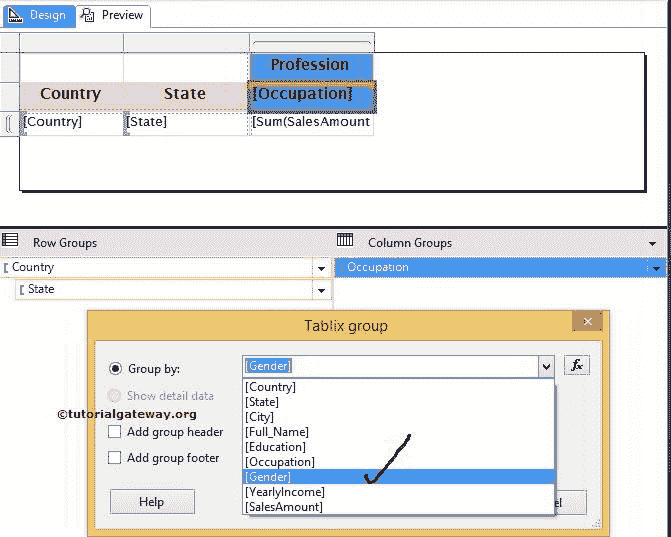
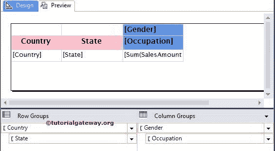

# SSRS 矩阵报告中的分组

> 原文：<https://www.tutorialgateway.org/grouping-in-ssrs-matrix-reports/>

在本文中，我们将向您展示如何将行组和列组添加到已经在 SSRS 创建的矩阵报表中。我们将使用下图所示的报告来解释 SSRS 矩阵报告中的分组。

请参考 [SSRS 矩阵报表](https://www.tutorialgateway.org/ssrs-matrix-report/)、[数据源](https://www.tutorialgateway.org/ssrs-shared-data-source/)、[数据集](https://www.tutorialgateway.org/shared-dataset-in-ssrs/)文章，了解数据源、数据集、 [SSRS](https://www.tutorialgateway.org/ssrs/) 矩阵报表的创建。如果您观察下面的截图，它是一个标准的矩阵报告，状态列为行组，职业为列组。

## 在 SSRS 矩阵报告中添加分组

在本例中，我们将在行分组中添加“国家”列，在列分组中添加“性别”列。我们可以通过多种方式将列名添加到矩阵分组中:

*   我们可以将列名从报表数据拖放到所需位置的行分组窗格或列分组窗格中。例如，将列名放在现有组的顶部，以添加 SSRS 的父组。
*   我们可以将列名从报表数据拖到行分组或列分组列中。例如，将列名放在现有组旁边，以添加父分组。

注意:使用上述方法不是一个好的做法。因为如果你改变蓝色条的方向，它会给出错误的结果。

在 SSRS 矩阵报告中添加分组的第三种方法是，转到行组窗格，右键单击状态组，将打开上下文菜单。请选择添加组，然后选择父组选项。如果要添加子组，请选择子组选项。

选择父组选项后，将打开一个新的 Tablix 组窗口来配置分组。

*   分组依据:在这里，您必须指定分组列名。您可以从下拉列表中选择列名，或者单击 fx 按钮创建表达式。在本例中，我们将国家添加为分组列，因此我们从列表中选择了相同的国家
*   添加组标题:如果要向该组添加标题，请选中此选项
*   添加组页脚:如果要将页脚添加到该组，请选中此选项

单击“确定”完成向现有 SSRS 矩阵添加行分组。

### 在 SSRS 添加列分组

转到列组窗格，右键单击职业组将打开上下文菜单。从上下文中，请选择添加组，然后选择父组选项。如果要添加子组，请选择子组选项。

在本例中，我们将性别添加为列分组列，因此我们从列表

中选择了相同的列

单击“确定”完成向现有 SSRS 矩阵添加列分组。从下面的截图中，可以看到我们在现有矩阵中添加了行组和列组。我们也做了一些[格式化](https://www.tutorialgateway.org/format-fonts-and-background-of-a-textbox-in-ssrs/)。

点击预览按钮查看

报告预览