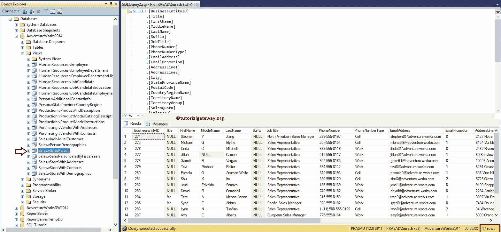
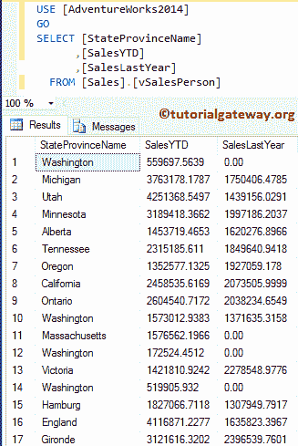
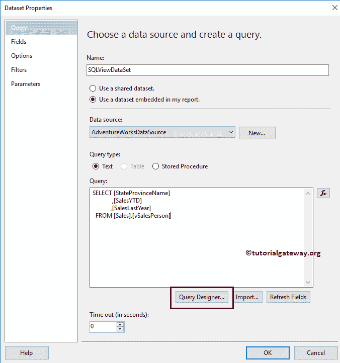
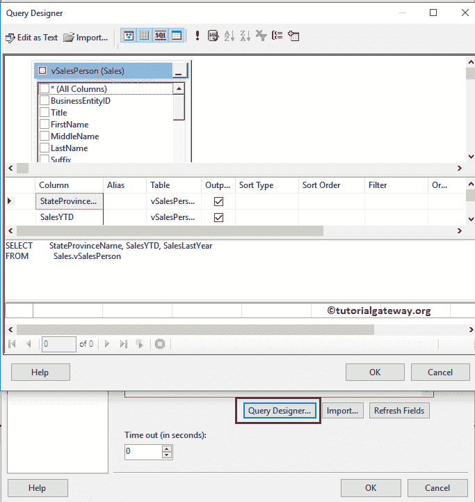
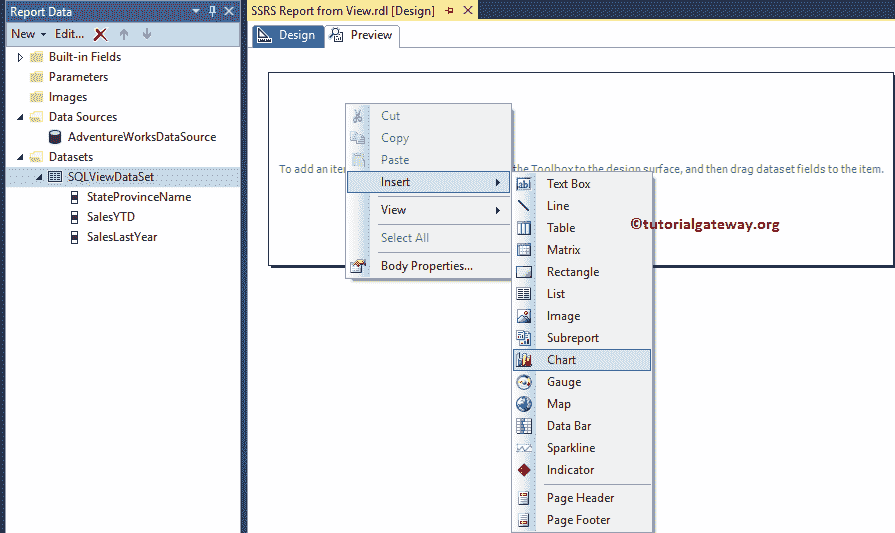
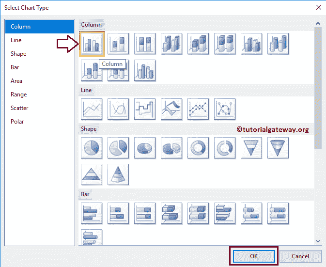
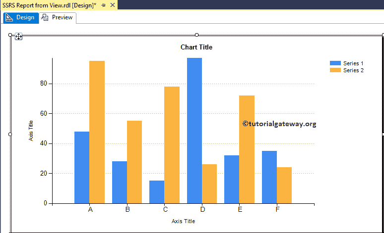
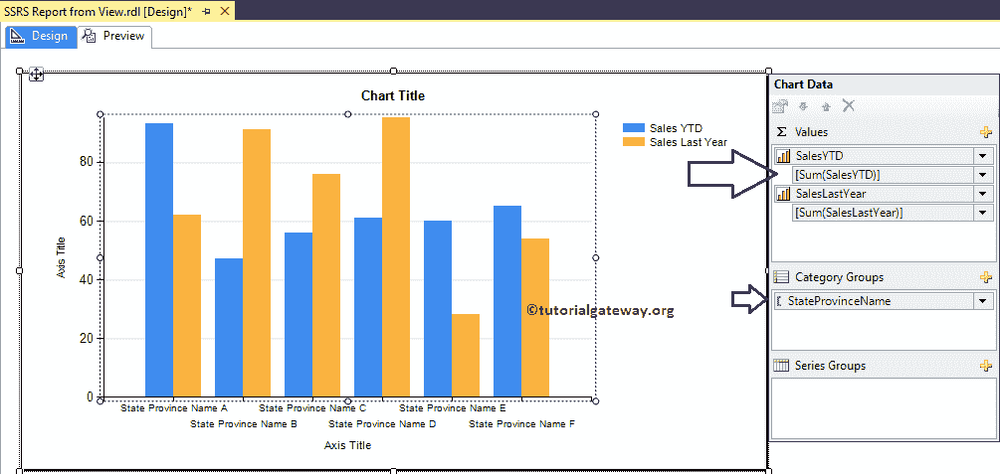
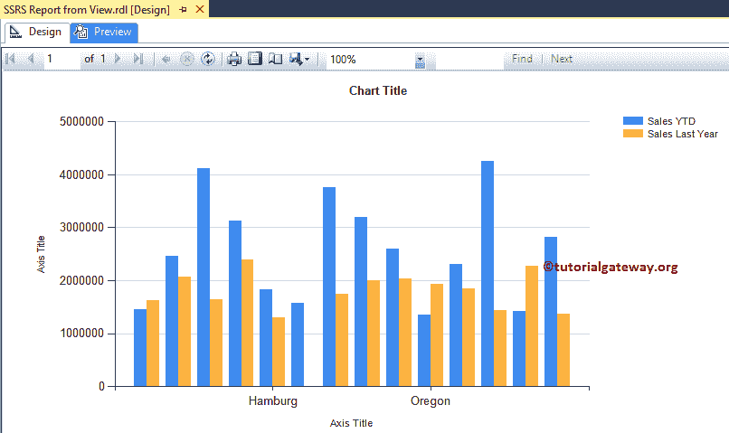
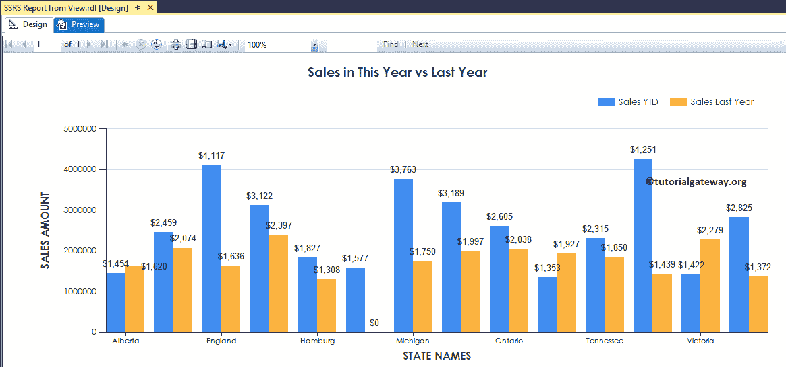

# 使用视图创建 SSRS 报告

> 原文：<https://www.tutorialgateway.org/create-ssrs-report-using-views/>

在本文中，我们将通过一个示例向您展示如何使用视图创建 SSRS 报告。这是 SSRS 追随者经常问的问题之一。为了演示相同的内容，我们将使用 Adventure Works 数据库附带的销售人员视图。

下面的截图将显示视图中的数据:

提示:如果你想自己创建一个自定义视图，那么我建议你参考我们在 [SQL Server](https://www.tutorialgateway.org/sql/) 教程中提到的[SQL view](https://www.tutorialgateway.org/views-in-sql-server/)文章。



对于本例，我们将编写自定义 [SQL](https://www.tutorialgateway.org/sql/) 查询，从销售人员视图中选择三列:

```
USE [AdventureWorks2014]
GO
SELECT [StateProvinceName] 
      ,[SalesYTD]
      ,[SalesLastYear]
  FROM [Sales].[vSalesPerson]
```

而以上查询的数据为:



## 使用视图创建 SSRS 报告

在本例中，我们将创建一个柱形图来显示使用视图创建 SSRS 报告的分步方法。

下面的 [SSRS](https://www.tutorialgateway.org/ssrs/) 截图将向您展示我们用于本[柱形图](https://www.tutorialgateway.org/column-chart-in-ssrs/)报表的[数据源](https://www.tutorialgateway.org/ssrs-shared-data-source/)和[数据集](https://www.tutorialgateway.org/shared-dataset-in-ssrs/)。



如果您觉得很难编写自定义 SQL 查询，那么可以使用[查询设计器](https://www.tutorialgateway.org/ssrs-query-designer/)来设计所需的查询。



右键单击报表设计器，选择插入->图表选项



对于这个使用视图创建 SSRS 报告的例子，我们选择[柱形图](https://www.tutorialgateway.org/column-chart-in-ssrs/)。



单击“确定”按钮，在设计区域显示带有虚拟数据的柱形图。



单击柱形图周围的空白区域将打开图表数据窗口。在本例中，我们将为今年的销售额和去年的销售额创建柱形图。因此，将它们从数据集拖放到类别组中的图表数据值和州省名称。

建议大家参考[在 SSRS 创建柱形图](https://www.tutorialgateway.org/column-chart-in-ssrs/)文章了解柱形图



的创建

单击预览按钮查看报告预览。



从上面的截图中，您可以看到我们使用销售人员视图创建了 SSRS 专栏报告。让我把图表格式化一点，让它看起来优雅一点。

记住，我们已经在[格式化柱状图](https://www.tutorialgateway.org/formatting-column-chart-in-ssrs/)中解释了格式化选项。

