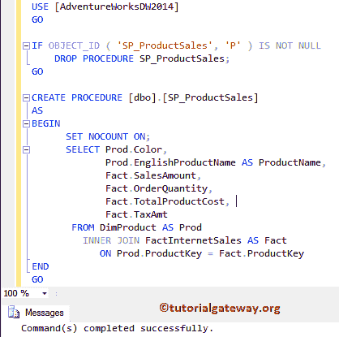
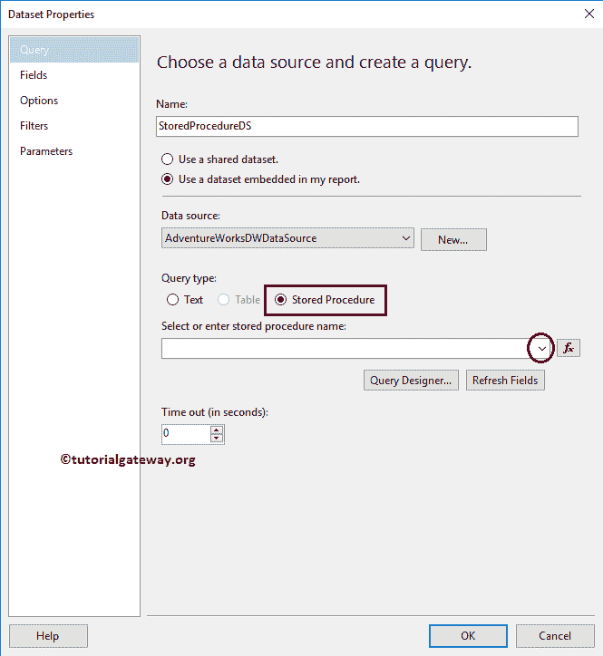
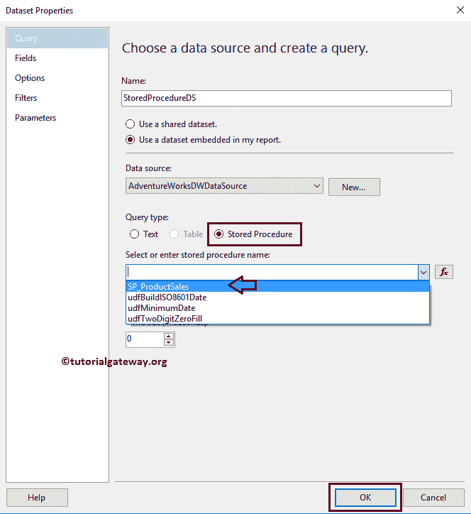
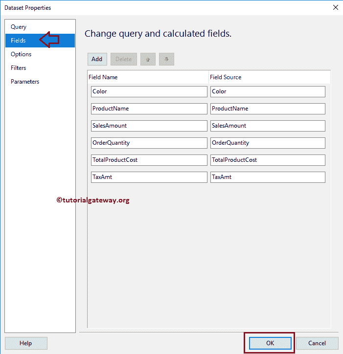
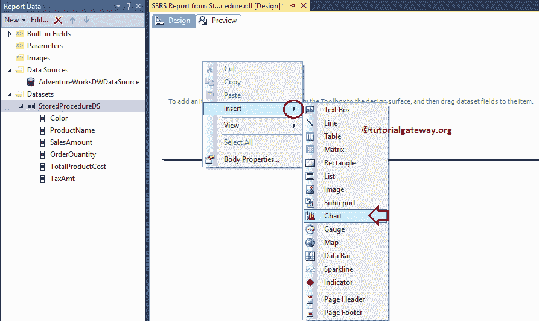
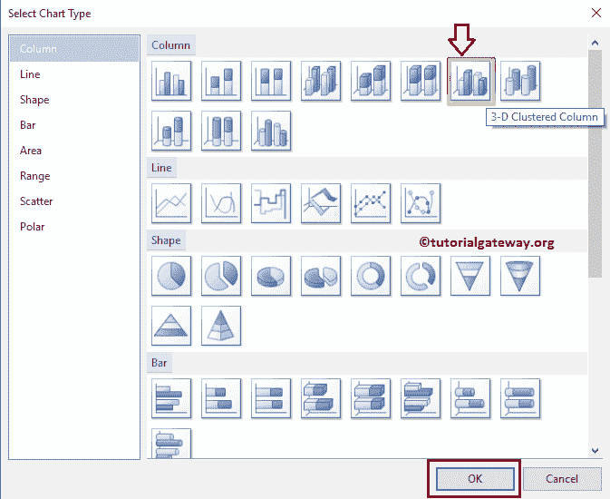
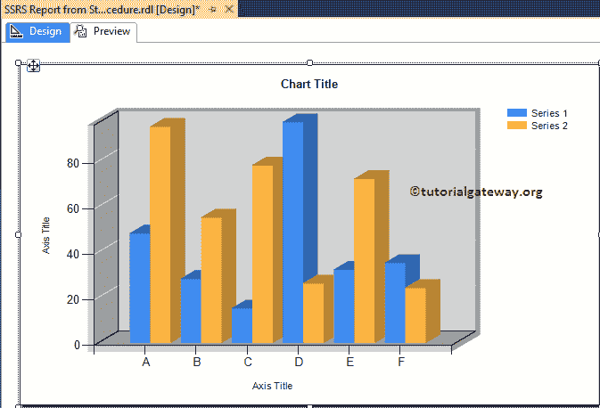
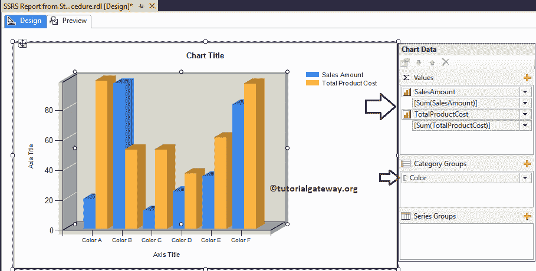
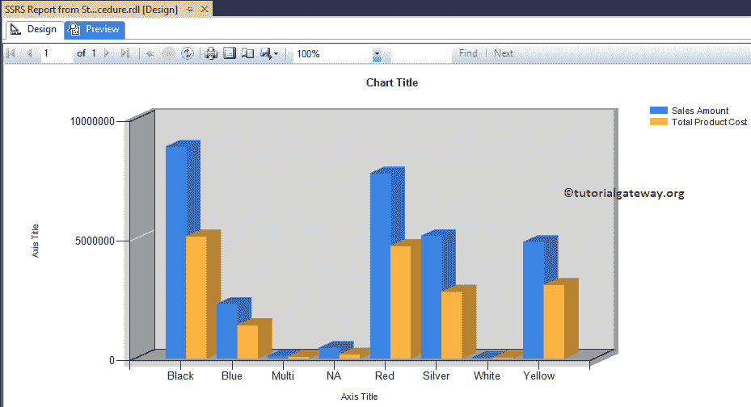
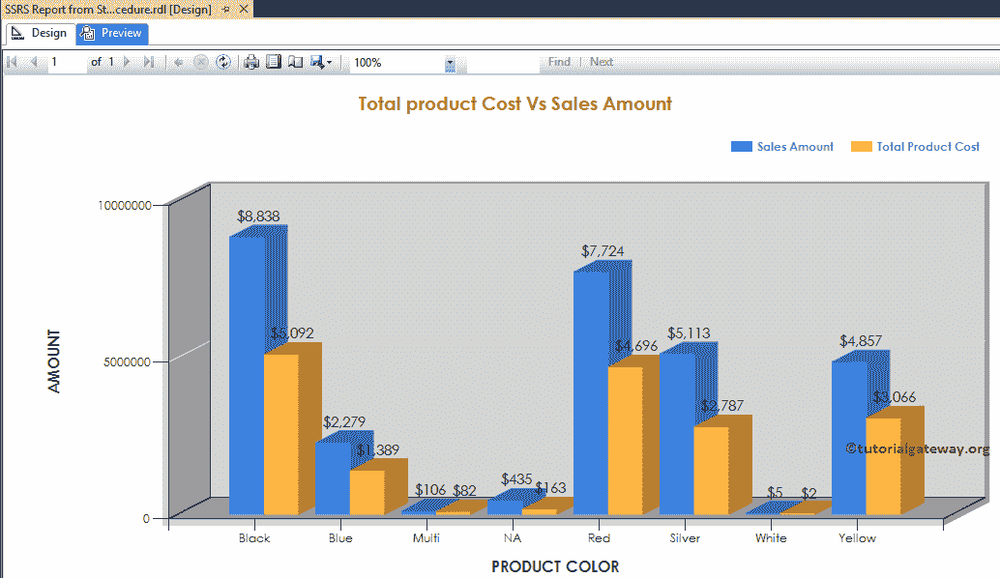

# 使用存储过程创建 SSRS 报告

> 原文：<https://www.tutorialgateway.org/create-ssrs-report-using-stored-procedure/>

在本文中，我们将通过一个示例向您展示如何使用存储过程创建 SSRS 报告。这是 SSRS 追随者经常问的问题之一。为了演示相同的内容，我们将在 Adventure Works DW 数据库上创建一个存储过程。

下面的屏幕截图显示了我们将在这个 SSRS 存储过程中使用的数据:

提示:如果您想创建自定义存储过程，请访问 [SQL Server](https://www.tutorialgateway.org/sql/) 中的 [SQL 存储过程](https://www.tutorialgateway.org/select-stored-procedure-in-sql-server/)一文。


现在，让我编写 [SQL](https://www.tutorialgateway.org/sql/) 查询，在 Adventure Works DW 上创建一个[存储过程](https://www.tutorialgateway.org/select-stored-procedure-in-sql-server/):

```
USE [AdventureWorksDW2014]
GO

IF OBJECT_ID ( 'SP_ProductSales', 'P' ) IS NOT NULL   
    DROP PROCEDURE SP_ProductSales;  
GO

CREATE PROCEDURE [dbo].[SP_ProductSales]
AS
BEGIN
      SET NOCOUNT ON;
	  SELECT Prod.Color, 
             Prod.EnglishProductName AS ProductName, 
             Fact.SalesAmount,
	         Fact.OrderQuantity, 
             Fact.TotalProductCost, 
             Fact.TaxAmt
       FROM DimProduct AS Prod 
         INNER JOIN FactInternetSales AS Fact 
            ON Prod.ProductKey = Fact.ProductKey 
END
GO
```

输出



## 使用存储过程创建 SSRS 报告

在本例中，我们将创建一个三维聚集柱形图来显示使用存储过程创建 SSRS 报告的分步方法。下面的截图将向您展示我们将用于此 [SSRS](https://www.tutorialgateway.org/ssrs/) 聚类[柱形图](https://www.tutorialgateway.org/column-chart-in-ssrs/)报告的[数据源](https://www.tutorialgateway.org/ssrs-shared-data-source/)和[数据集](https://www.tutorialgateway.org/shared-dataset-in-ssrs/)。

在这里，我们必须将查询类型从文本(默认)更改为存储过程。



接下来，请从可用列表中选择所需的存储过程名称。从下面的截图中，您可以看到我们正在选择之前创建的存储过程。



最后，请导航到字段选项卡，并检查我们是否从存储过程中获取了所有字段。这里也可以添加[计算字段](https://www.tutorialgateway.org/calculated-fields-in-ssrs/)。



在 SSRS 报表设计中，我们可以通过将图表属性从 SSRS 工具箱拖到设计空间来添加聚集柱形图。或者右键单击报表设计器以打开上下文菜单。从上下文菜单中，请选择插入->图表选项。



选择“图表”选项后，将打开一个名为“选择图表类型”的新窗口，从可用图表中选择所需的图表。对于本例，我们选择了三维聚集柱形图。



单击“确定”按钮后，三维聚集柱形图将显示在带有虚拟数据的设计区域中。



单击聚集柱形图周围的空间将打开图表数据窗口。

在本例中，我们将为产品总成本和销售额创建一个聚集柱形图。因此，将它们从数据集拖放到类别组中的图表数据值和产品颜色。

建议大家参考[在 SSRS 创建柱形图](https://www.tutorialgateway.org/column-chart-in-ssrs/)文章了解



集群柱形图的创建

单击预览按钮查看报告预览。



从上面的截图中，我们使用 SSRS 的 SP_ProductSales 存储过程创建了一个三维集群列报告。让我把图表格式化一点，让它看起来优雅一点。

请记住，我们已经在[格式化柱形图](https://www.tutorialgateway.org/formatting-column-chart-in-ssrs/)一文中解释了格式化选项。所以，请参考文章了解步骤。

