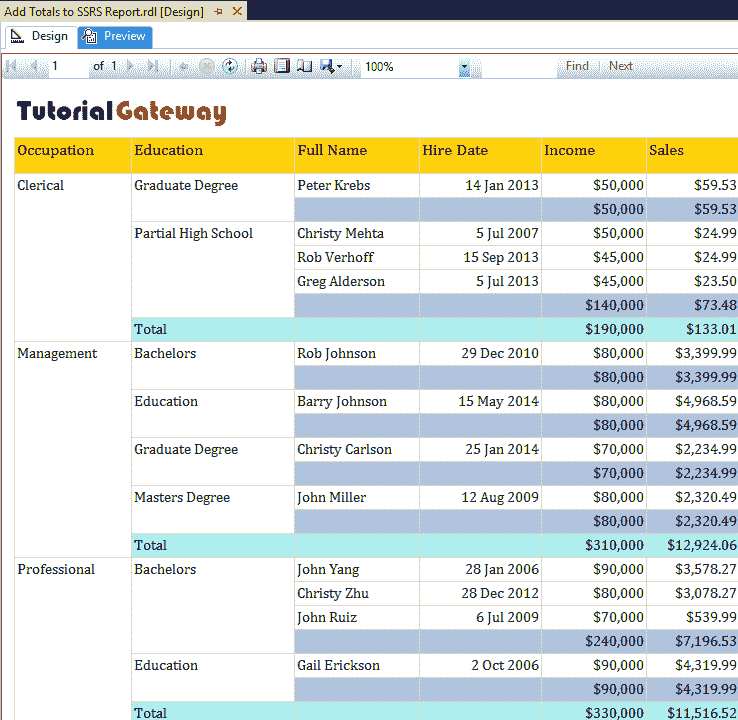
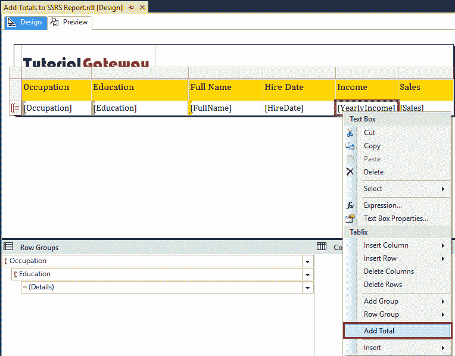

# 将总计和小计添加到 SSRS 报告

> 原文：<https://www.tutorialgateway.org/add-total-and-subtotal-to-ssrs-report/>

在本文中，我们将向您展示如何向 SSRS 报告添加总计和小计。当您设计表或矩阵报告时，这是客户端的标准要求之一。

为了解释将总计和小计添加到 [SSRS](https://www.tutorialgateway.org/ssrs/) 报告所涉及的步骤，我们将使用如下所示的数据集。请参考[嵌入式数据源](https://www.tutorialgateway.org/embedded-data-source-in-ssrs/)和[数据集](https://www.tutorialgateway.org/embedded-dataset-in-ssrs/)文章，了解我们在本报告中使用的创建嵌入式数据源和数据集的步骤。


我们在上面的数据集中使用的自定义 [SQL](https://www.tutorialgateway.org/sql/) 查询是:

```
-- Add Total to SSRS Report
SELECT [FirstName] +  ' ' + [LastName] AS FullName
      ,[Education]
      ,[Occupation]
      ,[YearlyIncome]
      ,[Sales]
      ,[HireDate]
  FROM [Employee]
```

以上查询所写的数据是:


## 将总计和小计添加到 SSRS 报告

SSRS 为您提供了两种不同的方法来为 SSRS 报告添加总计或小计。在这个例子中，我们将解释一种方法，稍后我们将解释另一种方法。

要添加总计和小计，我们需要 SSRS 的表或矩阵报告。我们将在这个例子中使用下面显示的报告。

分组技巧请参考[表报](https://www.tutorialgateway.org/ssrs-table-report/)、[格式-表报](https://www.tutorialgateway.org/format-table-report-in-ssrs/)，表报篇[分组。](https://www.tutorialgateway.org/ssrs-grouping-in-table-reports/)

[](https://www.tutorialgateway.org/ssrs-grouping-in-table-reports/)

让我给你看看报告预览。如果您看到下面的截图，它以三个级别显示数据:职业是顶级，然后是第二级教育，第三级是详细信息(全名、雇佣日期、收入、销售)。这里我们的任务是在所有级别的收入和销售栏中添加总计。


### 将总计和小计添加到 SSRS 报告:方法 1

首先，我们将在详细信息级别添加总计。首先，转到行组窗格，右键单击详细信息将打开上下文菜单。

从上下文中，请选择添加合计，然后选择之后选项。在明细行后增加新行，在明细级


增加合计

让我将总列的背景颜色更改为【浅钢蓝】


让我打开“预览”选项卡，检查细节级别的总计。从下面的截图中，你可以看到 SSRS 增加了一个额外的分类汇总栏。


接下来，我们将添加教育水平(二级)的总数。首先，转到行组窗格，右键单击教育将打开上下文菜单。

从上下文中，请选择添加合计，然后选择之后选项。在教育程度后增加新行，在教育程度


增加合计

让我将整个列的背景颜色更改为浅绿松石色。它区分了明细级别和教育级别的总数


让我打开“预览”选项卡，检查教育级别的总数。



最后，我们将添加职业总计(顶级)。首先，转到“行组”窗格，右键单击“职业”将打开上下文菜单。

从上下文中，请选择添加合计，然后选择之后选项。它在表的末尾添加一个新行，并添加职业级别


的总计

让我将总列的背景颜色更改为“梅花”


让我打开“预览”选项卡，检查细节级别的总计。从下图中，可以看到在“总计”的末尾添加了一个额外的列。


### 将总计和小计添加到 SSRS 报告:方法 2

首先，我们将在详细信息级别添加总计。为此，请转到指标列(年收入)并右键单击它，然后选择添加合计选项。在明细行后增加一行，在明细级



增加合计

对“销售额”列应用相同的技术。接下来，让我将总列的背景颜色更改为浅绿松石


让我打开预览选项卡，在详细信息级别检查总计。现在，您可以看到添加了小计的额外列。


接下来，我们将在教育级别添加总计。为此，转到年收入总额列(明细总额行->年收入列)，右键单击它并选择添加总额选项。


将同样的技巧应用于“销售额”栏，并将背景颜色更改为“梅”


让我打开“预览”选项卡，检查教育级别的总数。


最后，我们将添加职业级别的总数，或总计。首先，转到年收入总计列(教育水平总计行->年收入列)，右键单击它将打开上下文菜单。

从上下文中，请选择添加总计选项，如下图所示。


让我将同样的技巧应用于“销售额”列，并更改背景颜色


让我打开预览选项卡，在详细信息级别检查总计。现在，你可以看到在 SSRS 的总计末尾增加了一栏。


从上面的截图中，可以看到第二种方法也在显示总计。