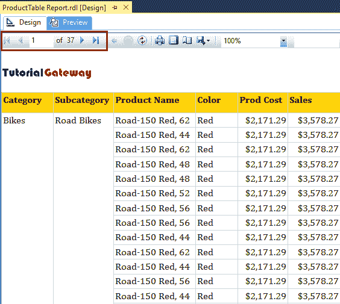

# 向 SSRS 报告添加页眉和页脚

> 原文：<https://www.tutorialgateway.org/add-headers-and-footers-to-ssrs-report/>

在本文中，我们将向您展示如何向 SSRS 报告添加页眉和页脚。或者，如何在 SSRS 报告中添加或删除页眉和页脚。

SSRS 页眉和页脚将在 SSRS 报告生成的每一页中重复。这些对于放置报告标题、公司徽标、公司地址、报告生成时间、页码等非常有帮助。

对于这个例子，我们将使用下面显示的数据集。请参考[共享数据源](https://www.tutorialgateway.org/ssrs-shared-data-source/)和[数据集](https://www.tutorialgateway.org/shared-dataset-in-ssrs/)文章，了解我们在本 [SSRS](https://www.tutorialgateway.org/ssrs/) 报告中使用的创建共享数据源和数据集的步骤。


我们在上面的数据集中使用的自定义 [SQL](https://www.tutorialgateway.org/sql/) 查询是:

```
-- Add, or Remove Headers and Footers on SSRS Report
SELECT Prodcat.EnglishProductCategoryName,
       prodSubcat.EnglishProductSubcategoryName,  
       prod.EnglishProductName, 
       prod.Color, 
       fact.[TotalProductCost],
       fact.SalesAmount, 
       fact.TaxAmt,
       fact.[OrderDate],
       fact.[ShipDate] 
FROM dbo.DimProduct as prod 
  INNER JOIN 
dbo.DimProductSubcategory AS prodSubcat ON 
       prod.ProductSubcategoryKey = prodSubcat.ProductSubcategoryKey 
  INNER JOIN  
dbo.DimProductCategory AS Prodcat ON 
       prodSubcat.ProductCategoryKey = Prodcat.ProductCategoryKey 
  INNER JOIN  
dbo.FactInternetSales AS fact ON 
       fact.ProductKey = prod.ProductKey
WHERE SalesAmount >= 3500
```

为了解释在 SSRS 报告中添加或删除页眉和页脚所涉及的步骤，我们将使用下面显示的报告。

请参考[表格报告](https://www.tutorialgateway.org/ssrs-table-report/)、[格式-表格报告](https://www.tutorialgateway.org/format-table-report-in-ssrs/)文章了解表格报告的创建、格式，分组技巧见表格报告文章中的[分组。](https://www.tutorialgateway.org/ssrs-grouping-in-table-reports/)

[](https://www.tutorialgateway.org/ssrs-grouping-in-table-reports/)

## 如何在 SSRS 报告中添加页眉和页脚

要添加 SSRS 表格报告页眉或 SSRS 页面页眉，请右键单击报表设计器中的空白区域以打开上下文菜单。请从中选择插入->页眉选项。


现在你可以看到 SSRS 报告的页眉。您可以使用此标题添加公司徽标、报告名称。


要添加 SSRS 表格报告页脚或 SSRS 页面页脚，请在报表设计器中右键单击表报表周围的空白区域，然后选择插入->页面页脚选项。


现在，您可以在 SSRS 报告中看到页脚。您可以使用此页脚来放置公司地址、页码、报告生成时间。


出于演示目的，我们将在页眉中添加我们的徽标。为此，右键单击页眉并从上下文菜单中选择图像选项。


现在你可以看到标志，这个标志将在每一页重复。


让我添加一个带有随机数据的文本框来展示页脚的优势。


如您所见，我们在文本框中添加了 Report is Generated By Suresh，我们希望该文本在每一页


中重复

让我来调整页眉、表格报告和页脚


之间的额外空间

现在你可以在页眉



看到 Logo

和正文在同一个页脚


让我打开最后一页，这样你就可以在一个截图


中看到页眉和页脚

## 删除 SSRS 报告的页眉和页脚

删除 SSRS 报告的页眉和页脚很简单。请右键单击页眉，并从上下文菜单中选择删除页眉选项。


要删除页脚，请右键单击页脚。接下来，从中选择“删除页脚”选项。


从下面的截图你可以看到，我们成功删除了页眉和页脚。

