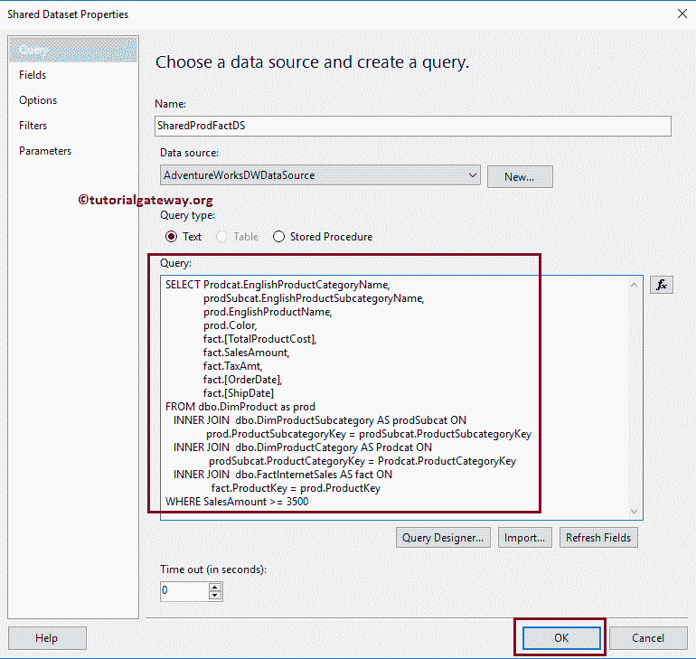
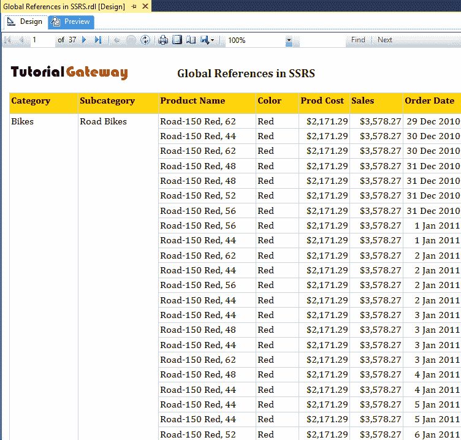

# SSRS 的全局参考

> 原文：<https://www.tutorialgateway.org/global-references-in-ssrs/>

内置字段集合包括 SSRS 的全局参考。引用包括微软预先定义的全局变量。这些是我们设计的每个报告中使用的标准 SSRS 全局参考变量，如页码、总页码等。

## SSRS 全局参考文献列表

以下是 SSRS 可用的全局参考列表。


它们的描述如下

| 成员 | 数据类型 | 描述 |
| 执行时间 | 日期时间 | 它将显示报告执行的日期和时间。 |
| page number-页面号码 | 整数 | 它将返回当前页码。它将为第一页分配 1，然后递增 1。如果有任何分页符，那么这将根据分页符返回结果。您可以通过分页符中的 RestPageNumber 属性来控制数字。您已经在页眉或页脚中使用了它。 |
| 报告文件夹 | 线 | 这将返回包含报告的文件夹路径。 |
| ReportName | 线 | 这将返回您在创建报告时分配的报告名称。 |
| ReportServerURL | 线 | 这将返回运行当前报表的报表服务器网址。 |
| TotalPages | 整数 | It returns the total number of pages returned by the report.如果报表没有分页符，那么这将返回与“总页数”相同的结果 |
| 页面名称 | 线 | It returns the name of the page.在 [SSRS](https://www.tutorialgateway.org/ssrs/) 页眉或页脚中使用。 |
| 总体议程编号 | 整数 | 返回当前页码。此值不受分页符中 ResetPageNumber 属性的影响。您可以在页眉或页脚中使用它。 |
| 总体总页数 | 整数 | 返回总页数。此值不受分页符中 ResetPageNumber 属性的影响。这用于页眉或页脚 |
| RenderFormat | RenderFormat | 它返回我们在报告服务配置文件中配置的渲染器的名称。 |

## SSRS 的全局参考案例

对于这个例子，我们将使用下面显示的数据集。请参考[共享数据源](https://www.tutorialgateway.org/ssrs-shared-data-source/)和[数据集](https://www.tutorialgateway.org/shared-dataset-in-ssrs/)文章，了解我们在本报告中使用的创建共享数据源和数据集的步骤。



我们在上面的数据集中使用的自定义 [SQL](https://www.tutorialgateway.org/sql/) 查询是:

```
-- SSRS Build-in Fields Example
SELECT Prodcat.EnglishProductCategoryName,
       prodSubcat.EnglishProductSubcategoryName,  
       prod.EnglishProductName, 
       prod.Color, 
       fact.[TotalProductCost],
       fact.SalesAmount, 
       fact.TaxAmt,
       fact.[OrderDate],
       fact.[ShipDate] 
FROM dbo.DimProduct as prod 
  INNER JOIN 
dbo.DimProductSubcategory AS prodSubcat ON 
       prod.ProductSubcategoryKey = prodSubcat.ProductSubcategoryKey 
  INNER JOIN  
dbo.DimProductCategory AS Prodcat ON 
       prodSubcat.ProductCategoryKey = Prodcat.ProductCategoryKey 
  INNER JOIN  
dbo.FactInternetSales AS fact ON 
       fact.ProductKey = prod.ProductKey
WHERE SalesAmount >= 3500
```

为了解释 SSRS 报告中全球资源的使用情况，我们将使用下图所示的报告。

请参考 SSRS 文章中的 [SSRS 表格报告](https://www.tutorialgateway.org/ssrs-table-report/)、[格式-表格报告，了解创建和格式化表格报告所涉及的步骤，分组技术请参见 SSRS 表格报告](https://www.tutorialgateway.org/format-table-report-in-ssrs/)文章中的[分组。](https://www.tutorialgateway.org/ssrs-grouping-in-table-reports/)

[](https://www.tutorialgateway.org/ssrs-grouping-in-table-reports/)

让我给你看看报告预览


要添加 SSRS 全局变量，您必须将所需的变量拖放到页眉或页脚。

现在，我们将报告名称变量添加到标题中。建议大家参考[添加页眉页脚](https://www.tutorialgateway.org/add-headers-and-footers-to-ssrs-report/)文章，了解添加页眉&页脚涉及的步骤。


单击预览选项卡查看报告预览。从下面的截图中，您可以看到 SSRS 全局变量显示了报告名称。


让我格式化全局变量。如果您观察项目，它是一个文本框。因此，请右键单击该变量并选择文本框属性选项。


选择文本框属性后..选项，将打开一个名为“文本框属性”的新窗口。


在“字体”选项卡下，请更改文本框字体。首先，我们将字体系列属性更改为 Cambria，大小更改为 14pt，字体样式属性更改为粗体，颜色更改为深绿色。建议大家参考[添加文本框到报表](https://www.tutorialgateway.org/add-textbox-to-ssrs-report/)文章，了解格式选项


单击确定按钮关闭属性窗口。让我给你看看报告预览。现在你可以看到格式化的全局变量，即报表名称


让我向现有报表中再添加两个变量，这次将它们添加到页脚。


您可以在报告预览中看到它们。


如果您需要组合一个或两个全局变量，或者使用全局变量创建一个复杂变量，那么您可以使用表达式来构建一个。

这里我们在页脚添加了一个空文本框，右键单击它将打开上下文。请选择表达式选项。


选择表达式后..选项，将会打开一个名为“表达式”的新窗口。

使用此表达式窗口组合一个或多个全局变量。这里，我们将在一个文本框中显示页码和总页数。

```
=Globals.PageNumber & " of " & Globals.TotalPages
```


完成表达式后，请单击确定按钮关闭表达式窗口。让我给你看看报告预览



报告很大，让我向下滚动到第一页


的末尾

让我导航到最后一页。如你所见，页码更新了。

