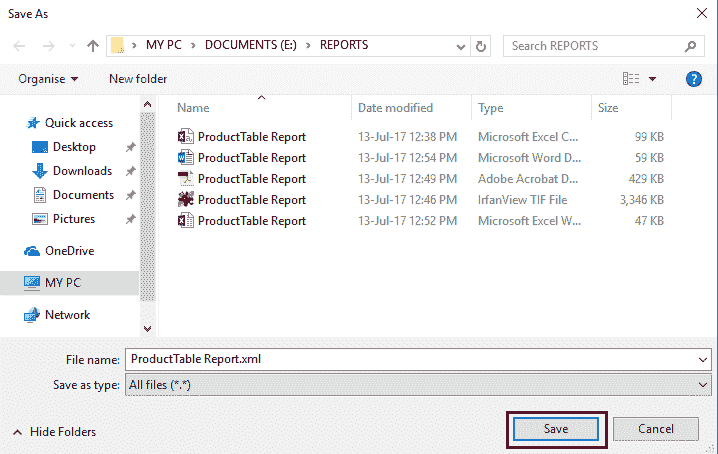

# 导出 SSRS 报告

> 原文：<https://www.tutorialgateway.org/export-ssrs-report/>

SSRS 生成的报告可以多种格式导出。在本文中，我们将向您展示导出由 SQL Server Reporting Services 生成的 SSRS 报告的分步方法

对于这个例子，我们将使用下面显示的数据集。请参考[共享数据源](https://www.tutorialgateway.org/ssrs-shared-data-source/)和[数据集](https://www.tutorialgateway.org/shared-dataset-in-ssrs/)文章，了解我们在本 [SSRS](https://www.tutorialgateway.org/ssrs/) 报告中使用的创建共享数据源和数据集的步骤。


我们在上面的数据集中使用的自定义 [SQL](https://www.tutorialgateway.org/sql/) 查询是:

```
-- Export SSRS Reports
SELECT Prodcat.EnglishProductCategoryName,
       prodSubcat.EnglishProductSubcategoryName,  
       prod.EnglishProductName, 
       prod.Color, 
       fact.[TotalProductCost],
       fact.SalesAmount, 
       fact.TaxAmt,
       fact.[OrderDate],
       fact.[ShipDate] 
FROM dbo.DimProduct as prod 
  INNER JOIN 
dbo.DimProductSubcategory AS prodSubcat ON 
       prod.ProductSubcategoryKey = prodSubcat.ProductSubcategoryKey 
  INNER JOIN  
dbo.DimProductCategory AS Prodcat ON 
       prodSubcat.ProductCategoryKey = Prodcat.ProductCategoryKey 
  INNER JOIN  
dbo.FactInternetSales AS fact ON 
       fact.ProductKey = prod.ProductKey
WHERE SalesAmount >= 3500
```

## 导出 SSRS 报告

为了解释导出 SSRS 报告的步骤，我们将使用下图所示的报告。有关创建和格式化表格报告的步骤，请参考 SSRS 文章中的 [SSRS 表格报告](https://www.tutorialgateway.org/ssrs-table-report/)、[格式-表格报告，分组技术请参考 SSRS 表格报告](https://www.tutorialgateway.org/format-table-report-in-ssrs/)文章中的[分组。](https://www.tutorialgateway.org/ssrs-grouping-in-table-reports/)

[](https://www.tutorialgateway.org/ssrs-grouping-in-table-reports/)

让我给你看看报告预览。


在“预览”选项卡中，如果您单击“保存”按钮，它会打开带有可用导出选项的上下文菜单。他们是:

*   带有报告数据的 XML 文件:报告将以 XML 格式保存。文件扩展名将为。XML
*   CSV(逗号分隔):以 CSV(逗号分隔值)格式保存的 SSSR 报告。文件扩展名将为。战斗支援车
*   TIFF 文件:以标记图像文件格式保存的报告。文件扩展名将为。一口
*   PDF:报告将以 PDF 格式保存。文件扩展名将为。可移植文档格式文件的扩展名（portable document format 的缩写）
*   网页存档:报告将以 MIME HTML 格式保存。您可以使用任何网络浏览器查看该文件。文件扩展名将为。单个文件网页
*   Excel: SSRS 报告将以微软 Excel 电子表格式保存。文件扩展名将为。文件格式
*   Word:以 Microsoft Word 文档格式保存的报告。文件扩展名将为。文档


### 将 SSRS 报告导出到 CSV 文件

在本例中，我们将 SSRS 报告导出为 CSV 文件。为此，请从上下文菜单


中选择 CSV 选项

它将打开另存为对话框来保存 CSV 文件。在这里，您可以选择保存该 CSV 文件的驱动器或文件夹(位置)。

从下面的截图中，您可以看到我们正在 E Drive 中选择 REPORT 文件夹。


让我打开 CSV 文件。如您所见，它显示了我们在 SSRS 报告中生成的所有记录。


### 将 SSRS 报告导出到 TIFF 文件

在本例中，我们将报告导出为标记图像文件格式。为此，请从上下文菜单


中选择 TIFF 文件选项

这将打开另存为对话框来保存 TIFF 文件。从下面的截图中，您可以看到我们正在将该文件保存到 E Drive 的 REPORT 文件夹中。


让我打开 TIFF 文件。如您所见，它显示了我们在 SSRS 报告中生成的所有记录以及格式(分组)。


让我们看看 TIFF 文件中的其他页面


### 将 SSRS 报告导出为 PDF

在本例中，我们将 SSRS 报告导出为 PDF 格式。为此，请从上下文菜单中选择 PDF 选项，如下图所示


从下图中，可以看到我们正在将此 PDF 文件保存到我们的 E Drive 中的 REPORT 文件夹中。


让我打开 PDF 文件。它显示了我们在 SSRS 报告中生成的所有记录以及格式(分组)。


### 将 SSRS 报告导出到 Excel 文件

在本例中，我们将 SSRS 报告导出为微软 Excel 电子表格式。为此，请选择 Excel 选项


在这里，我们将这个 Excel 文件保存到我们的 E 驱动器的 REPORT 文件夹中。


让我打开 Excel 电子表。您可以看到，它显示了所有记录以及格式(分组)。


### 将 SSRS 报告导出到 Word 文件

在本例中，我们将 SSRS 报告导出到微软 Word 文档。为此，请从菜单


中选择单词选项

在这里，我们将这个 word 文档保存在我们的 E Drive 中。


让我们打开文件。


### 将 SSRS 报告导出到 XML 文件

在本例中，我们将 SSRS 报告导出为 XML 格式。为此，请选择带有报告数据选项


的 XML 文件

让我将这个 XML 文件保存到 REPORT 文件夹中。



让我们在微软边缘浏览器中打开这个 XML 文件。如您所见，它显示了我们以 XML 格式生成的所有记录。


### 向三菱重工导出 SSRS 报告

在本例中，我们将报告导出为 MIME HTML 格式。为此，请选择 MHTML(网络档案)选项


我们正在电子驱动器中保存这个 mhtml 文件。


让我们在浏览器中打开 MHTML 文件。它显示了我们在 SSRS 报告中生成的所有记录以及分组。


让我打开报告文件夹。在这里，您可以看到我们在示例中保存的所有文件格式。

