# 格式化 SSRS 表格报告

> 原文：<https://www.tutorialgateway.org/format-table-report-in-ssrs/>

在本文中，我们将向您展示如何在 SSRS 格式化表格报告。例如，它包括在 SSRS 或 SQL Server Reporting Services 中更改表格报告的字体样式、字体颜色、字体系列、字体大小、字体粗细和背景颜色。

为了解释可用的格式选项，我们将使用下面显示的数据集。请参考[共享数据源](https://www.tutorialgateway.org/ssrs-shared-data-source/)和[数据集](https://www.tutorialgateway.org/shared-dataset-in-ssrs/)文章，了解我们在本 [SSRS](https://www.tutorialgateway.org/ssrs/) 报告中使用的创建共享数据源和数据集的步骤。

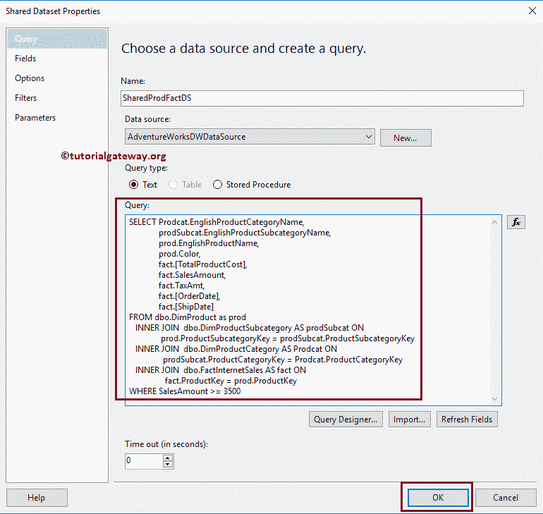

我们在上面的数据集中使用的自定义 [SQL](https://www.tutorialgateway.org/sql/) 查询是:

```
-- Format SSRS Table Report
SELECT Prodcat.EnglishProductCategoryName,
       prodSubcat.EnglishProductSubcategoryName,  
       prod.EnglishProductName, 
       prod.Color, 
       fact.[TotalProductCost],
       fact.SalesAmount, 
       fact.TaxAmt,
       fact.[OrderDate],
       fact.[ShipDate] 
FROM dbo.DimProduct as prod 
  INNER JOIN 
dbo.DimProductSubcategory AS prodSubcat ON 
       prod.ProductSubcategoryKey = prodSubcat.ProductSubcategoryKey 
  INNER JOIN  
dbo.DimProductCategory AS Prodcat ON 
       prodSubcat.ProductCategoryKey = Prodcat.ProductCategoryKey 
  INNER JOIN  
dbo.FactInternetSales AS fact ON 
       fact.ProductKey = prod.ProductKey
WHERE SalesAmount >= 3500
```

为了解释 SSRS 可用的表格式选项，我们将使用下面显示的报告。请参考 [SSRS 表格报告](https://www.tutorialgateway.org/ssrs-table-report/)一文了解创建表格报告的步骤，请参考【SSRS 表格报告】中的[分组](https://www.tutorialgateway.org/ssrs-grouping-in-table-reports/)一文了解分组。

如果你观察下面的截图，它只是一个普通的报告，产品类别名称(主要组)、产品子类别名称(子组)、产品名称、颜色、产品总成本和销售金额列为详细信息。

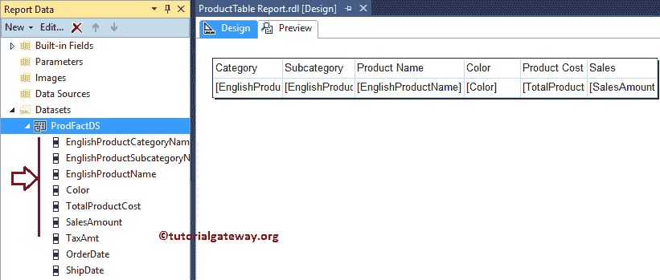

让我给你看一下报告预览表。

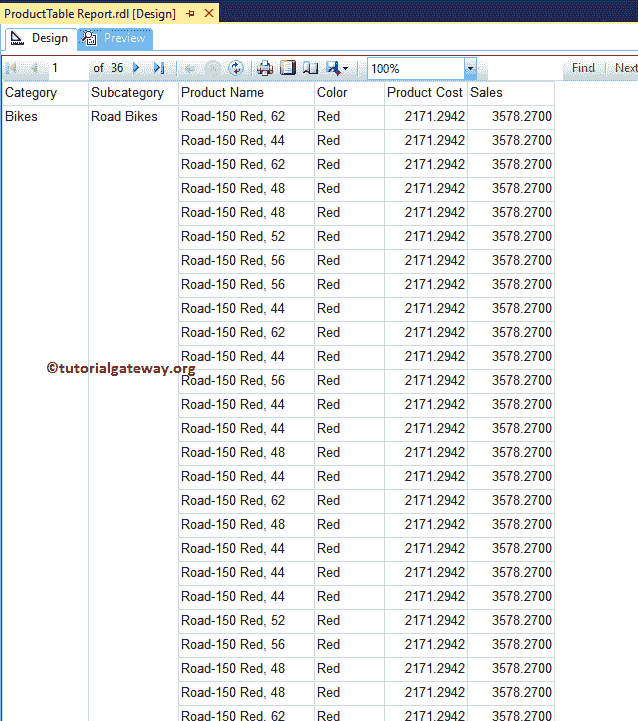

如果你观察上面的截图，它显示的是完美的结果，但我必须说，呈现的数据很糟糕。

## SSRS 表格报告格式

请按住 Ctrl 键(如果您在 Windows 上)选择所有列，然后转到属性窗口。它允许我们格式化表格报告中的所有行和列。

### SSRS 表格报告的格式字体

请导航到属性窗口中的字体部分，并将其展开以查看可用属性

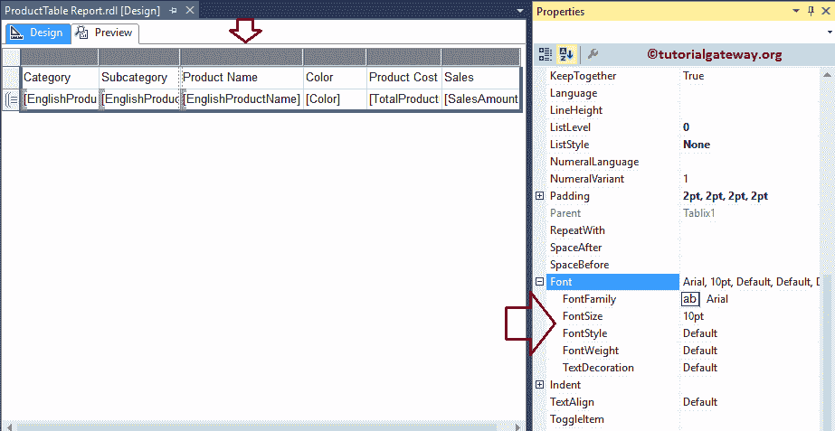

首先，我们将更改总报告的字体系列。要更改字体系列，请转到字体系列属性，并根据您的要求更改字体。

这里，我们将标题文本和详细信息行的字体更改为 Cambria。

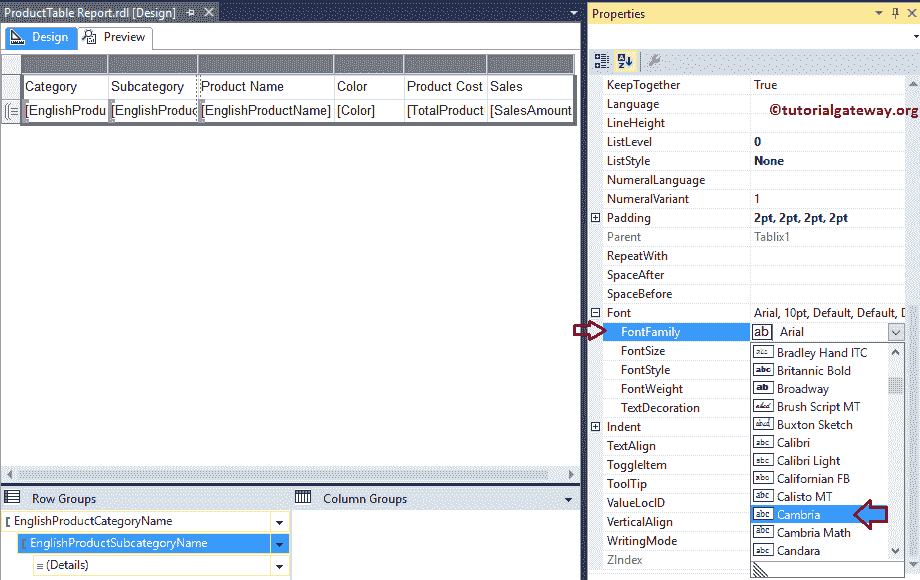

### 格式化 SSRS 表格报告的标题行

要格式化标题行(列标题)，请选择标题行。接下来，转到属性。首先，让我将字体大小更改为 12pt

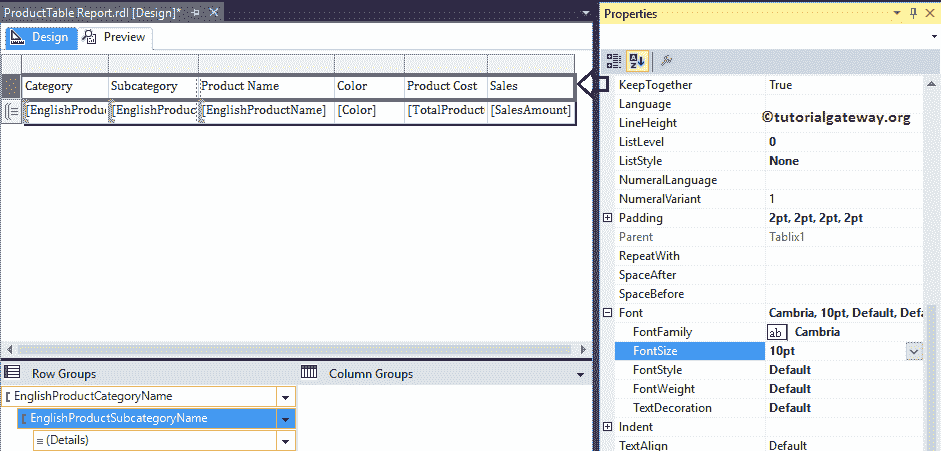

您可以使用字体样式属性将默认字体样式更改为斜体

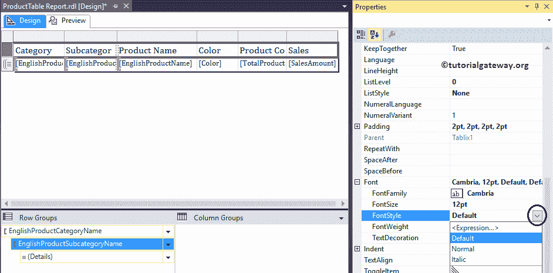

您可以使用“字体粗细”属性将字体更改为粗体、细字体、普通字体、特别轻字体、半粗体、特别粗体、重字体、轻字体等。这里我们将字体粗细改为半粗体。

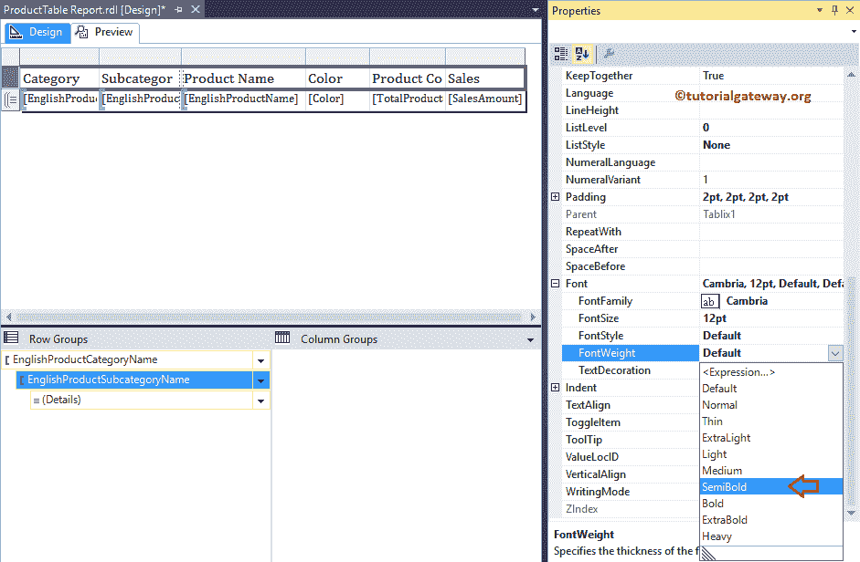

### SSRS 表格报告的格式标题行背景

要更改背景颜色，请转到背景颜色属性并选择所需的颜色。这里我们选择绿松石

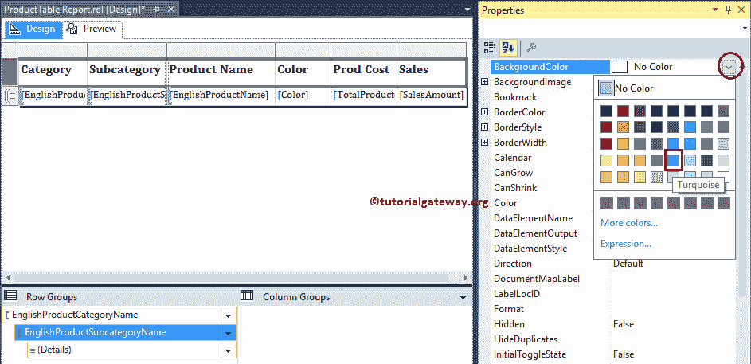

### 设置 SSRS 表格报告的明细行格式

要格式化详细行(除列标题之外的所有行)，请通过选择角来选择详细行，然后转到属性。让我把字体大小改为 11pt

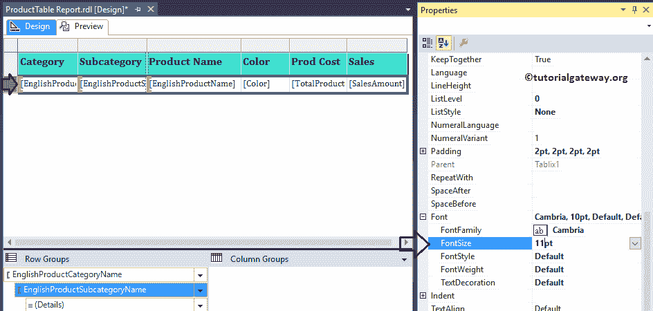

让我们预览格式化的 SSRS 表格报告

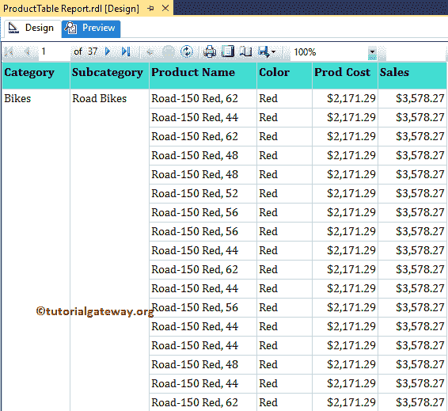

如果你观察上面的截图，它看起来整洁干净