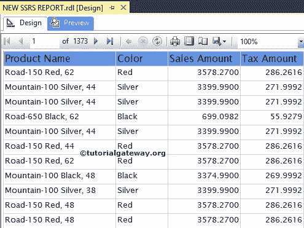

# 格式化 SSRS 文本框的字体和背景色

> 原文：<https://www.tutorialgateway.org/format-fonts-and-background-of-a-textbox-in-ssrs/>

在本文中，我们将通过一个示例向您展示如何更改 SQL Server Reporting Services 中文本框的字体样式、字体颜色、字体大小、字体系列、字体粗细和背景颜色。

为了解释可用的格式选项，我们将使用下面显示的报告。请参考 [SSRS 表格报告](https://www.tutorialgateway.org/ssrs-table-report/)文章，了解本次 [SSRS](https://www.tutorialgateway.org/ssrs/) 报告使用的[共享数据源](https://www.tutorialgateway.org/ssrs-shared-data-source/)和[数据集](https://www.tutorialgateway.org/shared-dataset-in-ssrs/)。

如果您观察下面的截图，它是一个包含产品名称、颜色、销售额和税额列的常规报告。

如果你观察上面的截图，它显示的是正确的数据，但并没有吸引最终用户。

## SSRS 文本框的格式字体和背景色

要格式化 SSRS 文本框的字体和背景色，请选择标题行并进入属性，如下图所示

### 格式化 SSRS 文本框的背景色

要更改背景颜色，请转到背景颜色属性并选择所需的颜色。这里我们选择的是

### SSRS 文本框的字体颜色格式

要更改字体颜色，请转到字体颜色属性并选择所需的颜色。这里我们留下默认的黑色

### 设置 SSRS 文本框的字体大小

要更改字体大小，请转到字体大小属性，并根据您的要求更改字体大小。这里我们将其更改为 12pt

### SSRS 的文本框字体格式

要更改字体样式，请转到字体样式属性，并根据您的要求更改字体样式(普通、斜体)。这里我们离开默认

### SSRS 的文本框字体系列格式

要更改字体系列，请转到字体系列属性，并根据您的要求更改字体。这里，我们将标题文本和详细信息行的字体更改为 Lucida Sans。

让我们预览格式化报告

如果你观察上面的截图，它看起来整洁又好