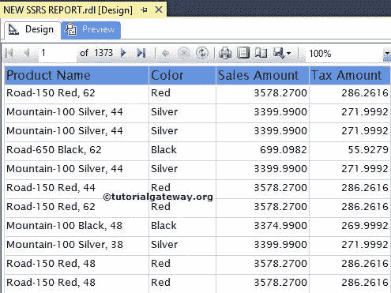
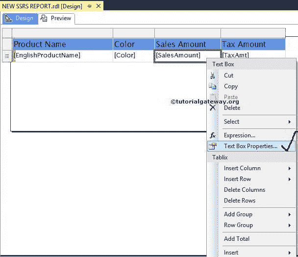
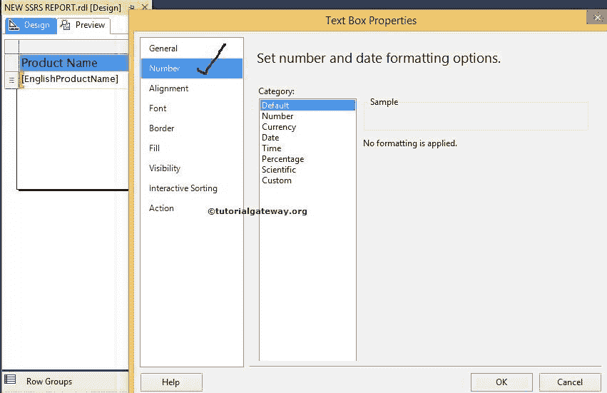
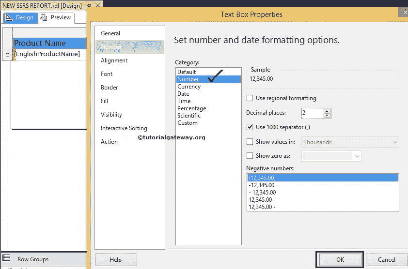
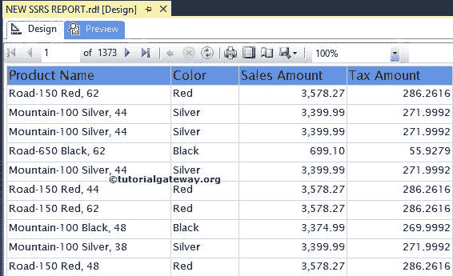
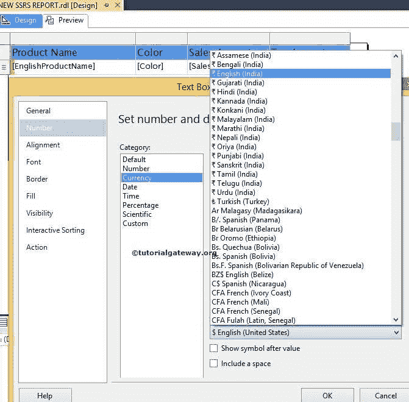
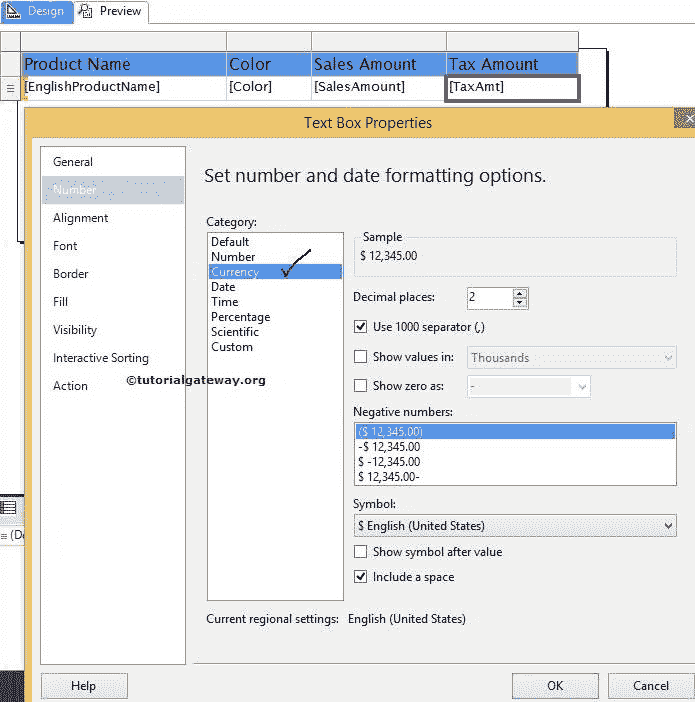
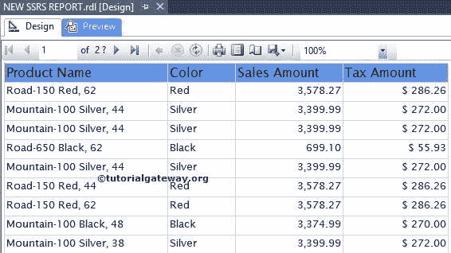

# 格式化 SSRS 报告中的数字

> 原文：<https://www.tutorialgateway.org/format-numbers-in-ssrs/>

在本文中，我们将向您展示在 SSRS 报告中格式化数字的分步方法。或者，举例说明如何在 SQL Server Reporting Services 或 SSRS 中格式化文本框中的数值或数字。

为了解释可用的数字格式选项，我们将使用下面显示的报告。请参考 [SSRS 表格报告](https://www.tutorialgateway.org/ssrs-table-report/)文章了解本次 [SSRS](https://www.tutorialgateway.org/ssrs/) 报告使用的[共享数据源](https://www.tutorialgateway.org/ssrs-shared-data-source/)和[数据集](https://www.tutorialgateway.org/shared-dataset-in-ssrs/)。这是一份包含产品名称、颜色、销售额和税额列的普通报告。

从上面的截图来看，“销售额”和“税额”列中显示的数值并不能吸引最终用户。小数点后数字太多，没有货币符号。

## 在 SSRS 格式化数字

要格式化 SSRS 报告中的数字，请选择包含数值的文本框。

在这个 SSRS 格式化数字的例子中，选择报告的销售额文本框，右键单击它将打开上下文菜单。请选择文本框属性..选项

一旦我们点击文本框属性..选项，将会打开一个新的文本框属性窗口。请选择数字选项卡。

### 在 SSRS 格式化数字的属性

要格式化 SSRS 的号码，请从可用列表中选择号码类别。

*   要从小数位数中删除这些额外的数字，请选择“小数位数”属性，并将该值更改为 2。
*   使用 1000 分隔符(，):如果要用逗号分隔 1000，请选择此选项

单击“确定”完成“销售额”文本框的数值格式化。让我们预览一下 SSRS 格式的数字报告

现在，让我们格式化税额中的数值

### SSRS 的货币格式

请从可用列表中选择货币类别。要更改货币，请从提供的列表

中选择所需货币

本例我们选择了美元

单击“确定”完成“销售额”和“税额”列中数字的格式化。让我们看看 SSRS 版式货币预览

如果您观察上面的截图，销售额和税额列中的数字数据看起来更有吸引力，也更有意义