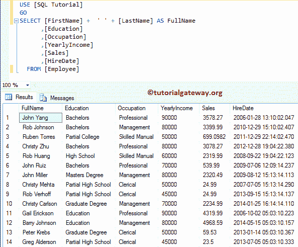
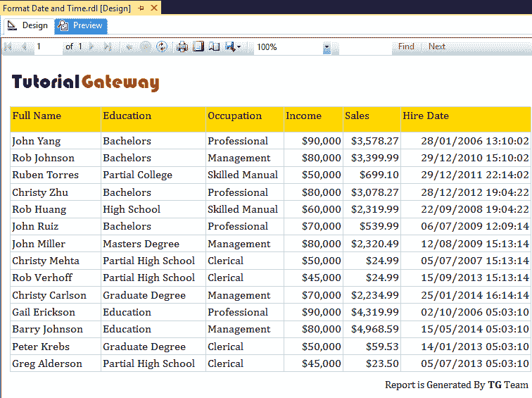
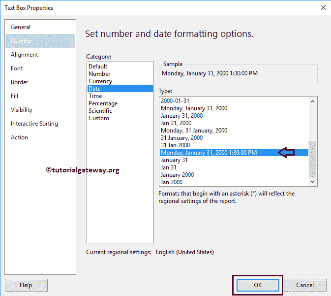

# 格式化 SSRS 报告中的日期和时间

> 原文：<https://www.tutorialgateway.org/format-date-and-time-in-ssrs-report/>

在本文中，我们将向您展示如何格式化 SSRS 报告中的日期和时间。这是用户经常问的问题之一。因此，这里我们将向您展示使用文本框属性格式化 SSRS 报告中的日期和时间的分步方法，并通过一个示例展示表达式。

为了解释可用的 SSRS 日期格式和时间格式选项，我们将使用下面显示的数据集。请参考[嵌入式数据源](https://www.tutorialgateway.org/embedded-data-source-in-ssrs/)和[数据集](https://www.tutorialgateway.org/embedded-dataset-in-ssrs/)文章，了解我们在本 [SSRS](https://www.tutorialgateway.org/ssrs/) 报告中使用的创建嵌入式数据源和数据集的步骤。


我们在上面的数据集中使用的自定义 [SQL](https://www.tutorialgateway.org/sql/) 查询是:

```
-- Formatting Date and Time on SSRS Report
SELECT [FirstName] +  ' ' + [LastName] AS FullName
      ,[Education]
      ,[Occupation]
      ,[YearlyIncome]
      ,[Sales]
      ,[HireDate]
  FROM [Employee]
```

以上查询所写的数据是:



## 格式化 SSRS 报告中的日期和时间

为了解释 SSRS 数据格式和时间格式选项的列表，我们将使用下图所示的报告。

请参考 [SSRS 表报告](https://www.tutorialgateway.org/ssrs-table-report/)一文了解创建表报告所涉及的步骤，请参考【SSRS】的[格式-表报告](https://www.tutorialgateway.org/format-table-report-in-ssrs/)一文了解格式。接下来，参见[添加页眉和页脚到 SSRS 报告](https://www.tutorialgateway.org/add-headers-and-footers-to-ssrs-report/)添加页眉和页脚。


让我给你看看报告预览。这里，我们的任务是格式化 SSRS 报告



中的雇佣日期列

在 SSRS，我们有两种格式化日期和时间的方法:一种是使用文本框属性，另一种是使用表达式。让我在这里解释第一个选项，稍后我们将展示第二个选项。

### SSRS 报告中格式化数据和时间的第一种方法

要格式化 SSRS 的日期，请选择包含日期值的文本框。在本例中，选择 SSRS 报告的“雇用日期”文本框，右键单击它将打开上下文菜单。请选择文本框属性..选项


一旦我们点击文本框属性..选项，将会打开一个新的文本框属性窗口。请选择数字选项卡，然后选择日期类别。


若要格式化 SSRS 的日期，请将默认日期时间格式更改为 2000 年 1 月 31 日星期一下午 1:30


从下面的截图中可以看到，我们的报告在【雇佣日期】栏


显示了格式化的日期和时间

再次，让我将日期时间格式更改为 2000 年 1 月 31 日星期一下午 1:30:00



从下面的截图中可以看到，我们的报告在“雇用日期”列中显示了上午和下午的日期和时间。希望大家理解 SSRS


的格式日期

这次，我们将尝试最短日期格式 2000 年 1 月 31 日


我们的报告预览以相同的格式显示雇用日期。


如果您观察文本框属性中的数字选项卡，我们有另一个名为时间的类别。此类别对于格式化时间(专用)很有用。让我选择格式为 31-1-00 下午 1:30


我们的报告预览以相同的格式显示雇用日期。


### 使用表达式格式化 SSRS 报告中的日期和时间

这是第二种方法，也是《SSRS 报告》中格式化数据和时间的最先进方法。

SSRS 支持表达式，它是开发人员可用的主导概念之一。如果所需的格式不在类别列表中，则可以使用表达式来编写自定义日期和时间。

请选择 SSRS 报告的“雇用日期”文本框，右键单击它将打开上下文菜单。请选择表达式..选项


一旦选择了表达式..选项，将打开一个名为“表达式”的新窗口。在类别部分->通用函数->日期和时间下，我们有许多日期和时间函数。我们可以使用任何函数或函数组合来达到预期的结果。


对于这个 SSRS 日期格式示例，我们将雇佣日期格式化为短日期


如您所见，“雇用日期”列表示它包含表达式，而不是列名“雇用日期”。


请参阅我们的报告预览，它在“雇用日期”列中显示相同的数据。

