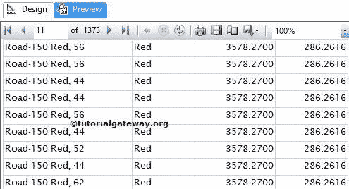
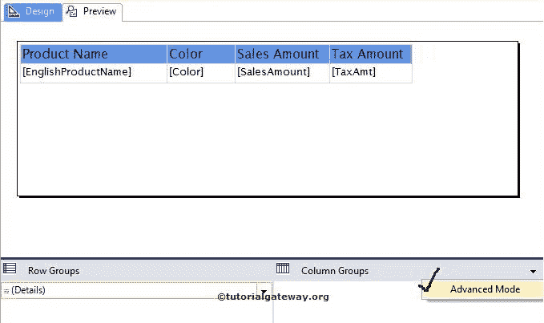
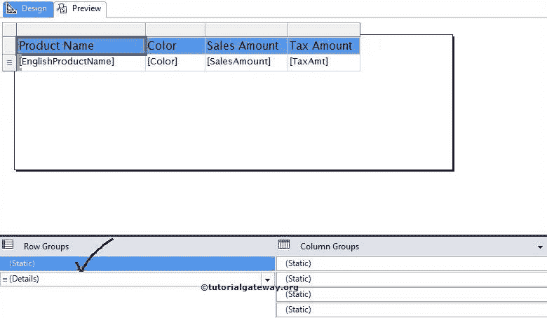
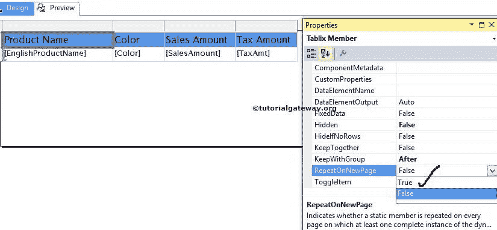
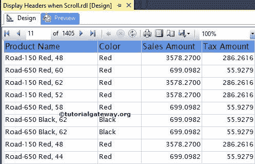

# 在 SSRS 每页重复标题

> 原文：<https://www.tutorialgateway.org/repeat-headers-on-each-page-in-ssrs/>

这篇文章将展示如何在 SSRS 的每一页上重复标题。这是您在开发表格或矩阵报告时可能面临的标准要求之一。

## 如何在 SSRS 每页上重复页眉

我们将使用下面显示的报告来解释“在 SSRS 报告中每页重复标题”。请参考 [SSRS 表报表](https://www.tutorialgateway.org/ssrs-table-report/)、[数据源](https://www.tutorialgateway.org/ssrs-shared-data-source/)、[数据集](https://www.tutorialgateway.org/shared-dataset-in-ssrs/)文章，了解 [SSRS](https://www.tutorialgateway.org/ssrs/) 数据源、数据集、表报表的创建。

如果您观察下面的截图，它是一个包含产品名称、颜色、销售额和税额列的普通表格报告。

如果我们导航到第二页或任何其他页面，我们将无法看到行标题。对于最终用户来说，识别哪个列数据属于销售和税务变得非常困难。

要在 SSRS 的每个页面上显示行标题，我们必须从行组窗格中选择标题。默认情况下，行组窗格中仅显示详细信息行。

要显示标题组，请单击向下箭头。接下来，从列组窗格中选择高级模式，如下图所示

单击高级模式后，它将在行组和列组中显示静态列(标题列)。请选择行组窗格(标题行组)中显示的静态列。接下来，转到这个静态列

的属性

请选择“重复新页面”选项，然后将“重复新页面”选项从默认值“假”更改为“真”。它将允许标题文本在报告

的每一页上重复

单击预览按钮，查看每页 SSRS 重复标题报告预览。

如果观察上面的截图，我们显示的是第 11 页，报告显示的是 Header 文本。