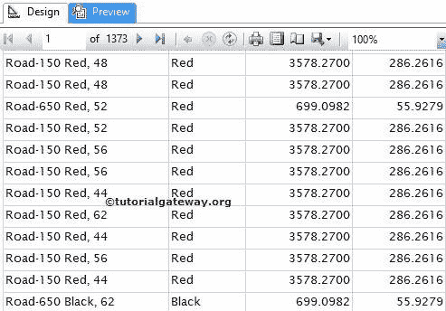
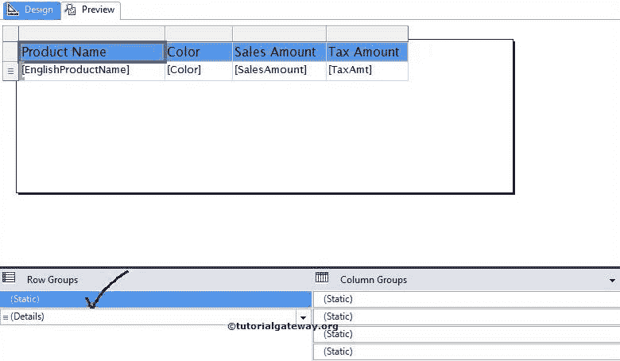

# 在 SSRS 滚动时保持标题可见

> 原文：<https://www.tutorialgateway.org/keep-headers-visible-while-scrolling-in-ssrs/>

在本文中，我们将向您展示如何在 SSRS 滚动时保持标题可见。这是您在开发表格或矩阵报告时可能面临的标准要求之一。

## 如何在 SSRS 滚动时保持标题可见

我们将使用下面显示的报告来解释，在 SSRS 报告中滚动时保持标题可见。请参考[表报告](https://www.tutorialgateway.org/ssrs-table-report/)、[数据源](https://www.tutorialgateway.org/ssrs-shared-data-source/)、[数据集](https://www.tutorialgateway.org/shared-dataset-in-ssrs/)文章，了解数据源、数据集、 [SSRS](https://www.tutorialgateway.org/ssrs/) 表报告的创建。

从下面的截图中，您可以看到，这是一个标准的表格报告，包含产品名称、颜色、销售额和税额列。

如果我们向下滚动一点，我们将看不到行标题。识别哪个列数据属于销售和税务变得非常有问题，如下图所示。

要在 SSRS 每页上滚动时显示行标题，我们必须从行组窗格中选择标题。默认情况下，只有明细行才会显示在行组窗格中。

要显示标题组，单击向下箭头，从“列组”面板

中选择高级模式

单击高级模式后，它将在行组和列组中显示静态列(标题列)。请选择行组窗格(标题行组)中显示的静态列，并转到该静态列的属性

请选择固定数据选项，然后将固定数据选项从默认的假更改为真。当我们滚动 SSRS 报告

时，它将允许标题文本冻结

请选择“重复新页面”选项，然后将“重复新页面”选项从默认值“假”更改为“真”。它将允许标题文本在 SSRS 报告

的每一页上重复

点击预览按钮，查看 SSSR 滚动时保持标题可见的报告预览。

如果您观察上面的截图，我们显示的是第 7 页的中间，报告显示的是 Header 文本。