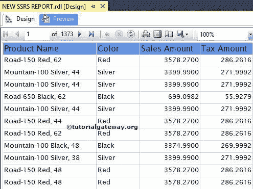

# SSRS Tablix 级别的过滤器

> 原文：<https://www.tutorialgateway.org/filters-at-tablix-level-in-ssrs/>

SSRS Tablix 级别的过滤器:在 SQL Server Reporting Services 中，过滤器类似于 [SQL WHERE](https://www.tutorialgateway.org/sql-where-clause/) 子句。过滤器用于限制报告显示的记录。SSRS 支持两种类型的过滤器:Tablix 级别的过滤器和数据集级别的过滤器。

在本文中，我们将通过一个示例向您展示如何在 SSRS([SQL Server Reporting Services](https://www.tutorialgateway.org/ssrs/))的表级别(或 tablix 级别)过滤数据。

提示:最好只在 Tablix 级别应用过滤器。因为它仅适用于此表，而不是使用该数据集的所有表。

我们将使用下面显示的报告来解释，SSRS 在表级别或 Tablix 级别过滤数据。请参考[表报告](https://www.tutorialgateway.org/ssrs-table-report/)文章，了解本报告使用的[共享数据源](https://www.tutorialgateway.org/ssrs-shared-data-source/)和[数据集](https://www.tutorialgateway.org/shared-dataset-in-ssrs/)。如果您观察下面的截图，它是一个包含产品名称、颜色、销售额和税额列的普通报告。

如果你观察上面的截图，它显示的是 1373 页的数据。

## SSRS Tablix 级别的过滤器

要在表级别过滤数据，请选择报告的左上角，右键单击它将打开上下文菜单。请选择 Tablix 属性..选项

一旦我们点击了 Tablix 属性..选项，将会打开一个新的 Tablix 属性窗口。请选择过滤器选项卡。

点击添加按钮将显示以下属性

*   表达式:它将允许您从数据集中选择可用的列，或者我们可以通过单击 fx 按钮来创建表达式
*   数据类型:默认情况下，选择文本作为数据类型。你可以根据你的要求改变。
*   运算符:如果要使用(如，
*   值:请指定要根据表达式检查的值。请点击 fx 按钮写入数值表达式。

在这个 Tablix 级别的 SSRS 过滤器示例中，我们将显示[销售额]大于或等于 3500 的记录。因此，请选择[销售额]作为表达式，运算符作为> =和值作为 3500。

这里，[销售额]是浮点值，所以我们必须将 3500 转换为十进制值。如果知道转换函数，可以直接写。如果没有，请点击 fx 按钮并使用内置功能

单击“确定”按钮完成值表达式的编写。

单击“确定”按钮完成在 SSRS 的 Tablix 级别配置过滤器。让我们预览报告

如果您在 SSRS 报告截图中观察到以上 Tablix 级别的过滤器，它将显示 36 页数据，因为剩余数据不满足过滤器条件。

如果您想删除不必要的过滤器，请选择 SSRS Tablix 过滤器，点击

删除按钮