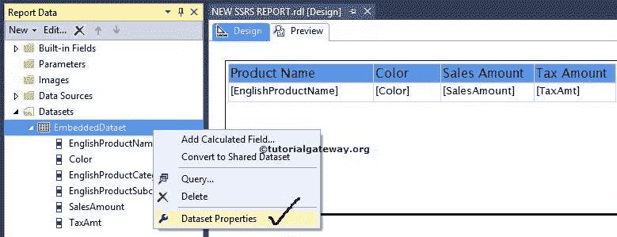
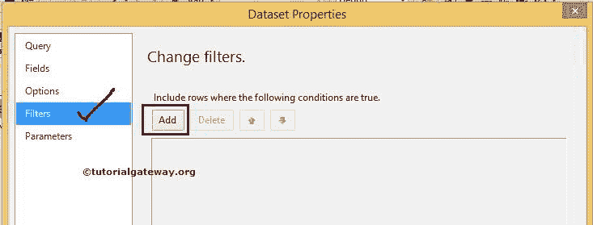
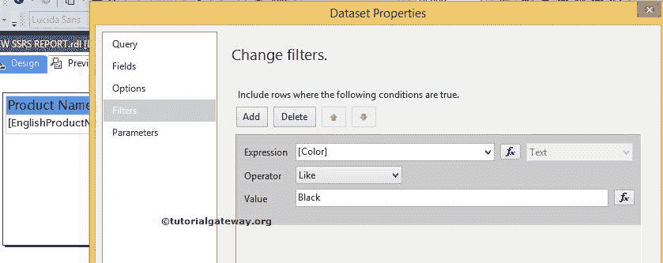
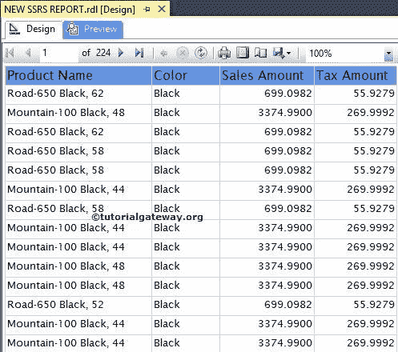
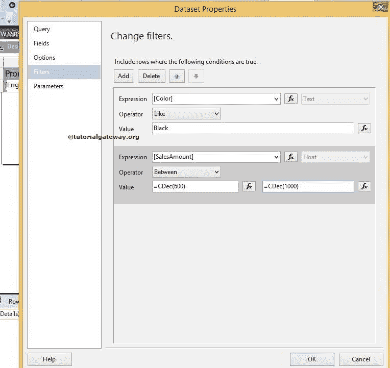
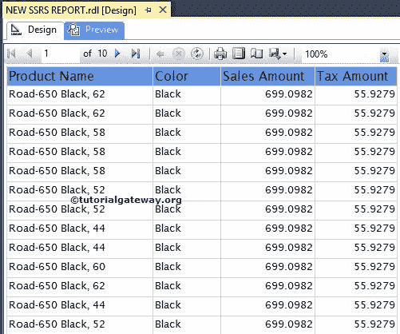

# SSRS 数据集级别的过滤器

> 原文：<https://www.tutorialgateway.org/filters-at-dataset-level-in-ssrs/>

在 SQL Server 报告服务中，过滤器类似于 SQL WHERE 子句。SSRS 数据集级过滤器用于限制 SSRS 报告显示的记录。在本文中，我们将通过一个示例向您展示在 SSRS 数据集级别(SQL Server Reporting Services)应用过滤器所涉及的步骤。

SSRS 支持两种类型的过滤器:Tablix 级别的[过滤器和数据集级别的过滤器。](https://www.tutorialgateway.org/filters-at-tablix-level-in-ssrs/)

提示:如果要在多个报告中使用 SSRS 过滤器，请在共享数据集级别应用过滤器。它将应用于使用该数据集的所有表。请参考 [SQL WHERE 子句](https://www.tutorialgateway.org/sql-where-clause/)一文。

我们使用下面显示的报告来解释，SSRS 在数据集级别过滤数据。请参考[表报告](https://www.tutorialgateway.org/ssrs-table-report/)了解本次 [SSRS](https://www.tutorialgateway.org/ssrs/) 报告使用的[共享数据源](https://www.tutorialgateway.org/ssrs-shared-data-source/)和[数据集](https://www.tutorialgateway.org/shared-dataset-in-ssrs/)。如果您观察下面的截图，它是一个包含产品名称、颜色、销售额和税额列的常规报告。

如果你观察上面的截图，它显示的是 1373 页的数据。

## SSRS 数据集级别的过滤器

从报告的“报告数据”选项卡中选择数据集，右键单击它将打开上下文菜单。请选择数据集属性..选项

一旦我们点击数据集属性..选项，将打开一个新的数据集属性窗口。选择过滤器选项卡。

点击添加按钮将显示以下属性

*   表达式:它允许从数据集中选择可用的列，或通过单击 fx 按钮创建表达式
*   数据类型:默认情况下，选择文本作为数据类型。根据需要改变。
*   运算符:选择要使用的运算符(如，
*   值:请给出要根据表达式检查的值。请点击 fx 按钮写入数值表达式。

在这个数据集级别的 SSRS 过滤器示例中，我们将显示[颜色]为黑色的记录。因此，选择[颜色]作为表达式，选择运算符作为相似值，选择值作为黑色。

单击确定按钮，在 SSRS 完成数据集级别的过滤器配置。让我们预览报告

如果观察上面的截图，它显示的是 224 页的数据，因为剩余的数据不满足过滤条件(它们的颜色不是黑色)。

为了更好地理解，让我们在数据集级别再添加一个过滤器。这里，我们将显示[销售金额]在 600 和 1000 之间的记录，因此，请选择[销售金额]作为表达式，选择运算符作为介于，选择值作为 600 和 1000。

这里，[销售额]是浮动值。因此，我们必须将 600 和 1000 都转换为十进制值。如果知道转换函数，可以直接写。如果没有，点击 fx 按钮并使用内置功能

提示:如果您想删除不必要的过滤器，请选择过滤器并点击删除按钮。

单击确定按钮完成数据集级别的过滤器配置。让我们预览报告

如果观察上面的截图，它显示的是 10 页数据，因为剩余的数据不满足 2 个过滤条件。