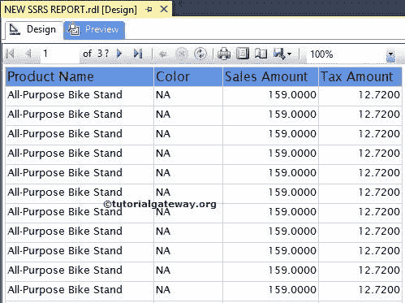
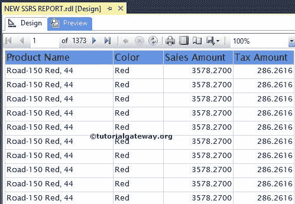

# SSRS 的排序

> 原文：<https://www.tutorialgateway.org/sorting-in-ssrs/>

SSRS 的排序类似于 SQL ORDER BY 子句。排序用于根据 Tablix 属性中给定的表达式对记录进行排序，然后排序后的数据将显示在最终的 SSRS 报告中。在本文中，我们将通过一个例子向您展示如何在 SSRS 的表级别(或 tablix 级别)对数据进行排序。

提示:最好只在文本框级别应用 SSRS 排序(交互式排序)，因为它允许用户动态排序记录。

我们将使用下面显示的报告来解释，在 Tablix 级别对数据进行排序。请参考 [SSRS 表格报告](https://www.tutorialgateway.org/ssrs-table-report/)文章，了解本次 [SSRS](https://www.tutorialgateway.org/ssrs/) 报告使用的[共享数据源](https://www.tutorialgateway.org/ssrs-shared-data-source/)和[数据集](https://www.tutorialgateway.org/shared-dataset-in-ssrs/)。如果您观察下面的截图，它是一个标准报告，包含产品名称、销售额、颜色和税额列。

如果您看到上面的截图，它会以未排序的方式显示数据。

## SSRS 的排序示例

要应用 SSRS 排序，请选择报告的左上角，然后右键单击它以打开上下文菜单。请选择 Tablix 属性..选项

一旦我们点击了 Tablix 属性..选项，将会打开一个新的 Tablix 属性窗口。请选择排序选项卡。

点击添加按钮将显示以下属性

*   排序依据:它将允许您从数据集中选择可用的列。或者，我们可以通过单击 fx 按钮来创建自己的表达式。例如，如果要按产品名称对数据进行排序，请选择该列名称。
*   订单:默认情况下，选择“从 A 到 Z”作为订单类型。你可以根据你的要求改变。A 到 Z 表示升序，Z 到 A 表示降序

在这个 SSRS 排序示例中，我们将按照升序按[英文产品名称]对记录进行排序。因此，请选择[英文产品名称]作为“按表达式排序”，选择 A 到 Z 作为“顺序”。

单击“确定”按钮完成在 SSRS 的 Tablix 级别配置排序。让我们预览报告

如果观察上面的截图，数据按照[升序](https://www.tutorialgateway.org/sql-order-by-clause/)按产品名称排序。

为了更好地理解，让我们在 Tablix 级别再添加一个排序选项。在这里，我们将按照降序按[销售额]对数据进行排序，然后按照升序按[英文产品名称]进行排序。

提示:如果要删除不必要的排序选项，请选择排序条件。接下来，点击删除按钮。

单击“确定”按钮完成在 SSRS Tablix 级别应用排序。让我们预览报告

如果您观察上面的图像，数据将按销售额降序排序。然后按英文产品升序排序。