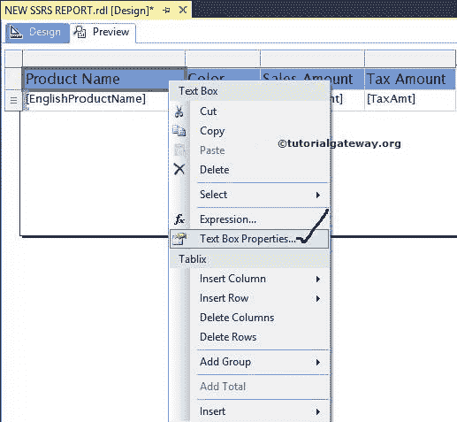
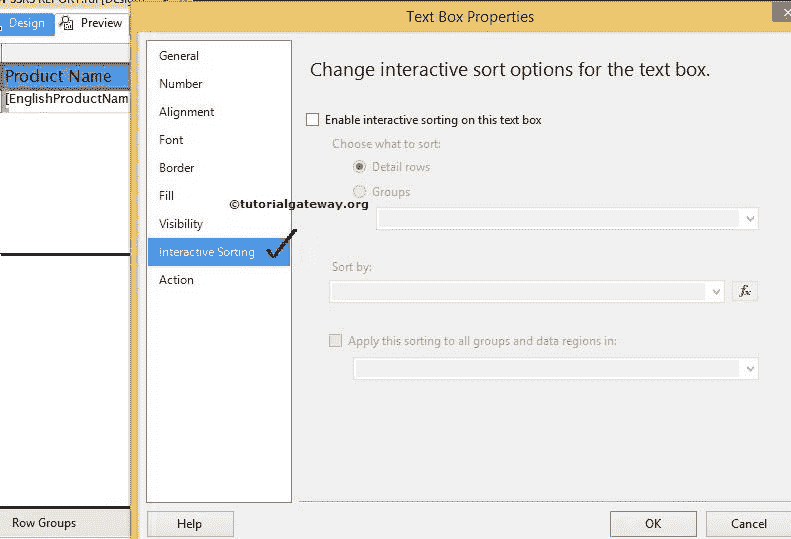
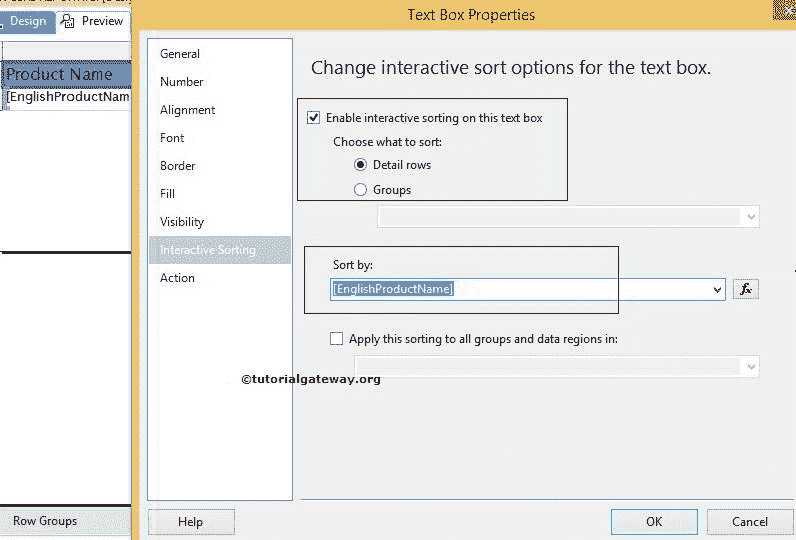
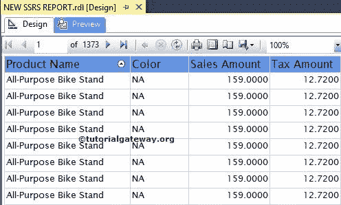
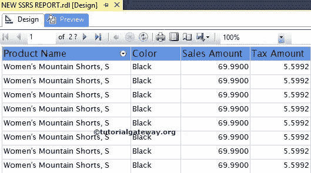
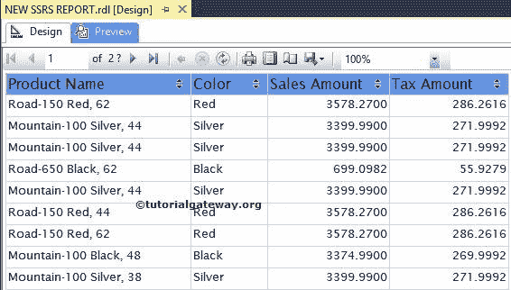

# SSRS 互动排序

> 原文：<https://www.tutorialgateway.org/ssrs-interactive-sort/>

SSRS 交互式排序类似于 SQL ORDER BY 子句。交互式排序用于向最终用户提供排序控制，就像我们在像亚马逊这样的流行电子商务网站中看到的那样。

SSRS 的交互式排序提供向上和向下箭头在升序和降序之间切换。在本文中，我们将通过一个示例向您展示如何启用 SSRS 交互式排序(在文本框级别对数据进行排序)

我们使用下面显示的报告来解释，报告中的 SSRS 互动排序。请参考[表报](https://www.tutorialgateway.org/ssrs-table-report/)、[共享数据源](https://www.tutorialgateway.org/ssrs-shared-data-source/)、[数据集](https://www.tutorialgateway.org/shared-dataset-in-ssrs/)文章。这是一个简单的 [SSRS](https://www.tutorialgateway.org/ssrs/) 报告，包括产品名称、颜色、销售额和税额栏。

如果您观察上面的截图，它以未排序的方式显示数据。

## SSRS 互动排序示例

首先，选择 SSRS 报告的标题文本框，右键单击它将打开上下文菜单。请选择文本框属性..选项

一旦我们点击文本框属性..选项，将会打开一个新的文本框属性窗口。请选择交互式排序选项卡。

点击 SSRS 互动排序标签将显示以下属性

*   在此文本框上启用交互式排序:如果要在此选定文本框上启用交互式排序，请选择此选项。
*   明细行:如果要启用明细行的交互式排序，请选择此选项。
*   分组:使用此选项可以对分组列启用交互式排序。
*   排序依据:它允许您从数据集中选择可用的列。或者，我们可以通过单击 fx 按钮来创建表达式。例如，如果要按产品名称对数据进行排序，请选择该列名称。

注:SSRS 互动排序适用于单个列。如果您选择了错误的列作为排序依据，可能会导致不正确的结果。例如，您启用了“产品名称交互式排序”并将“颜色”列指定为“排序依据”。如果是这种情况，那么当您点击产品名称时，数据将按颜色而不是产品名称进行排序。

在本例中，我们将在[英文产品名称]上应用交互式排序。因此，请选择[英文产品名称]作为“按表达式排序”。

单击“确定”按钮，完成启用产品名称的交互式排序。让我们预览一下 SSRS 互动整理报告

如果观察上面的截图，数据会按照产品名称的升序排序。

让我们点击向下箭头，按照[降序](https://www.tutorialgateway.org/sql-order-by-clause/)

对数据进行排序

让我们使用上面提到的步骤启用剩余列的交互式排序，如颜色、销售额和税额，并查看预览

我们就是这样向最终用户提供动态排序选项的。