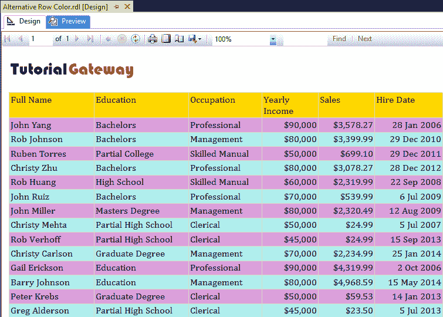

# 向 SSRS 报告添加替代行颜色

> 原文：<https://www.tutorialgateway.org/add-alternative-row-color-to-ssrs-report/>

在本文中，我们将向您展示如何向 SSRS 报告添加替代行颜色。这是用户经常问的问题之一。因此，在这里，我们将通过一个示例向您展示使用表达式向 SSRS 报告添加可选行颜色的分步方法。

我们将使用下面显示的数据集来解释同样的情况。请参考[嵌入式数据源](https://www.tutorialgateway.org/embedded-data-source-in-ssrs/)和[数据集](https://www.tutorialgateway.org/embedded-dataset-in-ssrs/)文章，了解我们在本 [SSRS](https://www.tutorialgateway.org/ssrs/) 报告中使用的创建嵌入式数据源和数据集的步骤。


我们在上面的数据集中使用的自定义 [SQL](https://www.tutorialgateway.org/sql/) 查询是:

```
-- Display Alternative Row Colors in SSRS Report
SELECT [FirstName] +  ' ' + [LastName] AS FullName
      ,[Education]
      ,[Occupation]
      ,[YearlyIncome]
      ,[Sales]
      ,[HireDate]
  FROM [Employee]
```

以上查询所写的数据是:


## 如何向 SSRS 报告添加替代行颜色

我们将使用之前设计的报告，如下所示。请参考 [SSRS 表](https://www.tutorialgateway.org/ssrs-table-report/)、[格式表](https://www.tutorialgateway.org/format-table-report-in-ssrs/)一文，了解创建表&格式的步骤。接下来，访问[添加页眉和页脚到 SSRS](https://www.tutorialgateway.org/add-headers-and-footers-to-ssrs-report/) 文章添加页眉和页脚。


让我给你看预览。


选择详细信息行时，属性窗格中有一个名为“背景颜色”的选项。如果您想为报告返回的所有记录设置标准颜色，可以使用所有预定义的颜色。

### 向 SSRS 报告添加替代行颜色

这里，我们的任务是向 SSRS 报告添加替代行颜色。这意味着我们必须使用一些条件来检查交替行。

为此，请单击“背景颜色”属性下的“表达式”超链接。


单击表达式超链接后，将打开一个名为表达式的新窗口。使用此表达式窗口检查替代行。


在表达式中，我们将使用 [IIF](https://www.tutorialgateway.org/sql-iif-function/) 条件来检查行号是否为偶数。如果是偶数，则为浅绿松石色，否则为梅花色。这样，我们可以为 SSRS 报告添加可选的行颜色。

```
=IIF(RowNumber(Nothing) MOD 2 = 0, "PaleTurquoise", "Plum")
```


完成后，点击【确定】关闭


窗口

如您所见，我们的报告预览正在 SSRS 报告



中显示指定颜色作为替代行颜色