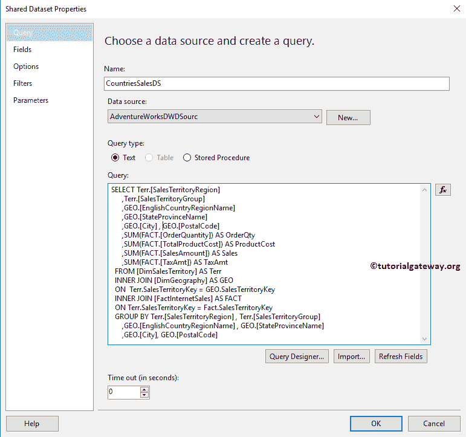
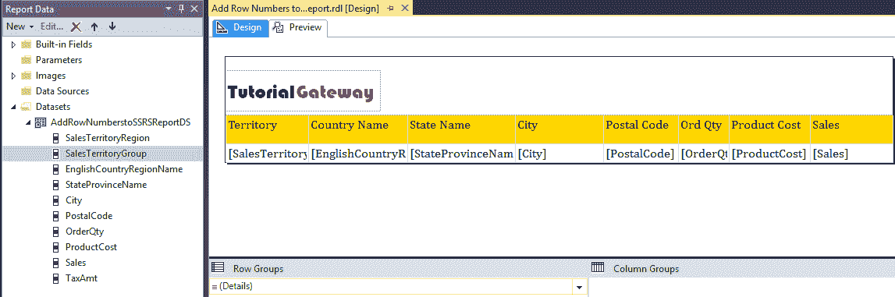
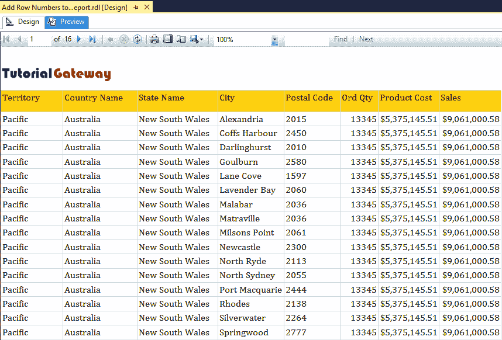
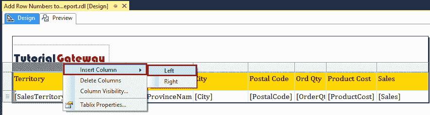
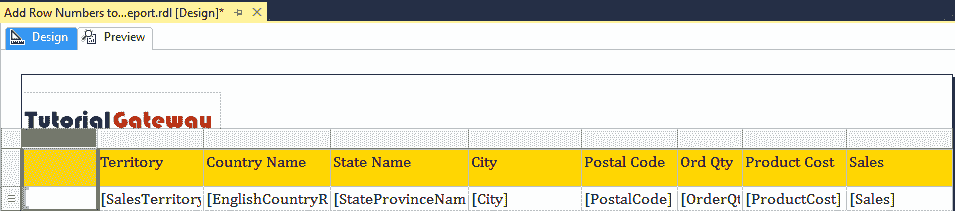
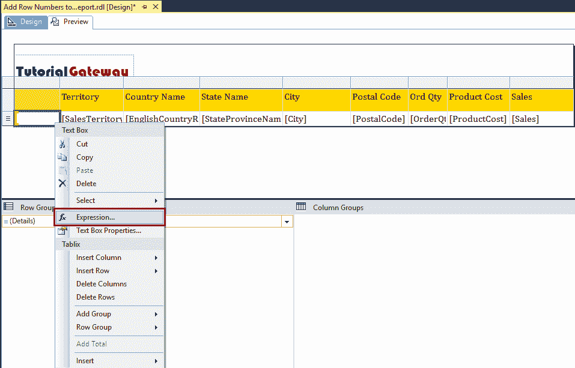
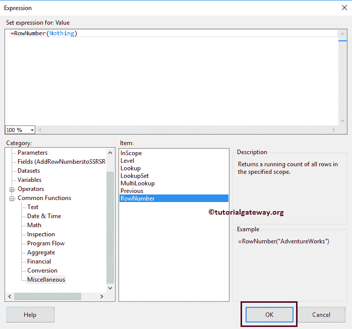
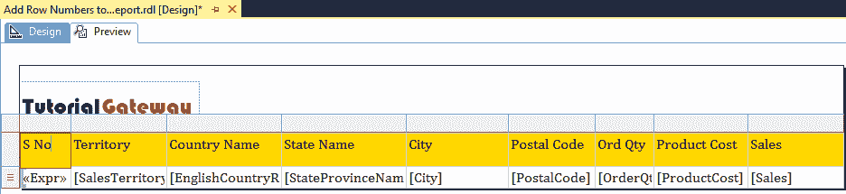
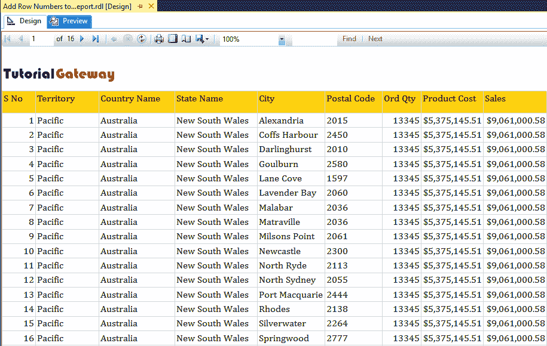
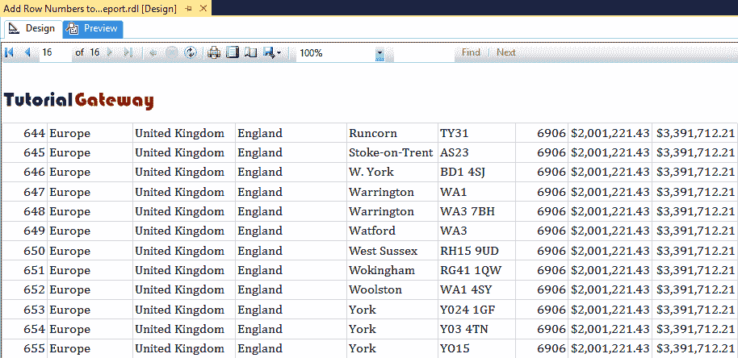

# 向 SSRS 报告添加行号

> 原文：<https://www.tutorialgateway.org/add-row-numbers-to-ssrs-report/>

当您开发[表格](https://www.tutorialgateway.org/ssrs-table-report/)或[矩阵](https://www.tutorialgateway.org/ssrs-matrix-report/)报告时，将要求在 SSRS 表格报告之前显示序列号或行号。在本文中，我们将向您展示如何为 [SSRS](https://www.tutorialgateway.org/ssrs/) 报告添加行号，或者如何在 SSRS 使用行号功能。这是每个报表开发人员的标准要求之一。

我们将使用下面显示的数据集来解释 SSRS 行号。请参考[共享数据源](https://www.tutorialgateway.org/ssrs-shared-data-source/)和[数据集](https://www.tutorialgateway.org/shared-dataset-in-ssrs/)文章，以了解创建共享数据源和数据集所涉及的步骤，我们在本报告中使用了



我们在上面的数据集中使用的自定义 [SQL](https://www.tutorialgateway.org/sql/) 查询是:

```
-- SSRS RowNumber Function
USE [AdventureWorksDW2014]
GO
SELECT Terr.[SalesTerritoryRegion]
      ,Terr.[SalesTerritoryGroup]
      ,GEO.[EnglishCountryRegionName]
      ,GEO.[StateProvinceName]
      ,GEO.[City]
      ,GEO.[PostalCode]
      ,SUM(FACT.[OrderQuantity]) AS OrderQty
      ,SUM(FACT.[TotalProductCost]) AS ProductCost
      ,SUM(FACT.[SalesAmount]) AS Sales
      ,SUM(FACT.[TaxAmt]) AS TaxAmt
  FROM [DimSalesTerritory] AS Terr
  INNER JOIN [DimGeography] AS GEO
  ON  Terr.SalesTerritoryKey = GEO.SalesTerritoryKey
  INNER JOIN [FactInternetSales] AS FACT
  ON Terr.SalesTerritoryKey = Fact.SalesTerritoryKey
  GROUP BY Terr.[SalesTerritoryRegion]
      ,Terr.[SalesTerritoryGroup]
      ,GEO.[EnglishCountryRegionName]
      ,GEO.[StateProvinceName]
      ,GEO.[City]
      ,GEO.[PostalCode]

```

## 向 SSRS 报告添加行号

在这个 SSRS 行号演示中，我们将使用之前设计的报告。请参考 [SSRS 表报告](https://www.tutorialgateway.org/ssrs-table-report/)、[格式表报告](https://www.tutorialgateway.org/format-table-report-in-ssrs/)一文，了解创建表报告&格式所涉及的步骤。接下来，访问[添加页眉和页脚到 SSRS 报告](https://www.tutorialgateway.org/add-headers-and-footers-to-ssrs-report/)文章添加页眉和页脚。



让我给你看看报告预览。



从上面的截图可以看出，从上面的报告中指出一个特定的行是很有挑战性的。如果我们浏览到第 10 页或第 20 页，情况会变得更糟。

如果数据集包含序列号(连续数字)，则可以使用该列。实时地，不可能从数据库中提取连续的列。因此，让我向您展示向 SSRS 报告添加连续列或添加行号的理想方法。

首先，添加一个空列，或者在表报告中插入一个列。为此，右键单击“销售区域”列，选择“插入列”，然后从上下文菜单中选择“左”。



这将在起始位置添加一个空列。



现在右键单击新添加的列将打开上下文菜单。请从上下文菜单中选择表达式选项。



单击表达式后，将打开一个名为表达式的新窗口。使用此表达式窗口编写自定义表达式。在 SSRS，我们有一个名为行号的函数，在这个例子中，我们将使用这个 SSRS 行号。



分配完 SSRS 行号后，点击【确定】关闭



窗口

如您所见，我们的报告预览显示了表报告中的连续数字(行号)。



让我给你看最后一页，看看 SSR 的行号。

