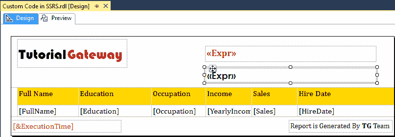

# SSRS 报告中的自定义代码

> 原文：<https://www.tutorialgateway.org/custom-code-in-ssrs-report/>

对于我们实时开发的大多数报告来说，表达式是一个完美的解决方案。但是在某些情况下，我们可能需要复杂的功能或计算。在这些情况下，我们可以在 SSRS 使用自定义代码的概念。

SSRS 定制代码创建定制功能，并将其纳入报告。或者创建 dll(类库)，这样我们就可以在多个报表中重用同一个函数。

在本文中，我们将通过一个实例向您展示在 SSRS 报告中添加自定义代码的分步方法

为了演示在 SSRS 报告中添加自定义代码所涉及的步骤，我们将使用之前生成的报告，如下所示。请参考[格式化日期和时间](https://www.tutorialgateway.org/format-date-and-time-in-ssrs-report/)文章了解 [SSRS](https://www.tutorialgateway.org/ssrs/) 报表数据。


让我给你看看报告预览。可以看到，很普通的[表报](https://www.tutorialgateway.org/ssrs-table-report/)，日期时间格式化


## 如何在 SSRS 报告中添加自定义代码

要在 SSRS 添加自定义代码，我们必须访问报告属性。为此，右键单击报表设计器中的空白区域将打开上下文菜单。请选择报告属性选项。


或者转到“报告”菜单，选择“报告属性”子菜单，如下所示。


不管怎样，它都会打开下面的窗口。


请自行导航到“代码”选项卡，在报告中编写自定义代码。


在这里，我们正在编写一个简单的函数，它将返回消息“欢迎使用教程网关”。代码是:

```
Function WelcomeMsg() As String
	return "Welcome to Tutorial Gateway"
End Function
```


我们已经完成了函数的创建。现在让我在报告中使用这个函数。为此，在页眉中添加一个[文本框](https://www.tutorialgateway.org/add-textbox-to-ssrs-report/)。

接下来，右键单击文本框将打开上下文菜单。请从中选择表达式选项。


选择表达式选项后，将打开一个新窗口来编写表达式。在这里，写代码。欢迎消息(即代码。函数名)，然后单击确定。

请记住，添加自定义代码的语法是代码。函数名(参数 1，…。，【参数】)


现在，让我向您展示添加 SSRS 自定义代码后的报告预览。从下面的截图中，您可以看到我们在函数内部创建的消息。


接下来，让我向报表属性代码中再添加一个函数。

```
Function GreetingMsg() As String
        If (DateTime.Now.Hour < 12) Then
            Return "Good Morning Suresh"
        ElseIf (DateTime.Now.Hour < 17) Then
            Return "Good Afternoon Suresh"
        Else
            Return "Good Evening Suresh"
End If
End Function
```


接下来，在页眉


的第二个文本框中添加以下代码

如您所见，我们格式化了文本框



让我给你看看 SSRS 报表


增加自定义编码后的报表预览