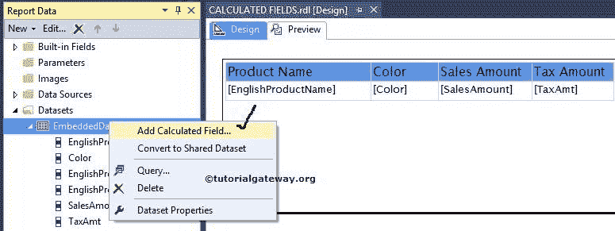

# SSRS 的计算字段

> 原文：<https://www.tutorialgateway.org/calculated-fields-in-ssrs/>

在 SSRS 创建报告时，我们可能需要数据库中无法直接获得的信息。例如，我们可能必须向最终用户显示利润，但是我们不在数据库中保存利润。在这些情况下，我们可以创建或向现有数据集添加计算字段，并在 SSRS 报告中使用它们。

提示:SQL Server 报告服务允许我们在 SSRS 使用强大的表达式来创建计算字段。因此，我们可以使用现有字段，也可以使用表达式窗口创建自定义表达式。

我们将使用下面显示的报告来解释如何在 SSRS 报告中创建计算字段。请参考 [SSRS](https://www.tutorialgateway.org/ssrs/) 中的[表格报告](https://www.tutorialgateway.org/ssrs-table-report/)、[数据源](https://www.tutorialgateway.org/ssrs-shared-data-source/)和[数据集](https://www.tutorialgateway.org/shared-dataset-in-ssrs/)文章，了解数据源、数据集和表格报告的创建。


## 在 SSRS 创建计算字段的步骤

首先，选择报告数据集，并右键单击数据集以打开上下文菜单。从上下文菜单中，请选择添加计算字段..选项如下所示。或者单击数据集属性选项，然后选择字段选项卡



单击添加计算字段选项后，将在 SSRS 打开一个名为带字段的数据集属性选项卡的新窗口。如果您观察下面的屏幕截图，将会添加一个新行，其中“字段名称”和“字段来源”下有两个空文本框。

*   字段名:您在此指定的名称将在数据集中显示为列名。
*   字段来源:这是我们将在报告中显示的值。我们可以分配静态值或者使用 fx 按钮来编写自定义表达式。


我们将字段名称指定为总计，并单击 fx 按钮来编写自定义表达式。


现在，我们将销售金额和纳税金额添加为合计，因此，我们将表达式值设置为

```
=Fields!SalesAmount.Value+Fields!TaxAmt.Value
```


单击“确定”添加表达式。接下来，我们将向您展示如何从 SSRS 的“数据集属性”窗口中再添加一个计算字段。

首先，点击添加按钮将打开带有两个选项的上下文菜单。这里我们必须选择计算字段选项，如下图所示


这里，我们将字段名称指定为静态，字段来源指定为 10000。这意味着静态列将对该报告中的每一行重复 10000 次。


单击确定完成在 [SSRS 数据集](https://www.tutorialgateway.org/embedded-dataset-in-ssrs/)中创建计算字段。

接下来，我们将新创建的计算字段(总计和静态列)添加到 SSRS 报告中，如下所示


单击预览按钮查看 SSRS 计算字段报告预览。


从上面的截图中，您可以观察到静态列对每个列重复 10000 次。