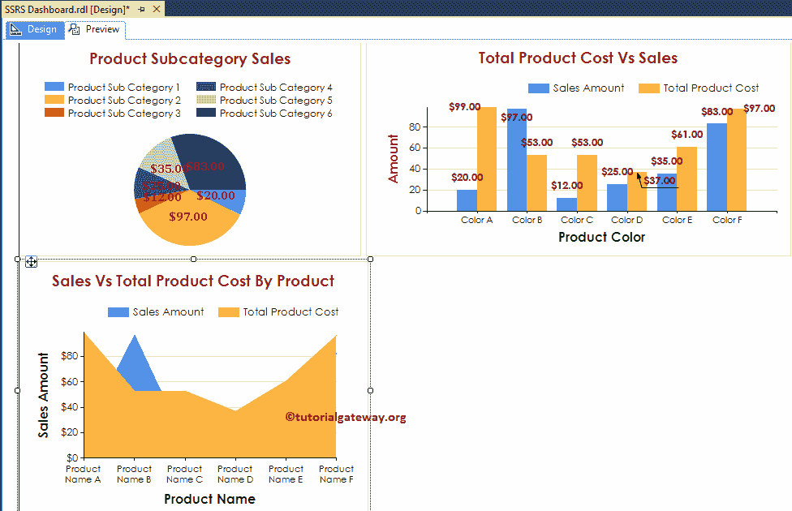

# SSRS 仪表板报告

> 原文：<https://www.tutorialgateway.org/ssrs-dashboard-reports/>

在本文中，我们将通过一个示例向您展示创建 SSRS 仪表板报表的分步方法，该报表包含不同类型的报表。对于这个 SSRS 仪表板示例，我们将使用共享数据源和共享数据集。

下面的截图将向您展示我们用来创建这个 [SSRS](https://www.tutorialgateway.org/ssrs/) 仪表盘的[数据源](https://www.tutorialgateway.org/ssrs-shared-data-source/)和[数据集](https://www.tutorialgateway.org/shared-dataset-in-ssrs/)。


我们针对此 SSRS 仪表板报告的 [SQL Server](https://www.tutorialgateway.org/sql/) 数据源使用的自定义 SQL 查询是:

```
-- SQL Query that we use in SSRS Dashboard
SELECT Cat.[EnglishProductCategoryName] AS ProductCategory, 
       SubCat.[EnglishProductSubcategoryName] AS ProductSubCategory, 
       Prod.EnglishProductName AS ProductName, 
       Prod.Color, 
       Fact.OrderQuantity, 
       Fact.TotalProductCost, 
       Fact.SalesAmount, 
       Fact.TaxAmt, 
       Fact.[Freight]
FROM FactInternetSales AS Fact
   INNER JOIN DimProduct AS Prod
      ON Fact.ProductKey = Prod.ProductKey
   INNER JOIN DimProductSubcategory AS SubCat
      ON Prod.ProductSubcategoryKey = SubCat.ProductSubcategoryKey 
   INNER JOIN DimProductCategory AS Cat 
      ON SubCat.ProductCategoryKey = Cat.ProductCategoryKey
```

## 如何在 SSRS 创建仪表板报告

在本例中，我们将向您展示如何在 SSRS 创建仪表板报告。或者，创建 SSRS 仪表板的步骤。

为了演示 SSRS 仪表板的创建，我们将向仪表板添加一个饼图、柱形图和区域图。

### 向 SSRS 仪表板添加饼图示例

我们可以通过将图表属性从 SSRS 工具箱拖到设计空间来添加任何[图表](https://www.tutorialgateway.org/charts-in-ssrs/)。或者，我们可以右键单击报表设计器以打开上下文菜单。

请从上下文菜单中选择插入->图表选项，如下所示。


选择图表选项将打开一个名为选择图表类型的新窗口。在这个例子中，我们选择了饼图。接下来，单击饼图周围的空白区域将打开图表数据窗口。

现在，我们希望创建一个饼图来显示按产品子类别划分的销售额。因此，将“销售额”列从数据集中拖放到类别组中的图表数据值和产品子类别中。建议大家参考 SSRS[饼图](https://www.tutorialgateway.org/pie-chart-in-ssrs/)详细了解步骤。


接下来，我们对饼图进行了一些格式化，使其看起来整洁干净。请参考[格式化饼图](https://www.tutorialgateway.org/formatting-pie-chart-in-ssrs/)一文，了解格式化标签、图例和托盘所涉及的步骤。


单击预览按钮查看 SSRS 仪表板的报告预览。从下面的截图可以看出，饼图中显示的产品子类别太多。所以让我添加一个过滤器来查看只属于自行车的产品子类别。


#### 在 SSRS 仪表板的数据集级别添加过滤器

请从“报告数据”选项卡中选择要应用过滤器的数据集，右键单击它将打开上下文菜单。请选择数据集属性..从中选择。一旦我们选择了该选项，一个名为数据集属性的新窗口将会打开。请选择过滤器选项卡，然后单击添加按钮。

在本例中，我们将显示[产品类别]为自行车的图表，因此，请选择[产品类别]作为表达式，运算符作为等于，值作为自行车。我建议您参考 SSRS 文章中的[数据集级别的过滤器来了解过滤器。](https://www.tutorialgateway.org/filters-at-dataset-level-in-ssrs/)

[](https://www.tutorialgateway.org/filters-at-dataset-level-in-ssrs/)

单击确定在数据集级别应用过滤器，并单击预览选项卡查看报告预览。从下面的截图中，您可以看到饼图显示了属于自行车类别的产品子类别。


### 向 SSRS 仪表板添加柱形图示例

接下来，我们将在先前在 SSRS 仪表板中创建的饼图旁边添加一个柱形图。为此，右键单击饼图旁边的开放空间以打开上下文菜单。请从中选择插入->图表选项。


选择“图表”选项后，将打开一个名为“选择图表类型”的新窗口。在这里，选择柱形图。


点击[柱形图](https://www.tutorialgateway.org/column-chart-in-ssrs/)周围的空白处，将打开图表数据窗口。在这里，我们希望创建一个柱形图，按产品颜色显示销售金额和产品总成本之间的差异。

因此，将“销售额”、“产品总成本”列从数据集拖放到图表数据值，并将“产品颜色”拖放到类别组中。


让我在柱形图上应用一些格式化技术。请参考[格式化柱形图](https://www.tutorialgateway.org/formatting-column-chart-in-ssrs/)以示例了解格式化柱形图所涉及的步骤。


让我给你看看 SSRS 仪表盘预览


### 将区域图添加到 SSRS 仪表板示例

最后，我们将向 SSRS 仪表板添加一个区域图。如您所见，我们将其添加到之前创建的饼图和柱形图下方。

为此，右键单击饼图下方的空白区域以打开上下文菜单。选择插入->图表选项。


这里，我们选择一个区域图。


点击[区域图](https://www.tutorialgateway.org/area-chart-in-ssrs/)周围的空格将打开图表数据窗口。在这里，我们希望创建一个区域图，按产品名称显示产品总成本和销售金额之间的差异。

因此，将“产品总成本”、“销售额”列从数据集中拖到图表数据值，并将“产品名称”拖到类别组中。


接下来，我们对区域图进行了一些格式化，使其看起来整洁干净。



让我调整 SSRS 仪表板中的图表，以便我们可以将其视为一个组。

注:您也可以使用[矩形](https://www.tutorialgateway.org/ssrs-report-items/)报告项将图表放置在 SSRS 仪表板中。它可以提供更多的格式选项。


让我给你看看 SSRS 仪表盘报告预览


我们成功创建了一个包含饼图、柱形图和区域图的 SSRS 仪表板。