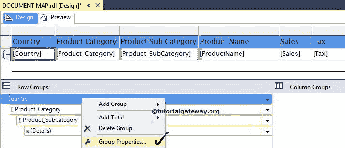

# SSRS 的文献地图

> 原文：<https://www.tutorialgateway.org/document-map-in-ssrs/>

SSRS 的文档图在报告预览中提供了导航链接。用户可以使用这些链接在多个页面之间或报告之间导航。

## SSRS 文档图示例

在本例中，我们将通过一个示例向您展示如何在 SSRS 或 SQL Server Reporting Services 中创建或启用文档地图标签。

对于这个 SSRS 文档图演示，我们将使用下面显示的报告。请参考表报告中的[分组，了解](https://www.tutorialgateway.org/ssrs-grouping-in-table-reports/)[数据源](https://www.tutorialgateway.org/ssrs-shared-data-source/)以及我们在本 [SSRS](https://www.tutorialgateway.org/ssrs/) 报告中使用的分组技术。


[我们在](https://www.tutorialgateway.org/sql/)[嵌入式数据集](https://www.tutorialgateway.org/embedded-dataset-in-ssrs/)中使用的 SQL 代码是:

```
SELECT Territory.SalesTerritoryCountry AS Country,
       Prodcat.EnglishProductCategoryName AS [Product Category], 
       prodSubcat.EnglishProductSubcategoryName AS [Product SubCategory], 
       prod.EnglishProductName AS [ProductName], 
       SUM(fact.SalesAmount) AS Sales, 
       SUM(fact.TaxAmt) AS Tax
FROM dbo.DimProduct as prod 
  INNER JOIN 
    dbo.DimProductSubcategory AS prodSubcat ON 
     prod.ProductSubcategoryKey = prodSubcat.ProductSubcategoryKey 
  INNER JOIN  
    dbo.DimProductCategory AS Prodcat ON 
     prodSubcat.ProductCategoryKey = Prodcat.ProductCategoryKey 
  INNER JOIN  
    dbo.FactInternetSales AS fact ON 
     fact.ProductKey = prod.ProductKey 
  INNER JOIN
    DimSalesTerritory AS Territory ON 
     fact.SalesTerritoryKey = Territory.SalesTerritoryKey
GROUP BY Territory.SalesTerritoryCountry,
       prod.EnglishProductName, 
       prod.Color, 
       Prodcat.EnglishProductCategoryName, 
       prodSubcat.EnglishProductSubcategoryName
```

在 SSRS 报告服务中，我们可以通过三种方式启用文档结构图:

### SSRS 启用文档图的第一种方法

首先，选择列并右键单击该列以打开上下文菜单。从上下文菜单中，请选择行组选项，然后选择组属性..选项如下所示


### 在 SSRS 启用文档图的第二种方法

第二种方法是“转到行组”窗格，右键单击列名以打开上下文菜单。请选择组属性..选项



选择组属性后..选项，将打开一个新窗口来配置组属性。

请导航到高级选项卡，并在文档结构图属性下选择列名。这些列值将显示为文档图输出


单击确定完成 SSRS 文档地图标签属性的配置。让我们点击预览按钮查看报告预览


从上面的截图中，您可以观察到报告预览显示了一个带有国家列表的单独选项卡。如果单击任何国家/地区名称，报表服务器将导航到该国家/地区名称。例如，下面的截图显示了德国的结果。


虽然我们为国家列表添加了文档图，但我们无法浏览这个大报告。让我们也将产品类别添加到文档地图标签中


现在，如果你观察下面的截图，你可以看到更好的导航。它看起来像一个 PDF 文件，左侧有一个索引


我们还使用上述步骤在之前创建的子报告上配置文档结构图标签属性。请参考 [SSRS 子报表](https://www.tutorialgateway.org/ssrs-subreports/)文章，了解子报表的设计和配置。


## Tablix 级别的 SSRS 文档图

实时地，我们可能会看到多个表或者多个 tablix 将嵌入到一个报表中。如果是这样的话，在两个表之间导航将会很困难。在这些情况下，我们可以在 tablix 级别使用 SSRS 文档图属性来实现更好的导航。

为了更好地理解，我们将向您展示一个示例。如果你观察下面的截图，我们在第一个例子


中增加了一个表格

首先，选择第一个表并转到 Tablix 属性。在属性窗格中，请选择文档映射标签属性，并为其分配唯一的名称。从下面的截图你可以观察到我们分配了国家销售


接下来，选择第二个表并转到 Tablix 属性。在属性窗格中，请选择文档映射标签属性，并为其分配唯一的名称。我们分配了产品销售


单击预览选项卡查看 SSRS 文档图报告预览。如果观察下面的截图，报表管理器显示的是两个表


的文档图标签

如果你想看第二张表，点击产品销售标签如下所示

