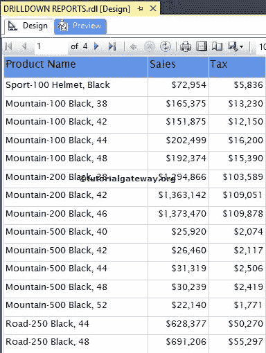
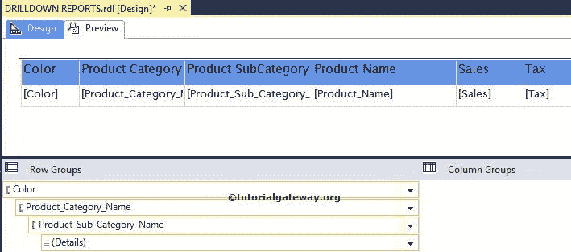
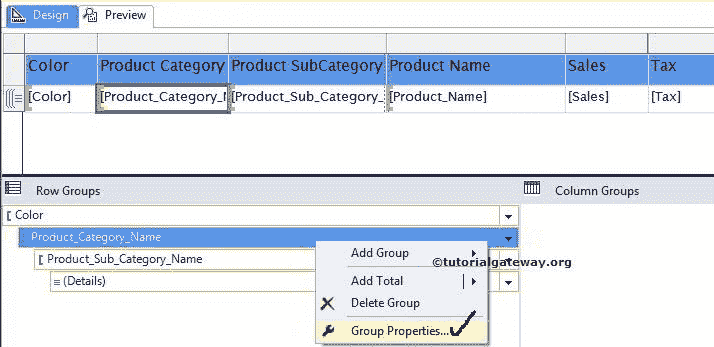
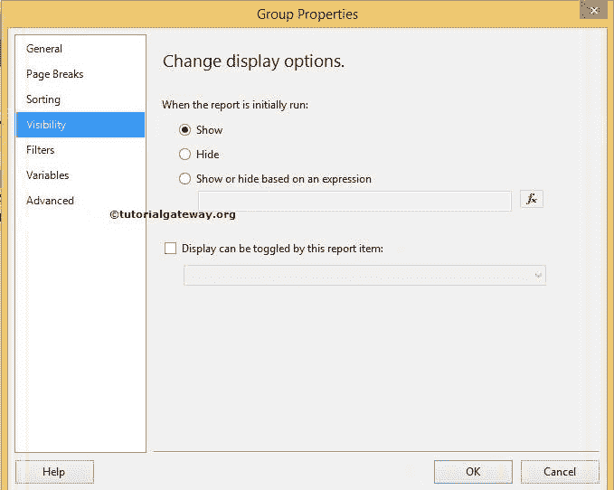
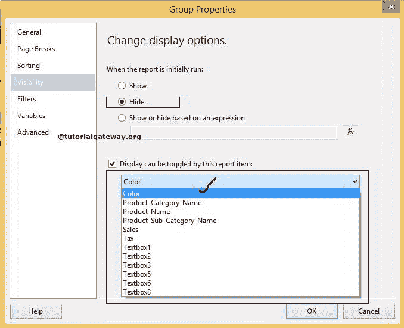
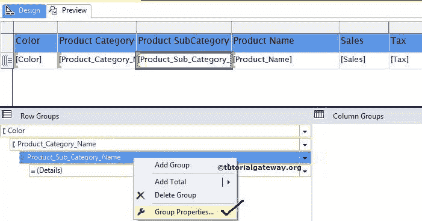
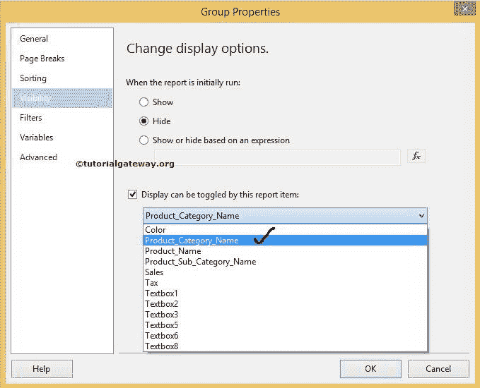
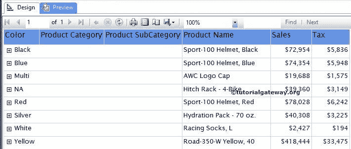
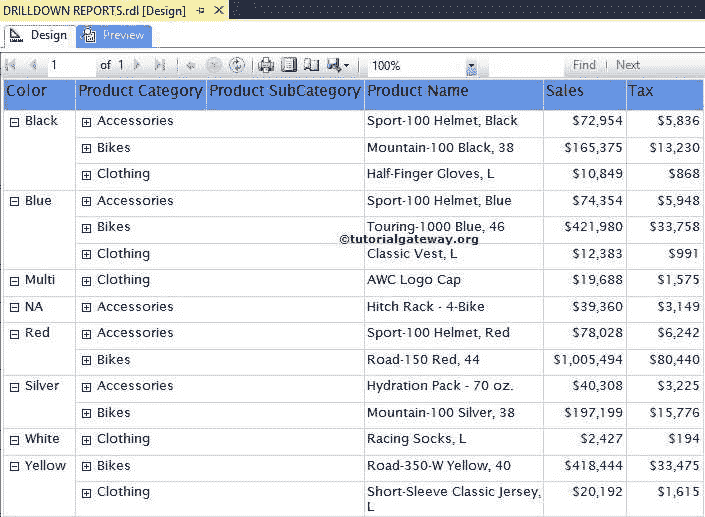
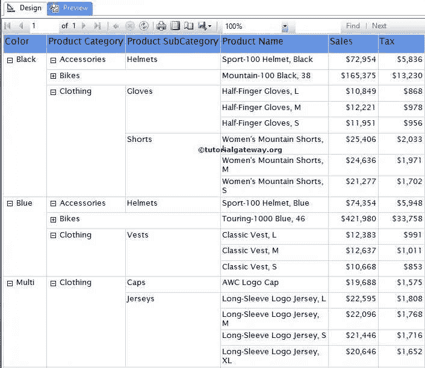

# SSRS 的深入调查报告

> 原文：<https://www.tutorialgateway.org/ssrs-drill-down-report/>

SSRS 的向下钻取报告意味着允许用户通过在文本框中提供加号和减号来显示或隐藏列数据(简而言之，为用户提供交互性)。

在本文中，我们将通过一个示例向您展示如何在 SSRS 创建深入查看报告。

我们将使用下表报告来解释如何在 SSRS 创建深入分析报告。请参考 [SSRS 表报告](https://www.tutorialgateway.org/ssrs-table-report/)、[数据源](https://www.tutorialgateway.org/ssrs-shared-data-source/)、[数据集](https://www.tutorialgateway.org/shared-dataset-in-ssrs/)文章，了解数据源、数据集、 [SSRS](https://www.tutorialgateway.org/ssrs/) 表报告的创建。



我们用于创建上述报表的[嵌入式数据集](https://www.tutorialgateway.org/embedded-dataset-in-ssrs/)的 [SQL](https://www.tutorialgateway.org/sql/) 查询为:

```
-- Query for Drill down reports in SSRS
SELECT prod.Color, 
       Prodcat.EnglishProductCategoryName AS [Product Category Name], 
       prodSubcat.EnglishProductSubcategoryName AS [Product Sub Category Name], 
       prod.EnglishProductName AS [Product Name],
       SUM(fact.SalesAmount) AS Sales, 
       SUM(fact.TaxAmt) AS [Tax]
FROM DimProduct AS prod 
       INNER JOIN
     DimProductSubcategory AS prodSubcat ON 
         prod.ProductSubcategoryKey = prodSubcat.ProductSubcategoryKey 
       INNER JOIN
     DimProductCategory AS Prodcat ON 
         prodSubcat.ProductCategoryKey = Prodcat.ProductCategoryKey 
       INNER JOIN
     FactInternetSales AS fact ON 
	 fact.ProductKey = prod.ProductKey
GROUP BY  prod.Color, 
	  Prodcat.EnglishProductCategoryName, 
	  prodSubcat.EnglishProductSubcategoryName,
	  prod.EnglishProductName
```

## 如何在 SSRS 创建追溯报告

在本例中，我们将向您展示在 SSRS 创建追溯报告的分步方法。

在这个 SSRS 向下钻取操作演示中，我们向您展示了如何在报告预览和中隐藏产品类别名称和产品子类别名称列

*   允许用户选择颜色名称来显示或隐藏产品类别
*   允许用户选择产品类别以显示或隐藏产品子类别列名

在开始启用 SSRS 向下钻取操作之前，我们必须使用 SSRS 分组技术对列进行分组。

在我们之前的文章中，我们已经解释了分组。因此，请参考 SSRS 表报告中的[分组文章，了解下图截图。](https://www.tutorialgateway.org/ssrs-grouping-in-table-reports/)

如果您观察下面的截图，我们应用了按颜色分组的行作为父组。接下来，产品类别列名作为子组，产品子类别名作为产品类别子。



### SSRS 向下钻取操作

要启用 SSRS 向下钻取操作，首先，转到行组窗格，右键单击产品类别名称将打开上下文菜单。请从上下文中选择组属性..选项，如下图所示。



选择组属性后..选项，将打开一个新窗口来配置组属性。请选择左侧的可见性选项卡。



“可见性”选项卡有多个用于 SSRS 深入查看报告的选项:

*   显示:最初运行报告时如果要显示产品类别名称，请选择显示选项
*   隐藏:最初运行报告时，如果要隐藏产品类别，请选择隐藏选项。在本例中，我们希望最初隐藏产品类别名称，因此我们选择了此选项。
*   基于表达式显示或隐藏:您可以编写自己的表达式，通过单击 fx 按钮来显示/隐藏产品类别。
*   可以按报告时间切换显示:如果选择此选项，产品类别名称将根据所选报告项目显示/隐藏。在本例中，我们希望根据用户选择的颜色来切换产品类别名称。因此，从列表中选择“颜色”列。



在“行组”窗格中，右键单击产品子类别名称，然后选择“组属性”..选项。



这里，我们希望根据用户选择的产品类别名称来切换产品子类别名称。因此，从列表中选择产品类别名称列。



单击“确定”完成对表报告启用 SSRS 向下钻取功能。现在，单击预览按钮查看报告预览

这里，每种颜色前的+符号是 SSRS 向下钻取动作。



让我们向下钻取或展开“颜色”列，查看“产品类别”列



中的数据

让我们展开或向下钻取产品类别列，查看产品子类别列中的数据，如下所示



提示:请参考 SSRS 文章中的[向下钻取矩阵报告，以启用矩阵报告中的 SSRS 下拉功能](https://www.tutorialgateway.org/drill-down-matrix-report-in-ssrs/)